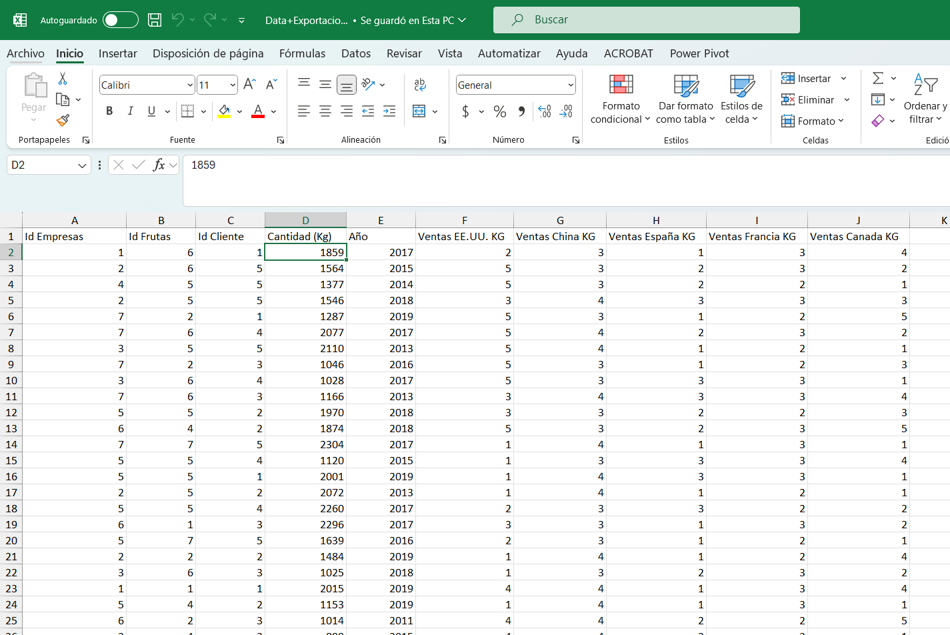
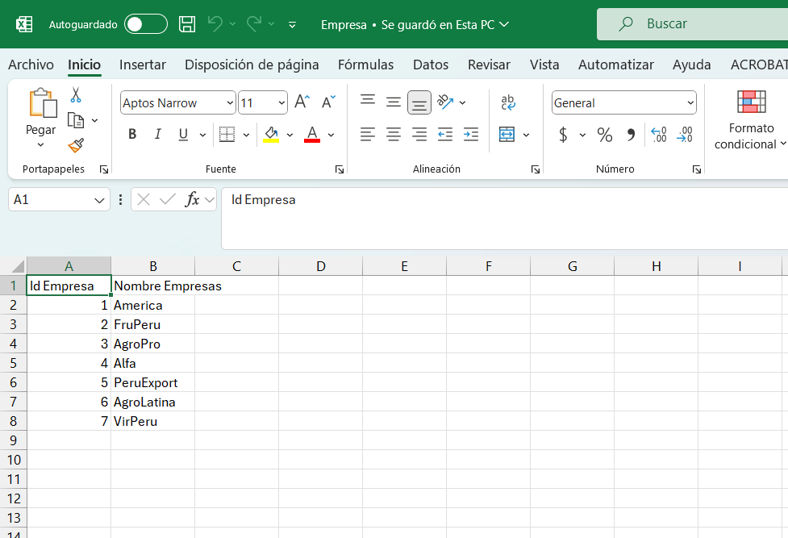
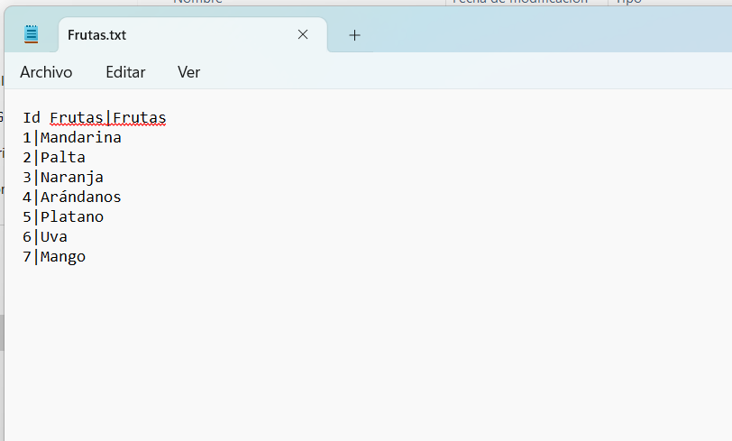

# Práctica 1. Conexión a una fuente de datos y limpieza básica 

## Objetivo de la práctica:

Al finalizar la práctica, serás capaz de:

- Poner en práctica la habilidad técnica de conectarse a una fuente de datos.  
- Manejar y preparar datos para ser utilizados de manera efectiva.

## Duración aproximada:
- 120 minutos.

## Instrucciones:

### Tarea 1. 

Se brindará una base de Excel en la cual es necesario que se analicen cada uno de los registros y estructuremos esta base lo mejor posible, esta será nuestra base 0.

**Paso 1.** Para este primer ejercicio, es necesario tener el material de la carpeta de nombre Primer Proyecto / Data, el cual se encuentra dentro de la MV, en el Escritorio, que se te ha proporcionado. 

**Paso 2.** Analiza la data que se te está proporcionando y realiza la primera inspección de limpieza de datos.

## Resultado esperado:

