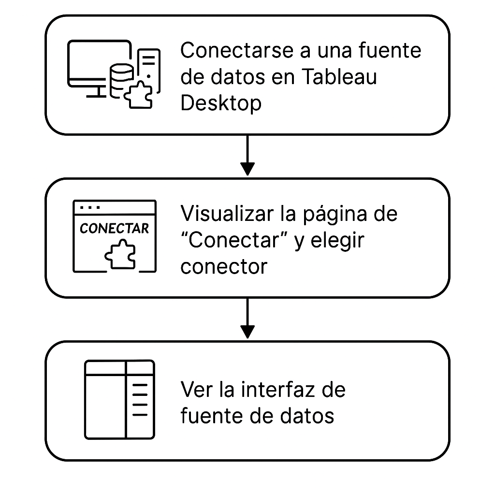
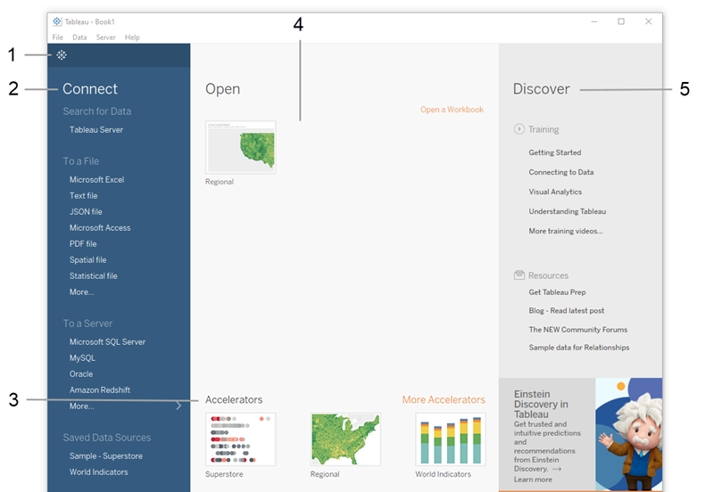
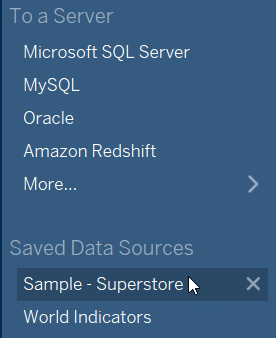
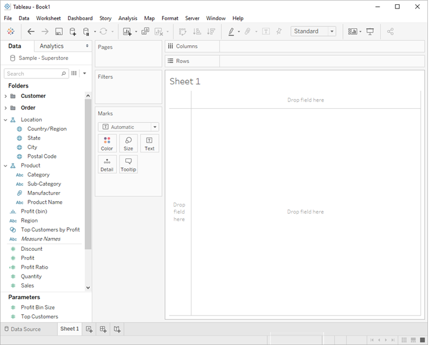

# Práctica 1. Conexión y preparación de datos

## Objetivos
Al finalizar la práctica, serás capaz de:
- Conectarte a una fuente de datos en Tableau Desktop y abrir la sesión inicial.
- Visualizar la página de `Conectar` en Tableau, elegir un conector y vincular el conjunto de datos `Muestra - Supertienda`. 
- Ver la interfaz de fuente de datos: observar la hoja de trabajo en blanco, la lista de campos, los tipos de dato y roles que asigna automáticamente Tableau. 

## Objetivo visual 

## Duración aproximada
- 30 minutos.

## Instrucciones 

Tu jefa te pidió que revisaras las ventas y la rentabilidad general de la empresa para detectar las principales áreas de mejora. Tienes un cúmulo de datos, pero no sabes por dónde empezar. Decides comenzar con una versión de prueba gratuita de Tableau Desktop.

### Tarea 1

En la página de inicio, selecciona el conector (el modo en que se conectará a los datos) que quieras utilizar.

La página de inicio ofrece varias opciones:

1.	**Icono de Tableau**. Haz clic en  situado en la esquina superior izquierda de cualquier página, para cambiar de la página de inicio al área de trabajo de creación y viceversa.

2.	**Conectar panel**. En `Conectar`, puedes conectarte a:

- Datos almacenados en un archivo, como Microsoft Excel, PDF y archivos especiales.
- Datos almacenados en Tableau Server, Microsoft SQL Server, Google Analytics u otro servidor.
- Una fuente de datos a la que te hayas conectado antes.

Tableau admite la posibilidad de conectarte a una amplia variedad de datos almacenados en una gran cantidad de sitios. En el panel `Conectar`, aparecen las ubicaciones más habituales a las que puedes conectarte. También puedes hacer clic en el vínculo `Más` para ver más opciones. Para obtener más información sobre cómo conectarte a fuentes de datos, consulta la **Biblioteca de aprendizaje**.

3. En `Aceleradores`, se encuentran una selección de aceleradores junto con los libros de trabajo de muestra que se incluyen con Tableau Desktop. Antes de 2023.2, estos se llamaban _Libros de trabajo de muestra_.

4. En `Abrir`, puedes abrir los libros de trabajo que ya has creado.

5. En `Descubrir`, encontrarás recursos adicionales como tutoriales de video, foros o la sección `Viz of the week` para obtener ideas sobre lo que puedes crear.

En el panel `Conectar`, en `Fuentes de datos guardadas`, haz clic en `Muestra - Supertienda` para conectarte al conjunto de datos de ejemplo.

Después de seleccionar `Muestra - Supertienda`, tu pantalla tendrá este aspecto:

El conjunto de datos `Muestra - Supertienda` se suministra con Tableau. Contiene información sobre productos, ventas, ganancias, entre otros, que puedes utilizar para identificar áreas clave para su mejora dentro de esta compañía ficticia.

#### ¿Qué hace Tableau con los datos?

Después de conectarte a los datos, Tableau procede del modo siguiente:

- Abre una nueva hoja de trabajo. Se trata de un área en blanco en la que puedes crear tu primera vista.
- Muestra la fuente de datos a la que te has conectado. Si utilizas varias fuentes de datos, las verás todas aquí.
- Agrega columnas de la fuente de datos al panel `Datos de la izquierda`. Las columnas se agregan como campos.
- Asigna automáticamente tipos de datos (como la fecha, el número, la cadena, etc.) y roles (dimensión o medida) a sus datos (más adelante se abordarán estos términos).

Si deseas conocer todos los detalles sobre los datos, puedes seleccionar la página `Fuente de datos` en la esquina inferior izquierda. Aquí puedes ver las primeras mil filas de datos, ordenar u ocultar campos, dividir campos en varias columnas y cambiar el nombre de los encabezados, todo sin modificar los datos originales. 

Lo que pasa en Tableau no sale de ahí: sus datos están protegidos.

En la página `Fuente de datos`, haz clic en la pestaña de `Hoja 1` para volver al punto de inicio.
