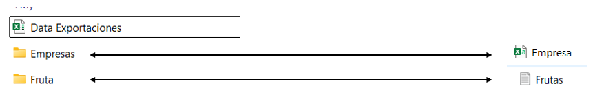

# Práctica 2. Creación de visualizaciones básicas

## Objetivo de la práctica:

Al finalizar la práctica, serás capaz de:

- Desarrollar habilidades en la creación de visualizaciones básicas en Tableau Desktop para analizar datos de ventas de la empresa Retallink.  
- Aprender a seleccionar el tipo de gráfico adecuado, personalizar visualizaciones y extraer conclusiones clave a partir de los datos.

## Duración aproximada:
- 210 minutos.

## Tabla de ayuda:

Se requiere:

- Cantidad de Toneladas por Cliente.  
- Cantidad de Toneladas por Empresa.  
- Cantidad de Tonelada de Clientes por Fruta.  
- Ganancias de Exportación por País.  
- % de las Ganancias de los Países del Monto Total.  
- % de las Exportaciones en Toneladas por País.  

## Instrucciones:

**Paso 1.** Es momento de organizar la data por lo cual, debes crear una carpeta dentro de equipo de cómputo donde organices de la siguiente manera los archivos:

**Paso 2.** Lo primero es organizar tu archivo para que, posteriormente, crees la conexión de nuestra data a la aplicación de Tableau.

**Paso 3.** Conecta los distintos archivos de data que tienes en desarrollo. 

**Paso 4.** Abre la aplicación de Tableau Desktop y dirígete a la primera pantalla, justo donde letrero de **CONECTAR**.

**Paso 5.** Primero, conecta la data generada en Excel (Data Exportaciones).

**Paso 6.** Presiona **Abrir**.

