# Práctica 2. Creación de visualizaciones básicas

## Objetivos
Al finalizar la práctica, serás capaz de:
- Crear una vista.
- Refinar una vista.

## Objetivo visual 

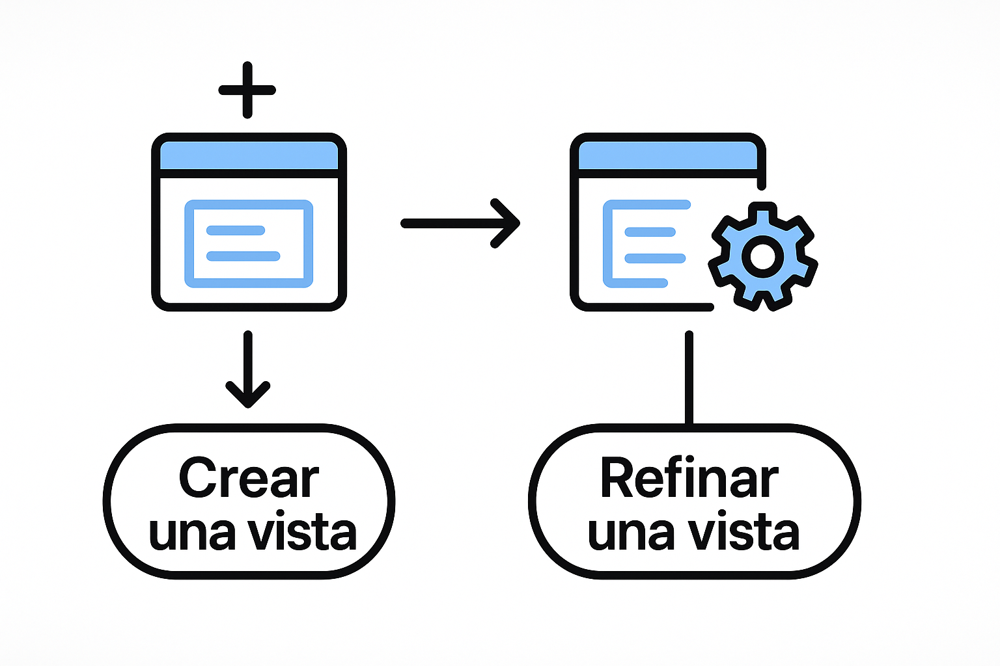

## Duración aproximada
- 40 minutos.

## Instrucciones

### Tarea 1.  Crear una vista
Quieres detectar las áreas que necesitan mejorar. Con datos de cuatro años, explora las ventas generales para descubrir información útil. Comienza creando un gráfico sencillo.

#### Términos en esta sección

| *Término* | *Descripción*|
| ------------- | ------------- |
| Agregación  | Datos de nivel de fila acumulados hasta una categoría superior, como la suma de las ventas o el total de ganancias. Tableau hace esto automáticamente para que pueda desglosar los datos al nivel de detalle con el que desea trabajar.  |
| Dimensión frente a medida | Las dimensiones son datos cualitativos, como un nombre o una fecha. De manera predeterminada, Tableau clasifica automáticamente como dimensiones aquellos datos que contienen información cualitativa o categórica, como por ejemplo, cualquier campo con texto o valores de fecha. Estos campos suelen mostrarse como encabezados de columnas para filas de datos, como Customer Name o `Order Date`, además de definir el nivel de granularidad que aparece en la vista. Las medidas son datos numéricos cuantitativos. De manera predeterminada, Tableau considera medidas cualquier campo que contenga este tipo de datos, como por ejemplo, transacciones de ventas o ganancias. Los datos que se clasifican como medidas se pueden agregar en función de una dimensión dada, como por ejemplo, ventas totales (Medida) por región (Dimensión). |
| Diferencias entre continuo y discreto | Los campos continuos pueden contener un número infinito de valores. Puedes tratarse de un rango de valores, como las ventas dentro de un determinado intervalo de fechas o cantidades. Los campos continuos aparecen de color verde en Tableau. Los campos discretos contienen un número finito de valores, como Country, State o Customer Name. Los campos discretos aparecen de color azul en Tableau.  |

#### Controles y elementos del área de trabajo de Tableau
En esta sección, arrastrará campos a los estantes de `Columnas` y `Filas` y también trabajará con la tarjeta `Marcas`. En la imagen siguiente se identifican algunos controles y elementos que utilizará en el área de trabajo.

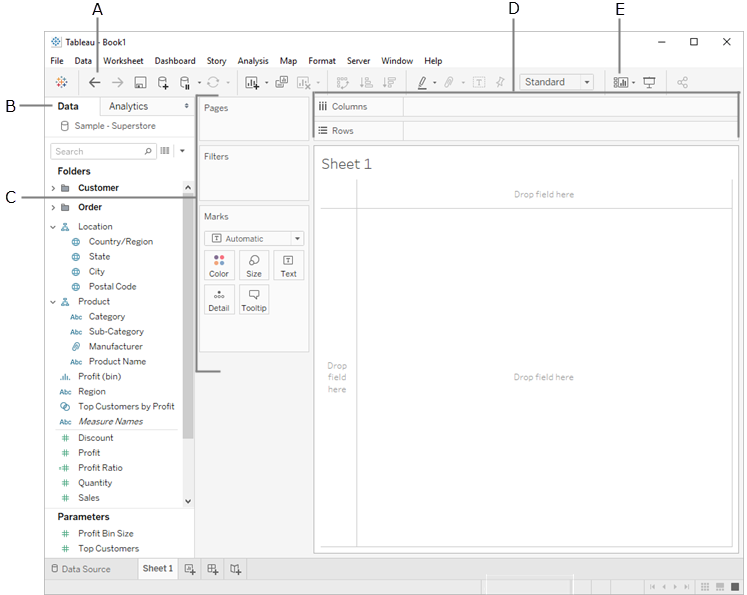

| *Elemento* | *Descripción*|
| ------------- | ------------- |
| A Deshacer | Con Tableau, tiene libertad para experimentar con los datos. Siempre puede volver donde empezó con el botón Deshacer. Utilice este botón para revertir la última acción realizada en el libro de trabajo. Puedes deshacer una cantidad ilimitada de veces y volver a la última vez que abrió el libro de trabajo, incluso después de haber guardado. |
| B `Panel de datos` | Muestra el nombre de la fuente de datos incluida en la vista y los campos disponibles como dimensiones y medidas. Los campos se pueden agrupar en función de su tabla propietaria o por carpeta. |
| C and D Tarjetas y estantes | Las tarjetas son contenedores para los distintos controles que están disponibles en Tableau. Los estantes son un tipo de control de tarjeta. Al arrastrar campos del panel Datos a los estantes `Columnas` o `Filas`, los datos se agregan como una columna o una fila en los ejes de la vista. Al arrastrar campos del panel Datos a la tarjeta `Marcas`, puede controlar propiedades visuales como tipo, color, tamaño, forma y mucho más. Esta acción afectará solamente a las marcas de la vista; los ejes no cambian. |
| E Ocultar o mostrar tarjetas | ¿Ha ocultado una tarjeta sin querer y ahora la necesita? No hay problema. Casi todo el contenido del área de trabajo de Tableau se puede activar o desactivar para proporcionar el máximo espacio para crear sus visualizaciones. Para mostrar u ocultar tarjetas como Páginas, Filtros o Leyendas, haga clic en la flecha desplegable del botón Ocultar o mostrar tarjetas icono de mostrar/ocultar tarjetas en la barra de herramientas o active la marca de verificación para la tarjeta. Incluso puede contraer el panel Datos y análisis a la esquina inferior izquierda del área de trabajo haciendo clic en el botón minimizar el panel Datos y análisis que se encuentra en la esquina superior izquierda del panel. Vuelva a hacer clic en el botón para restaurar el panel. |

1. Desde el panel Datos, arrastre Fecha de pedido al estante `Columnas`.

> [!NOTE]
> Al arrastrar `Order Date` al estante `Columnas`, Tableau crea una columna para cada año en el conjunto de datos. Debajo de cada columna hay un indicador Abc. Indica que aquí puede arrastrar texto o datos numéricos, como lo que se puede ver en una hoja de cálculo de Excel. Si decide arrastrar `Sales` a esta área, Tableau crea una tabulación cruzada (como una hoja de cálculo) y muestra el total de ventas para cada año.

2. Desde el panel Datos, arrastre `Sales` al estante `Filas`.

Tableau genera el siguiente gráfico con las ventas acumuladas como una suma (agregadas). Puedes ver el total de ventas agregadas para cada año por fecha de pedido.

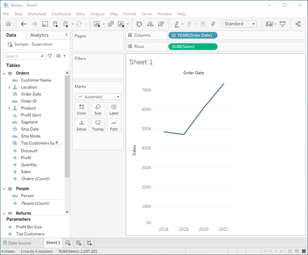

Cuando cree una vista por primera vez que incluya el tiempo (en este caso, `Order Date`), Tableau genera un gráfico de líneas automáticamente.

Este gráfico de líneas muestra que las ventas van bastante bien y parece que aumentan con el tiempo. Es buena información, pero realmente no dice mucho sobre qué productos venden más y si algunos están funcionando mejor que otros. Como acaba de empezar, decide seguir investigando y ver qué más puede averiguar.

## Explorar las opciones

Para cambiar rápidamente el tipo de gráfico, seleccione el menú desplegable en la tarjeta `Marcas`.

Por ejemplo, para un gráfico de áreas, puede seleccionar Área

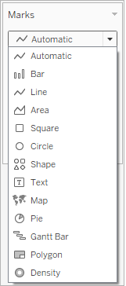

Tableau admite muchos tipos de gráficos distintos, conocidos como tipos de Marca. 

> [!NOTE]
> Antes de seguir con el tutorial, asegúrese de revertir el tipo de gráfico a Automático.

### Tarea 2. Refinar la vista

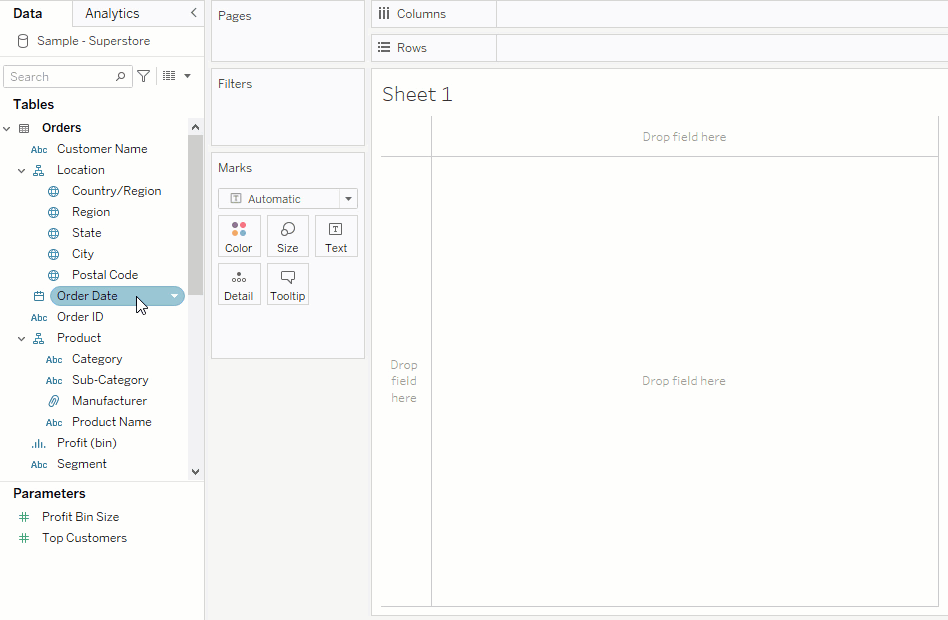

#### Refinar la vista

1. Para obtener información más útil sobre qué productos impulsan las ventas generales, intente agregar más datos. Comienza agregando las categorías de producto para observar los totales de ventas de manera distinta.

En el panel Datos, arrastre `Category` al estante `Columnas` y colóquela a la derecha de YEAR(`Order Date`).

La vista se actualiza a un gráfico de barras. Al agregar una segunda dimensión discreta a la vista, puede categorizar los datos en fragmentos discretos en lugar de buscar en los datos continuamente a lo largo del tiempo. De este modo, se crea un gráfico de barras que muestra las ventas generales por cada categoría de producto al año.

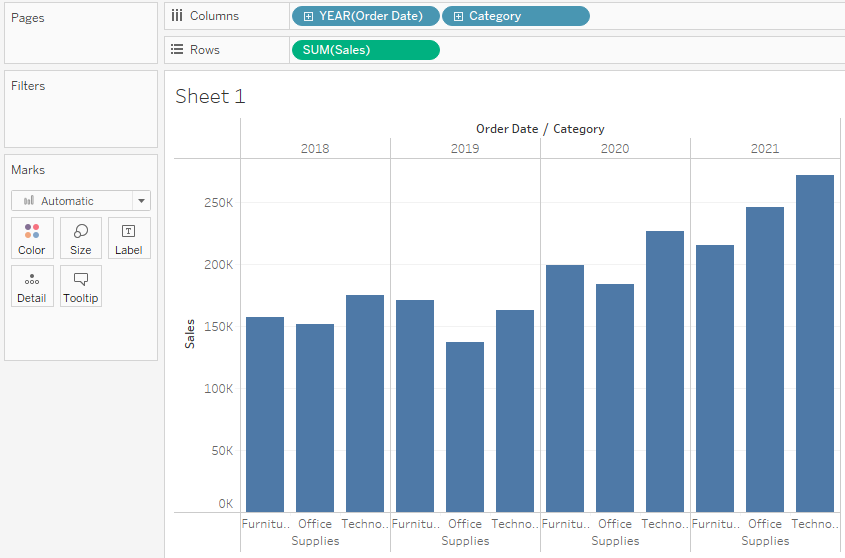

#### Ver los números

Puedes ver o agregar información de punto de datos a la vista. En este ejemplo, esta información muestra los totales de ventas exactos por categoría.

Para ver información sobre cada punto de datos (es decir, la marca) en la vista, sitúe el cursor sobre una de las barras para mostrar una descripción emergente. La descripción emergente muestra los totales de ventas para esa categoría. A continuación se muestra la descripción emergente de la categoría Office Supplies (Suministros de oficina) de 2021:

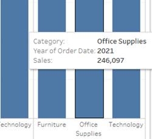

Para añadir información de punto de datos como etiquetas a la vista, haga clic en Mostrar etiquetas de marca en la barra de herramientas. Abajo se muestran las ventas totales para cada año y categoría.

> [!NOTE]
> en el tutorial Introducción, las etiquetas de texto no se agregan a la vista.

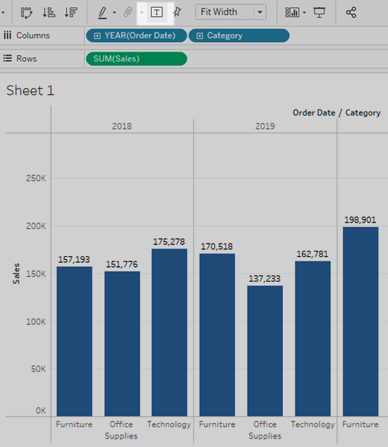

#### Cambiar la perspectiva

Para mostrar el gráfico de barras horizontalmente, en lugar de verticalmente, haga clic en Intercambiar filas y columnas en la barra de herramientas.

> [!NOTE]
> deshaga esta acción antes de continuar con el tutorial Introducción.

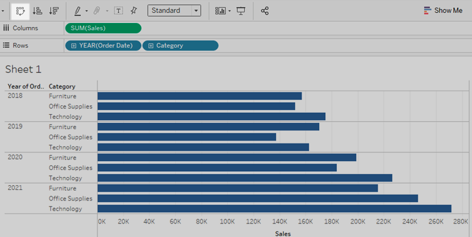

Su vista está quedando muy bien al mostrar las ventas por categoría (Furniture, Office Supplies y Technology). ¡Se ha revelado información interesante!

Desde esta vista puede ver que las ventas de muebles (Furniture) crecen más rápido que las del material de oficina (Office Supplies), a pesar de que 2021 fue un año muy bueno para la categoría Office Supplies. Quizás le interese recomendar que su empresa centre los esfuerzos de ventas en los muebles en lugar de hacerlo en el material de oficina. Sin embargo, su empresa vende muchos productos diferentes en estas categorías, por lo que necesita más información antes de hacer una recomendación.

Para responder a esta pregunta, decide ver los productos por subcategoría para detectar qué artículos se venden mejor. Por ejemplo, para la categoría Furniture, desea ver detalles sobre Bookcases, Chairs, Furnishings y Tables. Estos datos pueden ofrecerle más información sobre las ventas y, con ello, sobre la rentabilidad, por lo que no dude en añadir subcategorías al gráfico de barras.

2. Haga doble clic en `Sub-`Category`` o arrástrela al estante `Columnas`.

> [!NOTE]
> Puedes arrastrar y soltar o hacer doble clic en un campo para agregarlo a la vista, pero tenga cuidado. Tableau presupone dónde agregar los datos y puede que no los coloque en el lugar que usted esperaba. Siempre tiene la opción de hacer clic en Deshacer para eliminar el campo o arrastrarlo fuera del área donde Tableau lo colocó y empezar de nuevo.

`Sub-`Category`` es otro campo discreto. Crea otro encabezado al final de la vista y muestra una barra para cada subcategoría (68 marcas) desglosada por categoría y año.

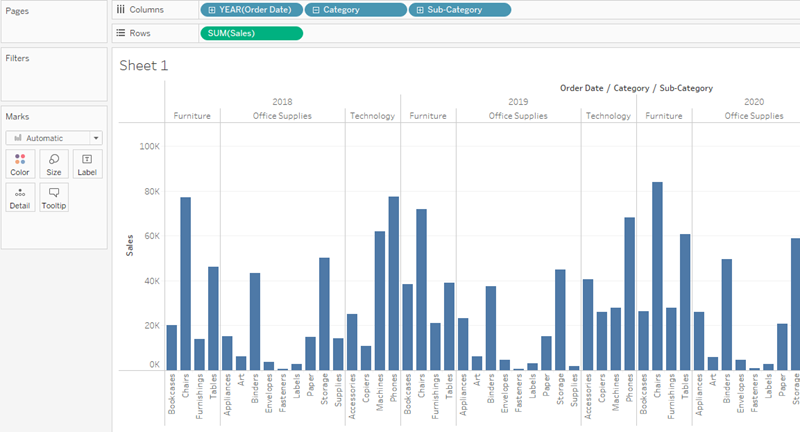

Ahora está llegando a algún lugar, pero son muchos datos para ordenarlos visualmente. En la siguiente sección, aprenderá a agregar colores, filtros y más opciones para centrarse en resultados específicos

#### Utilizar una vista distinta para comparar ventas de productos

Si desea ver cómo contribuyen sus productos a las ventas generales por categoría, Tableau le ofrece otra opción.

Si arrastra la `Sub-`Category`` a Color en la tarjeta `Marcas`, puede crear un gráfico de barras apiladas con marcas adicionales para cada subcategoría identificada por un único color. Tableau muestra automáticamente una leyenda a la derecha para los valores de subcategoría.

> [!NOTE]
> Deshaga esta acción antes de continuar con el tutorial Introducción.

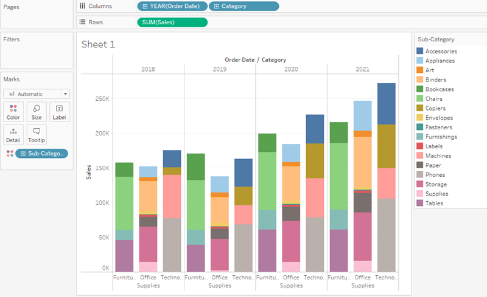

Se muestra rápidamente la cantidad de ventas con la que contribuye cada producto al total general para cada categoría y año, e inmediatamente se muestra de un vistazo cuál contribuye más y cuál menos.

Las subcategorías se muestran como barras apiladas en el orden en que están enumeradas en la leyenda, y no en función de cómo caen en el eje `Sales`.

En la vista anterior, por ejemplo, se muestra que la subcategoría Bookcases aportó 38 544 USD en ventas al total general de 170 518 USD de la categoría Furniture en 2019. La marca se muestra en la parte superior de la barra porque Bookcases se muestra por encima de Chairs, Furnishings y Tables en la leyenda. Las subcategorías se muestran en la leyenda, de modo que puede cambiarlas de sitio y examinar los datos de la manera que tenga más sentido para usted.

En función del tipo de análisis que desee hacer, el gráfico de barras apiladas puede que sea o no el gráfico que necesita.

#### Compruebe su trabajo. Vea "Refinar la vista" en acción
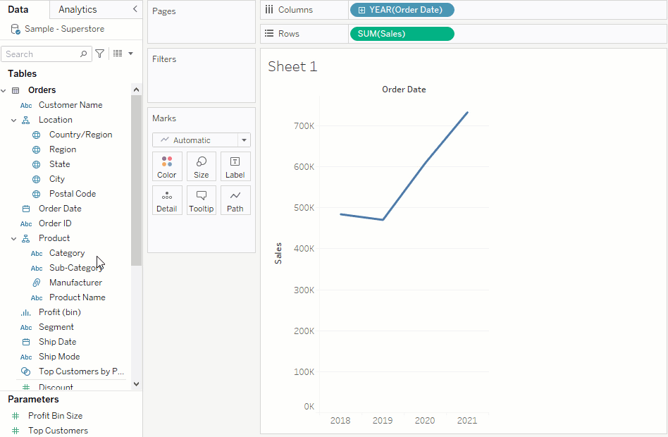

#### Resumen de los pasos

Este paso consistía en conocer los datos y empezar a hacerse preguntas sobre los datos para obtener información útil. Has aprendido a:

- Crear un gráfico en una vista que le sirva.
- Agregar campos para obtener el nivel de detalle adecuado en la vista.

Ya está listo para empezar a centrarse en los resultados e identificar áreas de interés más específicas. En la siguiente sección, aprenderá a usar filtros y colores para ayudarlo a explorar los datos visualmente.

