# Práctica 3. Análisis y filtros en Tableau 

## Objetivos
Al finalizar la práctica, serás capaz de:
- Centrarte en los datos relevantes mediante filtros y colores para analizar con mayor precisión los resultados en Tableau Desktop.
- Analizar las tendencias geográficas de ventas y rentabilidad creando una vista de mapa en Tableau para visualizar patrones por región.
- Profundizar en el análisis filtrando los datos para centrarse en los estados con pérdidas y descubrir las causas de las ganancias negativas.

## Objetivo visual 

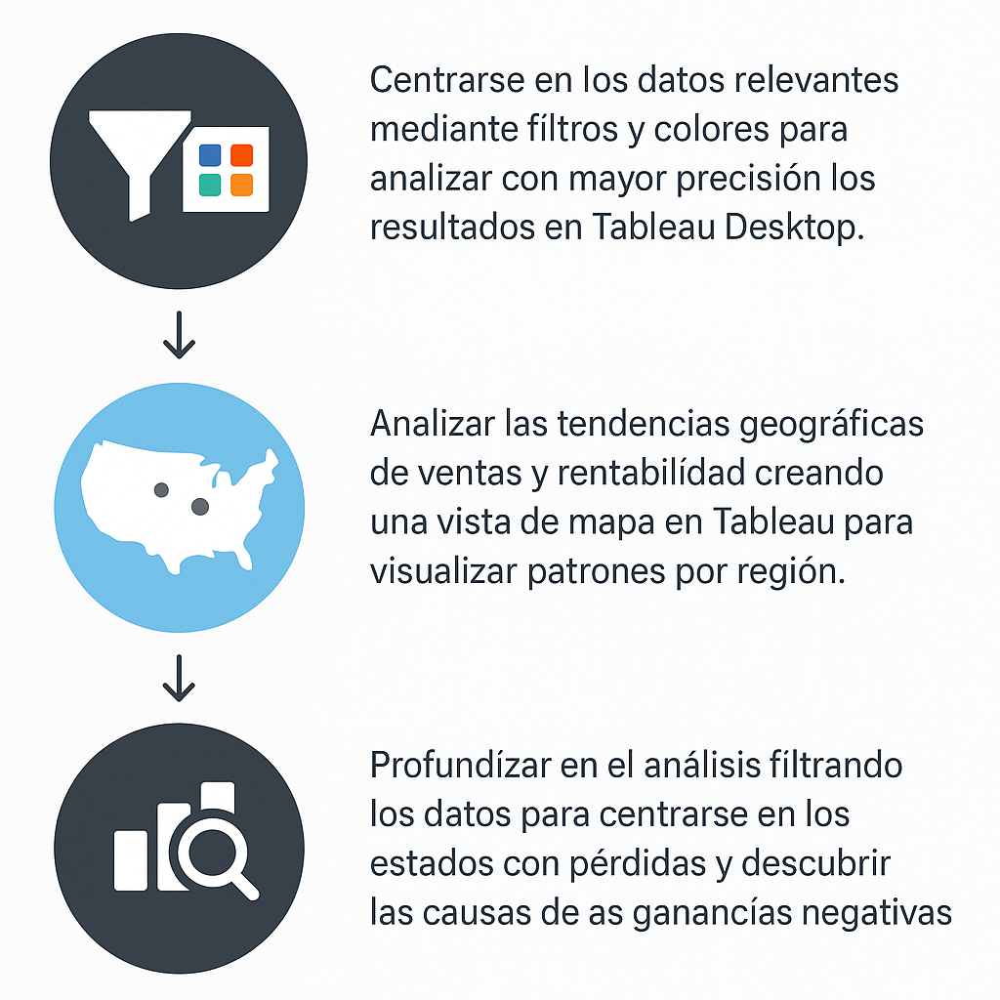

## Duración aproximada
- 90 minutos.

## Instrucciones 

### Tarea 1. Centrarse en los resultados

Ha creado una vista de ventas de productos, desglosada por categoría y subcategoría. Está empezando a llegar a algún lugar, pero son muchos datos para ordenarlos. Necesita encontrar fácilmente los puntos de datos interesantes y centrarse en resultados concretos. Bueno, Tableau le ofrece estupendas opciones para conseguirlo.

Mediante el uso de filtros y colores, puede centrarse más en los detalles que le interesan. Después de centrarse en ciertos datos, puede empezar a utilizar otras características de Tableau Desktop para interactuar con esos datos.

#### Añadir filtros a la vista

Puede utilizar filtros para incluir o excluir valores en la vista. En este ejemplo, decide agregar dos filtros sencillos a la hoja de trabajo para que sea más sencillo ver las ventas de productos por subcategoría para un determinado año.

1. En el panel Datos, haga clic con el botón derecho en Order Date y seleccione Mostrar filtro.

2. Repita el paso anterior para el campo Sub-Category.

Los filtros se añaden al lateral derecho de la vista en el orden en el que los haya seleccionado. Los filtros son tipos de tarjeta y se pueden mover por el lienzo haciendo clic en el filtro y arrastrándolos a otro sitio de la vista. A medida que arrastre el filtro, aparece una línea que le muestra dónde puede colocar el filtro para moverlo.

Nota: Para el tutorial  se utiliza la posición predeterminada de las tarjetas de filtro.

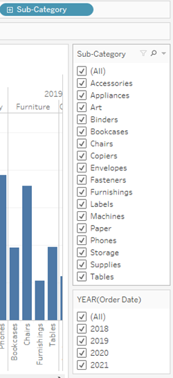

#### Compruebe su trabajo. Vea "Aplicar filtros a la vista" en acción

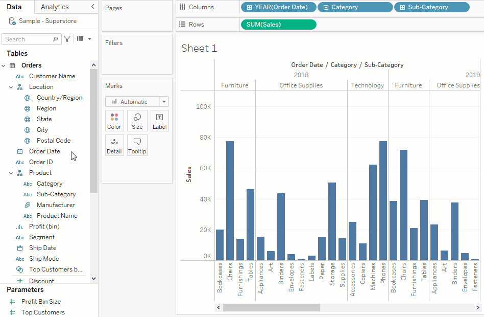

#### Agregar color a la vista

Al agregar filtros es más fácil ordenar todos estos datos pero, vaya, ¡se ve mucho el color azul! Es hora de que hagamos algo para cambiarlo.

Lo que estamos viendo ahora son los totales de ventas para los distintos productos. Puede ver que algunos productos tienen ventas consistentemente bajas y algunos productos pueden ser buenos candidatos para reducir los esfuerzos de ventas para esas líneas de productos. Pero, ¿cómo se ve la rentabilidad general de sus productos? Arrastre Profit a Color para ver qué ocurre.

En el panel Datos, arrastre Profit hasta Color en la tarjeta Marcas.

Al arrastrar Profit a Color, puede ver que tiene ganancias negativas en Tables, Bookcases e incluso Machines. ¡Ha descubierto otro dato útil!

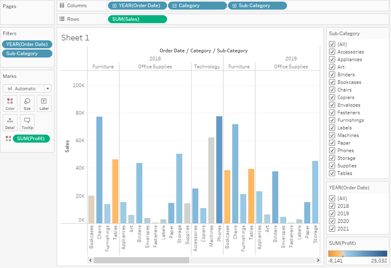

> [!NOTE]
> Tableau ha añadido automáticamente una leyenda de color y ha asignado una paleta de colores divergentes, porque los datos incluyen valores negativos y positivos.

#### Trabajar con colores

Al agregar colores, mejora el aspecto de la vista, pero también puede ayudar a revelar datos interesantes. Tableau utiliza una paleta de colores predeterminada para asignar colores a los productos de la vista, pero no está limitado a utilizar esa paleta de colores. ¡Hay más opciones!

Si desea utilizar colores distintos de los que se muestran, puede cambiar los colores o la paleta de colores cuando lo desee. Solo tiene que hacer clic en Color en la tarjeta Marcas y, después, en Editar colores. Puede seleccionar otra paleta de colores distinta en el cuadro de diálogo Editar colores que se abre.

Nota: Para el tutorial se utiliza la paleta de colores predeterminada.

En función de los datos de la vista, es posible que el cuadro de diálogo Editar colores muestre una paleta de colores divergentes en lugar de una paleta de colores categórica.

Las paletas de colores divergentes tienen el aspecto de la imagen siguiente y suelen asignarse a campos continuos.

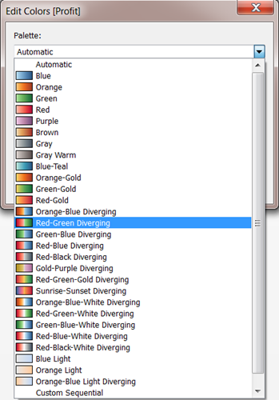

Si utiliza una leyenda, puede que tenga el aspecto de la imagen de abajo. Las paletas de colores categóricas como esta suelen asignarse a campos discretos.

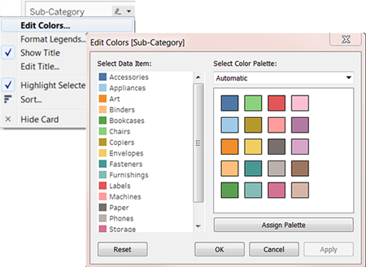

#### Compruebe su trabajo. Vea "Agregar color a la vista" en acción

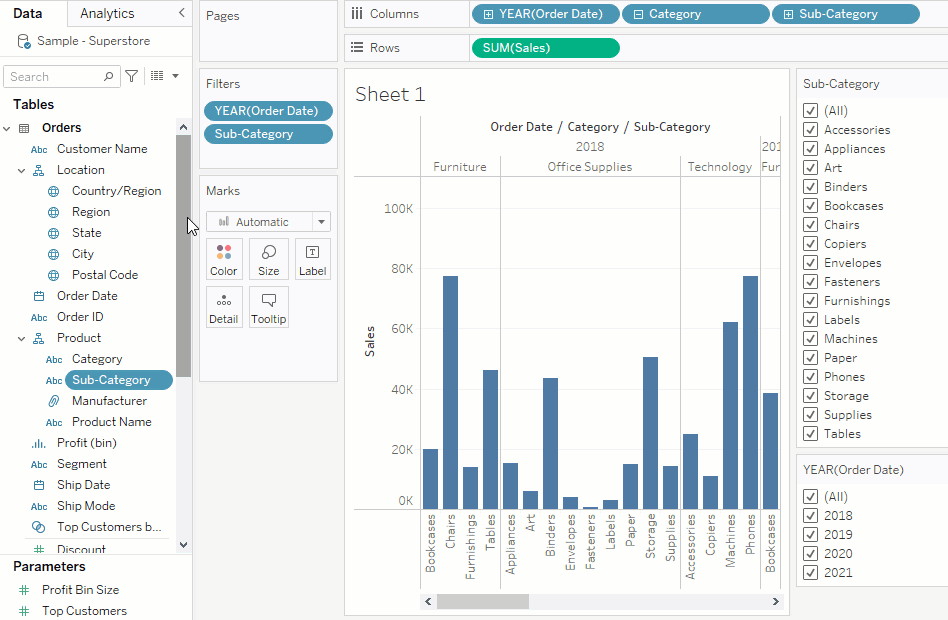

#### Encontrar información útil esencial

Como ya hemos dicho, puede explorar los datos a medida que crea vistas con Tableau Desktop. Al agregar filtros y colores, es más fácil visualizar los datos e identificar los problemas al instante.

La siguiente parada consiste en interactuar con la vista para poder empezar a extraer conclusiones.

Al examinar la vista, se dio cuenta de que algunos productos no son rentables en absoluto, pero ahora quiere comprobar si estos productos han sido poco rentables a lo largo de los años.

Es el momento de utilizar los filtros para examinarlos más de cerca.

1. En la vista, en la tarjeta de filtro Sub-Category, desactive todas las casillas de verificación excepto Bookcases, Machines y Tables.

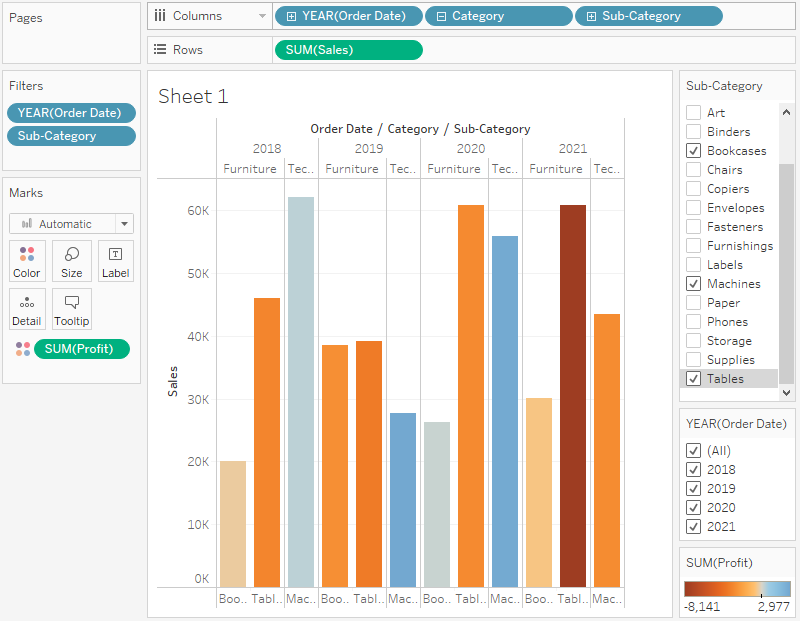

Ahora puede ver que, en algunos años, Bookcases y Machines fueron realmente rentables. Sin embargo, vemos que, recientemente, Machines han dejado de ser rentables. Aunque ha descubierto algo importante, desea recopilar información antes de proponer cualquier elemento de acción a su jefa.

Siguiendo una corazonada, decide desglosar la vista por regiones:

2. Seleccione Todo en el filtro Sub-Category para mostrar todas las categorías de nuevo.

3. Desde el panel Datos, arrastre Region al estante Filas y colóquelo a la derecha de Sum(Sales).

Tableau crea una vista con varios ejes desglosados por región.

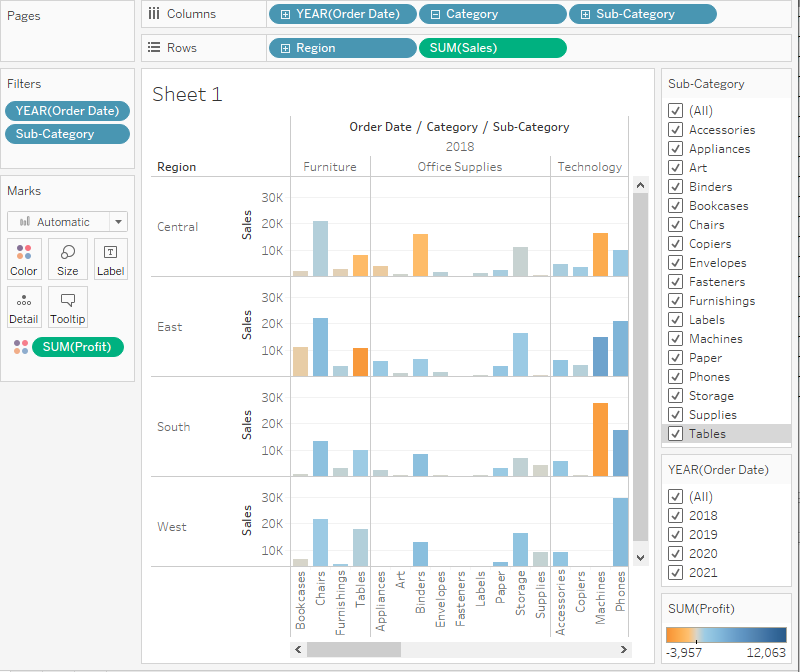

Ahora puede ver las ventas y la rentabilidad por producto para cada región. Al agregar la región a la vista y filtrar la subcategoría para que muestre solo Machines, observa que Machines en el Sur indican unas ganancias negativas más elevadas que en otras regiones de manera general. ¡Ha descubierto un dato útil que estaba oculto!

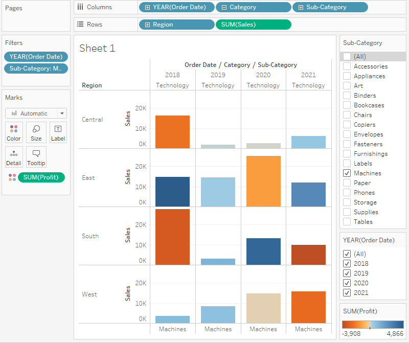

Esta vista es la que mejor resume su trabajo hasta ahora. Seleccione Todo en la tarjeta de filtro Subcategoría (si ha cambiado el filtro) para mostrar todas las subcategorías de nuevo y, a continuación, ponga un nombre a la hoja de trabajo y añada un título.

4. En la parte inferior izquierda del espacio de trabajo, haga doble clic en Hoja 1 y escriba Ventas por producto/región.

Decide centrar su análisis en South, pero no quiere perder la vista que ha creado. En Tableau Desktop, puede duplicar la hoja de trabajo para seguir trabajando donde lo dejó.

5. En el libro de trabajo, haga clic con el botón derecho en la hoja Ventas por producto/región y seleccione Duplicar.

6. Cambie el nombre de la hoja duplicada a Sales in the South.

7. En la nueva hoja de trabajo, desde el panel Datos, arrastre Region al estante Filtros para agregarlo como un filtro en la vista.

8. En el cuadro de diálogo del filtro Region, desactive todas las casillas de verificación excepto South y haga clic en Aceptar.

La vista se actualiza para tener el aspecto de la imagen siguiente.

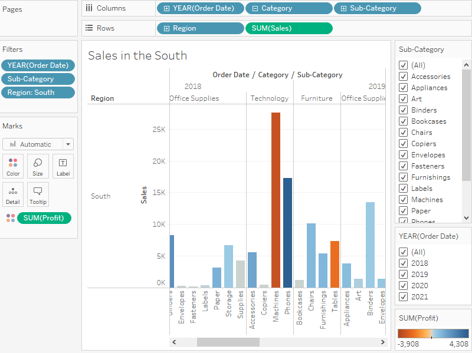

Ahora puede centrarse en las ventas y las ganancias en South. Inmediatamente se da cuenta de que las ventas de Machines tienen ganancias negativas en 2018 y de nuevo en 2021. ¡Está claro que tiene que investigar este dato!

1. Guarde su trabajo seleccionado Archivo > Guardar como. Asigne un nombre al libro de trabajo, como Regional Sales and Profits.

#### Cómo organiza Tableau los libros de trabajo guardados

Cuando instala Tableau, se crea automáticamente un directorio de carpetas en *Documentos > Mis documentos > Mi repositorio de Tableau*. Mi repositorio de Tableau contiene varias carpetas para fuentes de datos, libros de trabajo guardados, datos de geocodificación y mucho más.

#### Compruebe su trabajo. Vea "Encontrar información útil esencial" en acción

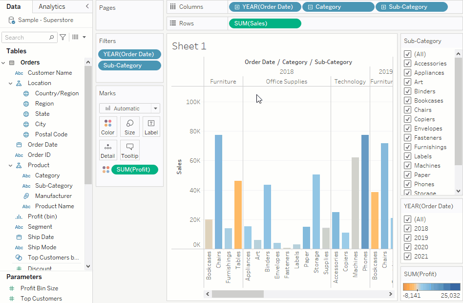

#### Resumen de los pasos

En esta tarea utilizó filtros y colores para facilitar el trabajo con los datos. También aprendió a utilizar algunas características interesantes que ofrece Tableau para responder a preguntas esenciales sobre los datos. Ha aprendido a:

- Aplicar filtros y colores para centrarse más fácilmente en aquellas áreas de los datos que más le interesan.
- Interactuar con el gráfico utilizando las herramientas que proporciona Tableau.
- Duplicar hojas de trabajo y guardar los cambios para seguir explorando los datos de distintos modos sin perder el trabajo.

Tras explorar los datos en Tableau Desktop, ha detectado algunas áreas que merecen atención. Ahora sabe que las ventas y las ganancias en la región South son un problema, pero aún no ha encontrado una solución. Le gustaría analizar otros factores que pueden contribuir a obtener estos resultados. A continuación, aprovechará otra característica esencial de Tableau para trabajar con datos geográficos.

### Tarea 2. Explorar los datos geográficamente

Ha creado una vista muy práctica que le permite revisar las ventas y las ganancias producto a producto a lo largo de varios años. Después de fijarse en las ventas de productos y en la rentabilidad de la zona South, decide buscar tendencias o patrones en esa región.

Como está buscando datos geográficos (el campo Region), tiene la opción de crear una vista de mapa. Las vistas de mapa son ideales para mostrar y analizar este tipo de información. Además, quedan genial.

Para este ejemplo, Tableau ya ha asignado funciones geográficas adecuadas a los campos Country, State, City y Postal Code. El motivo es que reconoció que cada uno de estos campos contenía datos geográficos. Puede ponerse a crear directamente la vista de mapa.

#### Conocer las funciones geográficas

Tableau reconoce una gran variedad de datos geográficos comunes (por ejemplo, nombres de estados y ciudades). Cuando Tableau reconoce este tipo de datos, asigna de forma automática las funciones geográficas adecuadas a los campos, para que se conviertan en campos geográficos.

En el panel Datos, los campos geográficos tienen iconos de globo Icono de un globo que identifica campos de datos geográficos al lado. Si se asigna una función geográfica a un campo, Tableau crea automáticamente una vista de mapa al agregar el campo a Detalle en la tarjeta Marcas. Más adelante veremos más sobre esto.

Si Tableau no reconoce los datos como geográficos, puede asignar manualmente una función geográfica a cada uno de los campos relevantes.

Hay varias funciones geográficas entre las que elegir:

- Aeropuerto
- Código de área
- CBSA/MSA
- Ciudad
- Distrito electoral
- País/región
- Provincia/Municipio/Condado
- NUTS Europa
- CC. AA./Estado/Provincia/Dpto.
- Código postal

Para verlo en acción, consulte la animación que aparece más abajo.

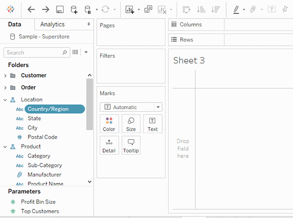

#### Crear una vista de mapa

Empiece de cero con una nueva hoja de trabajo.

1. Al final del libro de trabajo, haga clic en el icono Nueva hoja de trabajo.

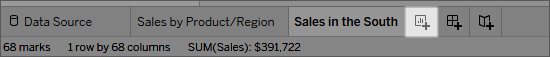

Tableau conserva la hoja de trabajo anterior y crea una nueva para que pueda continuar explorando los datos sin perder su trabajo.

2. En el panel Datos, haga doble clic en State para agregarlo a Detalle en la tarjeta Marcas.

Ya tiene una vista de mapa.

#### Hacer doble clic para agregar campos geográficos

Puede hacer doble clic en los campos para agregarlos rápidamente a la vista. Cuando hace doble clic en un campo geográfico, se agrega automáticamente a Detalles en la tarjeta Marcas, y se crea una vista de mapa con marcas para cada ubicación enumerada en el campo.

Como Tableau ya sabe que los nombres de estado son datos geográficos y la dimensión State está asignada a la función geográfica CC. AA./Estado/Provincia/Dpto., Tableau crea automáticamente una vista de mapa.

Hay una marca para cada uno de los 48 estados contiguos en la fuente de datos. (Alaska y Hawaii no están incluidos en la fuente de datos, así que se quedan fuera).

Tenga en cuenta que el campo Country también se agrega a la vista. Esto ocurre porque los campos geográficos en Muestra - Supertienda forman parte de una jerarquía. Cada nivel de la jerarquía se agrega como un nivel de detalle.

Además, los campos Latitud y Longitud se agregan a los estantes Columnas y Filas. Puede considerarlos como campos X e Y. Son esenciales para cuando quiera crear una vista de mapa, porque cada ubicación de los datos se asigna a un valor de latitud y de longitud. A veces, los campos Latitud y Longitud los genera Tableau. Otras veces, es posible que quiera incluirlos manualmente en los datos. En la Biblioteca de aprendizaje encontrará recursos para profundizar más en este tema.

Bien, una cosa es tener un interesante mapa que se centra en los 48 estados pero, ¿se acuerda de que lo que quería era saber qué ocurría en la región South?

3. Arrastre Region al estante Filtros y, después, filtre solo por South. La vista de mapa amplía la región South, donde hay una marca para cada estado (11 en total).

Ahora le gustaría ver datos más detallados para esta región, así que empieza a arrastrar otros campos a la tarjeta Marcas:

4. Arrastre la medida Sales a Color en la tarjeta Marcas.

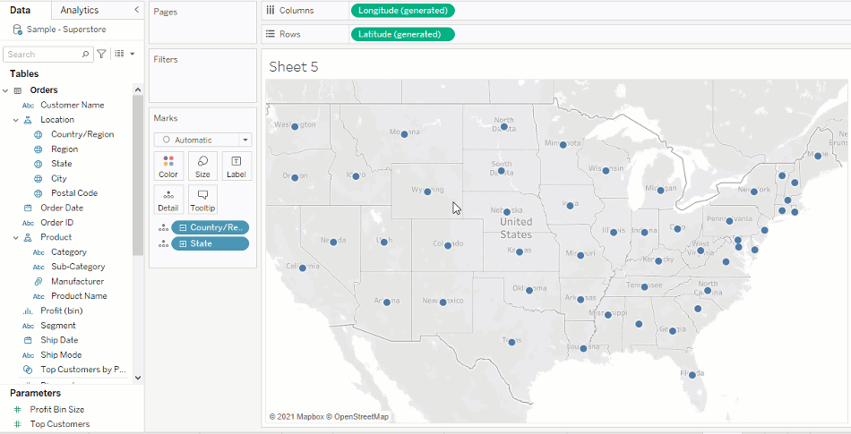

La vista se actualiza automáticamente a un mapa rellenado, donde cada estado está representado por un color según el total de ventas. Debido a que está explorando las ventas de productos, desea que sus ventas aparezcan en USD. Haga clic en el campo Sum(Sales) en el estante Columnas y seleccione Formato. En Números, seleccione Moneda.

Cada vez que añade una medida continua que contiene número positivos (por ejemplo, Ventas) a Color en la tarjeta Marcas, el mapa rellenado con datos se vuelve azul. A los valores negativos se les asigna el naranja.

Puede que en ocasiones no quiera que el mapa sea azul. Quizá prefiera el verde o piense que ciertos datos no se deben representar de color azul, como en el caso de incendios forestales o atascos. Resultaría muy confuso.

No hay problema, puede cambiar la paleta de colores como hizo antes.

5. Haga clic en Color en la tarjeta Marcas y seleccione Editar colores.

Para este ejemplo, desea saber qué estados tienen buenos resultados en ventas y cuáles no.

6. En la lista desplegable Paleta, seleccione Rojo-verde divergente y haga clic en Aceptar. Esto le permite ver rápidamente los estados que tienen peores resultados y los que tienen mejores resultados.

La vista se actualiza y tiene más o menos este aspecto:

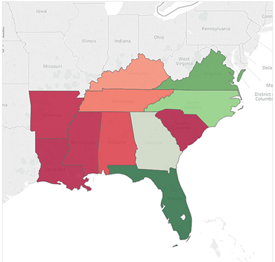

Espere un momento: ¡Todo se ha puesto en rojo! ¿Qué ha ocurrido?

Los datos son correctos y, técnicamente, puede comparar los estados con peores resultados con respecto a los que tienen buenos resultados. ¿Pero hay algo más que no sabe?

¿Realmente las ventas en estos estados son tan terribles o simplemente hay más personas en Florida que quieren comprar sus productos? Quizá en los estados que se muestran en rojo haya menos tiendas o estas sean más pequeñas. O quizá haya una mayor densidad de población en los estados que se muestran en verde, así que hay más gente para comprar los productos.

En cualquier caso, no quiere mostrar esta vista tal cual a su jefa porque no está convencido de que los datos estén transmitiendo información útil.

7. Haga clic en el icono Deshacer  de la barra de herramientas para volver a la vista azul que tanto le gustaba.

igue habiendo un problema con el color. Así todo parece perfecto, ¡ese es el problema!

A primera vista, parece que Florida es el estado con mejores resultados. Al situar el cursor sobre su marca, descubre que tiene un total de ventas de 89 474 dólares estadounidenses, comparado por ejemplo con South Carolina, cuyas ventas solo son 8482 dólares estadounidenses. Sin embargo, ¿ha resultado rentable alguno de la región South?

8. Arrastre Ganancias a Color en la tarjeta Marcas para ver si encuentra una respuesta a esta pregunta.

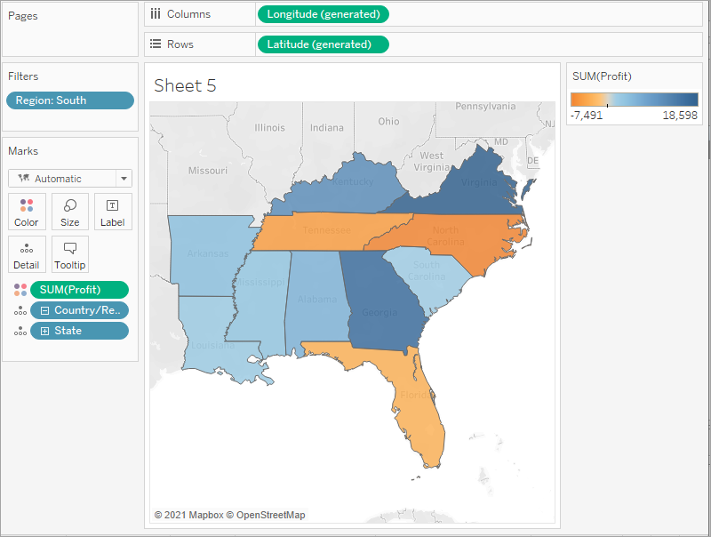

¡Así mejor! Puesto que a menudo las ganancias están formadas por valores positivos y negativos, Tableau selecciona automáticamente la paleta de colores divergentes Naranja-Azul para mostrar rápidamente los estados con ganancias negativas y con ganancias positivas.

Ahora se ve claramente que Tennessee, North Carolina y Florida tienen ganancias negativas, aunque pareciera que daban buenos resultados (incluso excelentes) en Sales. ¿Pero por qué? Encontrará la respuesta en el paso siguiente

#### Compruebe su trabajo. Vea "Crear una vista de mapa" en acción

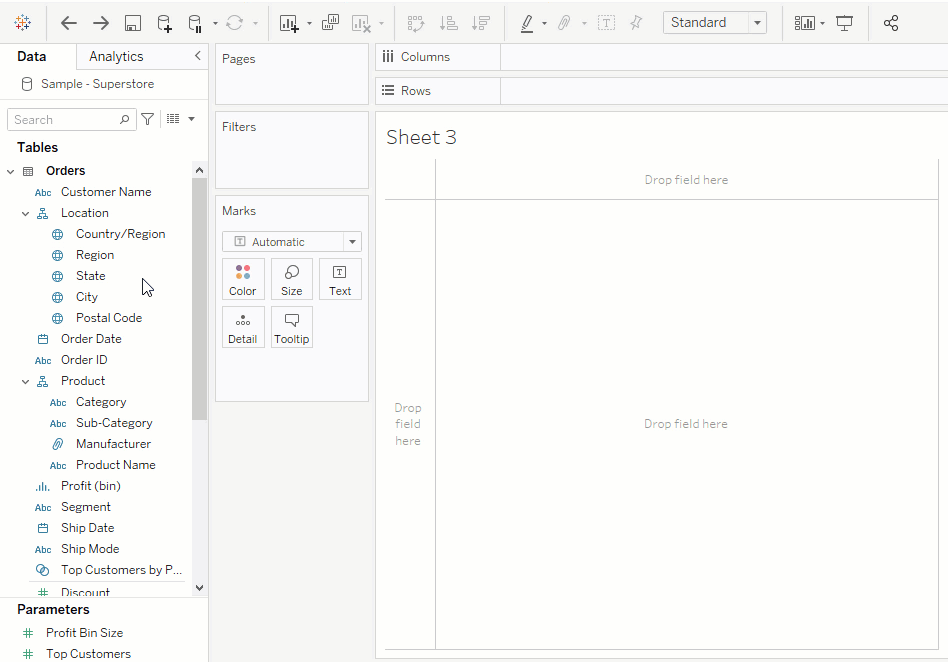

### Tarea 3. Desglosar los detalles

En el último paso, descubrió que Tennessee, North Carolina y Florida tienen ganancias negativas. Para averiguar por qué, decide profundizar aún más y centrarse en qué ocurre solo en estos tres estados.

#### Retomar por donde se quedó con la vista de mapa

Como vimos en el último paso, los mapas son estupendos para visualizar los datos de manera general. El gráfico de barras le ayudará a ir al grano. Para hacerlo, cree otra hoja de trabajo.

1. Haga doble clic en Hoja 3 y asígnele el nombre Profit Map.

2. Haga doble clic en Profit Map al final del área de trabajo y seleccione Duplicar. Asigne el nombre Negative Profit Bar Chart a la nueva hoja.

3. En la hoja de trabajo Negative Profit Bar Chart, haga clic en Mostrarme y seleccione barras horizontales.

Mostrarme destaca tipos de gráficos distintos según los datos que ha agregado a la vista.

> [!NOTE]
> Cuando lo desee, puede volver a hacer clic en Mostrarme para contraerlo.

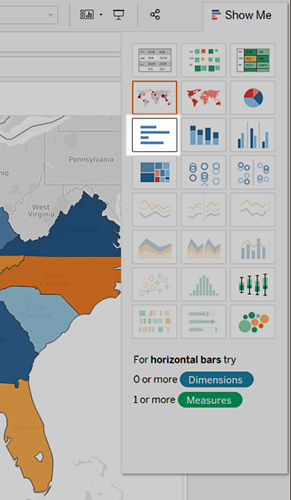

Ya vuelve a tener un gráfico de barras, así de fácil.

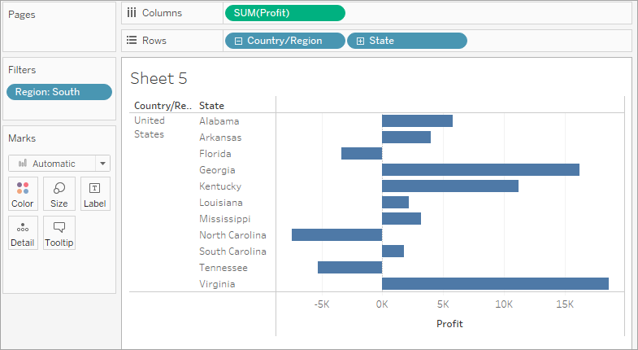

4. Para seleccionar varias barras en la izquierda, seleccione y arrastre el cursor por varias de las barras situadas entre Tennessee, North Carolina y Florida para seleccionar las barras de la izquierda. En la descripción emergente que aparece, seleccione Mantener solamente para centrarse en estos tres estados.

> [!NOTE]
> también puede hacer clic con el botón derecho en las barras destacadas y seleccionar Mantener solamente.

Tenga en cuenta que el campo Inclusiones para State se agrega al estante Filtros para indicar que ciertos estados están filtrados en la vista. El icono con dos círculos en el campo indica que este campo es un conjunto. Puede editarlo haciendo clic con el botón derecho en el campo en el estante Filtros y seleccionando Editar filtro.

Ahora quiere ver los datos de las ciudades en estos estados.

5. En el estante Filas, haga clic en el icono de suma en el campo State para desglosar al nivel de detalle City.

Aquí hay demasiada información, así que decide filtrar la vista a las ciudades con las ganancias más negativas usando un filtro Top N.

#### Compruebe su trabajo. Vea los pasos del 1 al 5 en acción

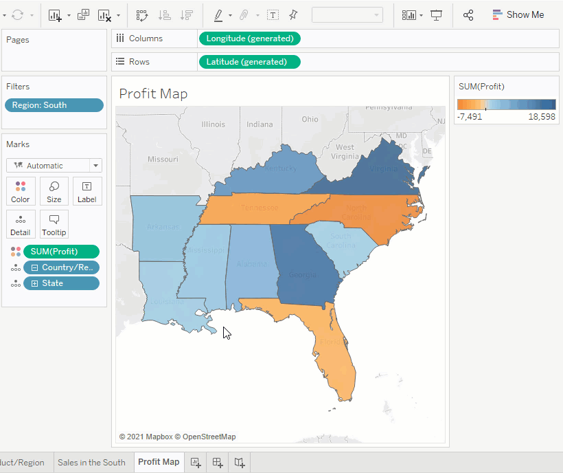

#### Crear un filtro N superior

Puede utilizar un filtro N superior en Tableau Desktop para establecer un límite para el número de marcas que se muestran en la vista. En este caso, desea utilizar el filtro N superior para centrarse en los que tienen menos ganancias.

1. En el panel Datos, arrastre City al estante Filtros.

2. En el cuadro de diálogo Filtro, seleccione la pestaña Superior y haga lo siguiente:

- Haga clic en *Por campo*.
- Haga clic en la lista desplegable *Superior* y seleccione *Inferior* para mostrar los que obtuvieron menos ganancias.
- Escriba *5* en el cuadro de texto para mostrar los 5 con peores resultados en el conjunto de datos.

Tableau Desktop ya ha seleccionado un campo (Profit) y agregación (Suma) para el filtro N superior según los campos de la vista. Esta configuración garantiza que la vista mostrará solo las cinco ciudades con peor rendimiento por suma de ganancias.

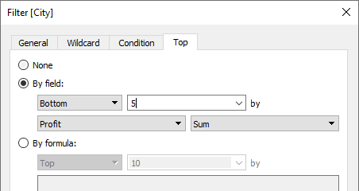

- Haga clic en Aceptar.

¿Qué pasó con el gráfico de barras y por qué está en blanco? Se trata de una buena pregunta y de una buena oportunidad para presentar el orden de las operaciones en Tableau.

El orden de las operaciones en Tableau, también conocido como proceso de consulta, es el orden en que Tableau realiza las distintas acciones, como el orden en que aplica los filtros del usuario a la vista.

Tableau aplica los filtros en el siguiente orden:

- Filtros de extracciones
- Filtros de fuentes de datos
- Filtros de contexto
- Filtros de N primeros
- Filtros de dimensión
- Filtros de medidas

El orden en el que cree los filtros o en el que los organice en el estante Filtros no modifica el orden en el que Tableau los aplica en su vista.

Lo bueno es que puede indicarle a Tableau que cambie este orden cuando detecte que algo extraño está sucediendo a los filtros de la vista. En este ejemplo, el filtro Top N se aplica a las cinco ciudades con peor rendimiento por suma de ganancias para todo el mapa, pero ninguna de esas ciudades está en el sur, por lo que el gráfico está en blanco.

Para arreglar el gráfico, agregue un filtro al contexto. Esto indicará a Tableau que filtre primero ese campo, con independencia de si se ajusta al orden de operaciones.

Pero, ¿qué campo agrega al contexto? Hay tres campos en el estante Filtros: Región (filtro de dimensión), Ciudad (filtro de N primeros) e Inclusiones (País, Estado) (País, Estado) (conjunto).

Si vuelve a observar el orden de operaciones, sabrá que el conjunto y el filtro de N primeros se están aplicando antes que el filtro de dimensión. ¿Pero sabe si el filtro de los N primeros o el filtro de conjunto se ha aplicado primero? Vamos a verlo.

3. En el estante Filtros, haga clic con el botón derecho en el campo Ciudad y seleccione Agregar a contexto.

El campo Ciudad se atenúa y pasa a la parte superior del estante Filtros, pero en la vista no cambia nada. Por lo que, incluso aunque esté forzando a Tableau a filtrar primero por Ciudad, el problema no se resuelve.

4. Haga clic en Deshacer.

5. En el estante Filtros, haga clic con el botón derecho en el conjunto Inclusiones (País, Estado) (País, Estado) y seleccione Agregar a contexto

El conjunto Inclusiones (País, Estado) (País, Estado) se atenúa y pasa al principio del estante Filtros. ¡Y las barras vuelven a la vista!

Va por buen camino. Pero hay seis ciudades, incluida Jacksonville y Carolina del Norte, que tienen una ganancia positiva. ¿Por qué aparece en la vista una ciudad con ganancias positivas si ha creado un filtro que se supone que debía eliminarla de la vista?

Jacksonville (Carolina del Norte) se ha incluido porque Ciudad es el nivel de detalle mínimo que se muestra en la vista. Para que Tableau Desktop conozca la diferencia entre Jacksonville (Carolina del Norte) y Jacksonville (Florida), necesita profundizar al siguiente nivel de detalle en la jerarquía de ubicación que, en este caso, es Postal Code. Después de añadir este nivel de detalle, puede excluir Jacksonville de North Carolina sin tener que excluir Jacksonville de Florida.

6. En el estante Filas, haga clic en el icono de suma en City para profundizar al nivel de detalle Postal Code.

7. Haga clic con el botón derecho en el código postal para Jacksonville (Carolina del Norte) 28540 y seleccione Excluir.

Postal Code se agrega al estante Filtros para indicar que algunos miembros del campo Postal Code se han filtrado de la vista. Aunque se elimine el campo Postal Code de la vista, el filtro permanecerá.

8. Arrastre Postal Code fuera del estante Filas.

La vista se actualiza y tiene más o menos este aspecto:

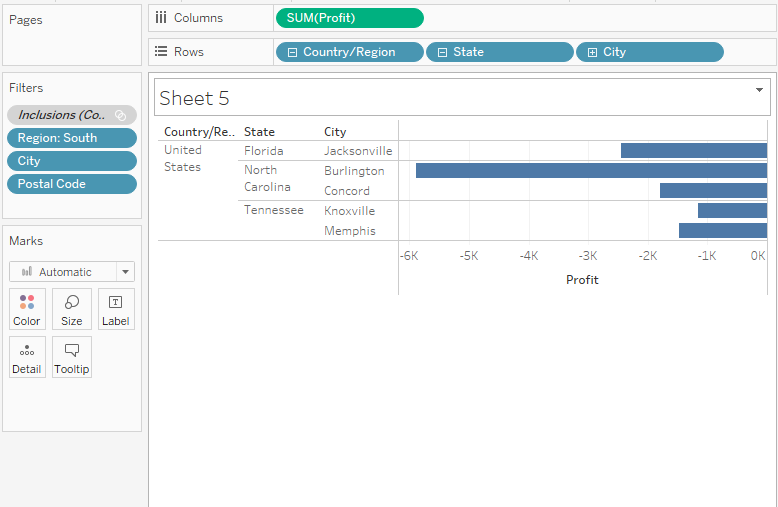

#### Compruebe su trabajo. Vea los pasos del 1 al 8 en acción

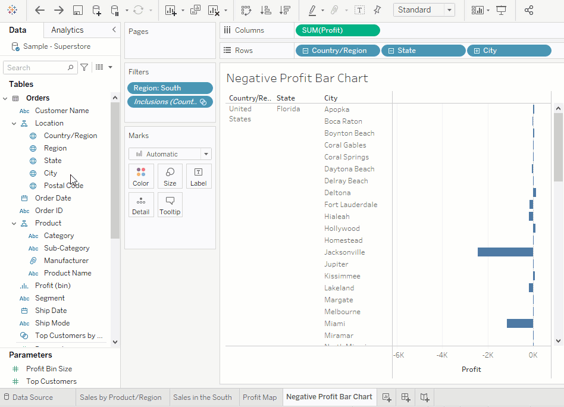

#### Identificar los menos rentables

Decide desglosar la vista por Sub-Category para identificar los productos que están mermando las ganancias. Como sabe que el campo Sub-Category contiene información sobre los productos vendidos por ubicación, decide comenzar ahí.

1. Arrastre Sub-Category al estante Filas y colóquelo a la derecha de City.

2. Arrastre Profit a Color en la tarjeta Marcas para que resulte más fácil ver qué productos tienen ganancias negativas.

3. En el panel Datos, haga clic con el botón derecho en Order Date y seleccione Mostrar filtro.

Ahora, si lo desea, puede explorar los beneficios negativos para cada año y detectar rápidamente los productos que están perdiendo dinero.

Parece que Machines, Tables y Binders no están dando buenos resultados. Así que, ¿qué tal si deja de vender esos artículos en Jacksonville, Concord, Burlington, Knoxville y Memphis?

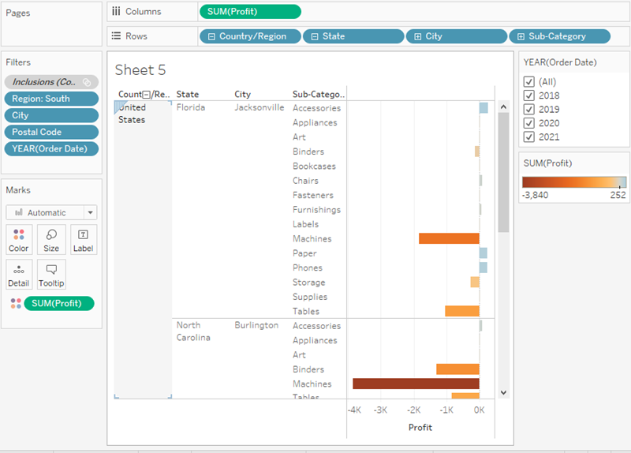

#### Comprobar los hallazgos

Si se elimina Binders, Machines y Tables, ¿mejorarán las ganancias en Florida, North Carolina y Tennessee? Para averiguarlo, puede filtrar los productos que dan problemas para ver qué ocurre.

1. Vuelva a la vista de mapa haciendo clic en la pestaña de la hoja Profit Map.

2. En el panel Datos, haga clic con el botón derecho en Sub-Category y seleccione Mostrar filtro.

Junto a la vista de mapa se muestra una tarjeta de filtro para todos los productos que ofrece. Utilizará este filtro más tarde.

3. En el panel Datos, arrastre Profit y Profit Ratio a Etiqueta en la tarjeta Marcas. Para dar formato a la Relación de beneficios como porcentaje, haga clic con el botón derecho en Relación de beneficios y seleccione Formato. Luego, para Números predeterminados, elija Porcentaje y establezca el número de lugares decimales que desea que se muestren en el mapa. Para este mapa, elegiremos cero lugares decimales.

Ahora puede ver las ganancias exactas de cada estado sin tener que situar el cursor sobre ellos.

4. En el panel Datos, haga clic con el botón derecho en Order Date y seleccione Mostrar filtro para proporcionar algo de contexto a la vista.

Se muestra una tarjeta de filtro para YEAR(Order Date) en la vista. Ya puede ver las ganancias de todos los años o de una combinación de años. Esto puede resultar útil para la presentación.

5. Borre Binders, Machines y Tables de la lista en la tarjeta de filtro Sub-Category en la vista.

No olvide que al agregar filtros a la vista, podrá incluir y excluir valores para destacar ciertos elementos de los datos.

Después de eliminar cada miembro, mejoran las ganancias para Tennessee, North Carolina y Florida hasta que, finalmente, cada estado tiene ganancias positivas.

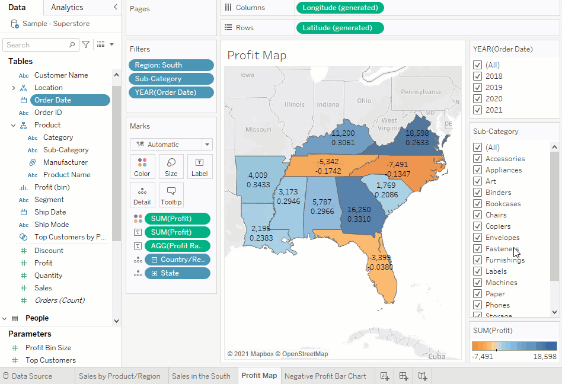

Este descubrimiento es muy interesante.

Binders, Machines y Tables son definitivamente los responsables de las pérdidas en Tennessee, North Carolina y Florida, pero no en el resto de la región South. ¿Ha notado cómo las ganancias disminuyen en realidad para otros estados cuando borra artículos de la tarjeta de filtro? Si, por ejemplo, conmuta Binders (Carpetas) en la tarjeta de filtro Subcategoría, las ganancias caen un cuatro por ciento en Arkansas. Puede deducir que las carpetas son rentables en Arkansas.

Desea compartir este hallazgo con su equipo y para ello quiere que sigan los mismos pasos hechos por usted.

6. Seleccione (Todos) en la tarjeta de filtro Sub-Category para incluir todos los productos de nuevo.

Ha averiguado que Binders, Machines y Tables son los responsables de las ganancias negativas en Tennessee, North Carolina y Florida. ¿Y ahora qué?

Puede seguir explorando los datos respondiendo a las preguntas de abajo. Nota: Si usa la vista para explorar estas preguntas, deshaga cualquier cambio antes de continuar con el tutorial Introducción.

- ¿Cómo son las ventas de Machines en Tennessee, North Carolina y Florida? ¿Se está vendiendo mucho? En ese caso, ¿cómo afectan a las ganancias?
- ¿Qué otros factores pueden estar contribuyendo a estos resultados? ¿Los minoristas de la región South están vendiendo productos con descuento?
- ¿Qué ocurre con las ventas de Tables y Binders?
- ¿Qué ocurre con las ventas en Jacksonville, Miami, Burlington, Knoxville y Memphis cuando quitamos Machines, Tables o Binders?
- ¿Y qué ocurre con Bookcases? Recuerde que en el paso 2 vimos que Bookcases no era nada rentable en otras regiones. Si profundiza en esas regiones, podrá descubrir otras soluciones.

#### Compruebe su trabajo. Vea "Comprobar los hallazgos" en acción

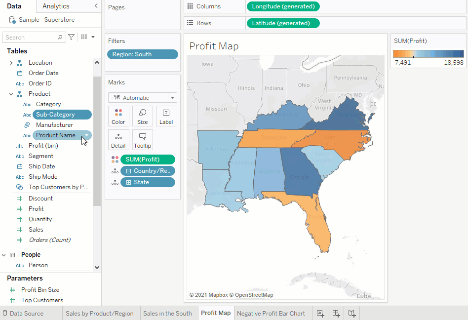

Ya sabe que Machines, Tables y Binders son productos problemáticos para su empresa. Al centrarse en el sur, comprueba que estos productos tienen un impacto variable en las ganancias. Puede que merezca la pena comentar esto con su jefa.

A continuación, recopilará el trabajo que ha realizado hasta ahora en un dashboard para poder presentar sus hallazgos de manera clara.
