# Práctica 4. Dashboards e historias

## Objetivos
Al finalizar la práctica, serás capaz de:
- Diseñar dashboards efectivos.
- Añadir interactividad a los dashboards.
- Crear historias en Tableau.

## Objetivo visual 

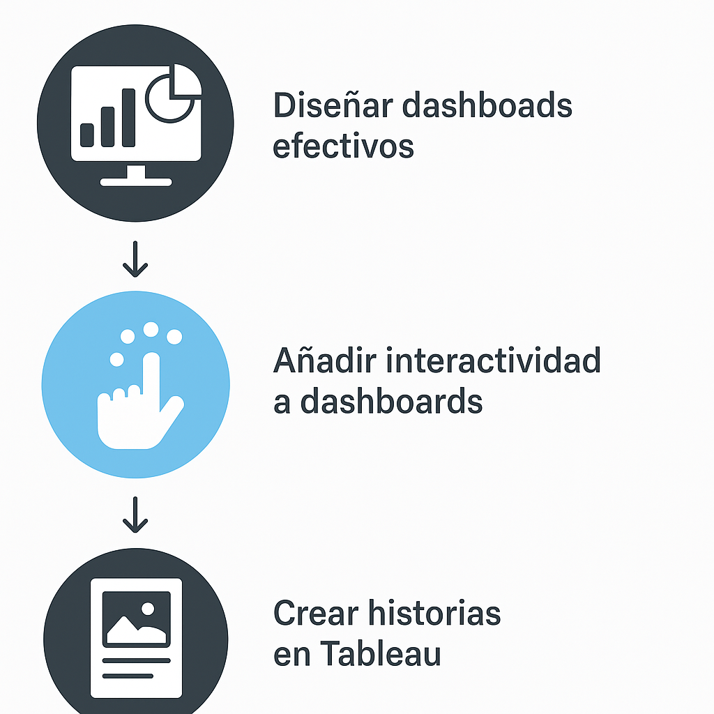

## Duración estimada
- 60 minutos.

## Instrucciones 

### Tarea 1. Crear un dashboard para mostrar información

Has creado cuatro hojas de trabajo y están transmitiendo información importante que tu jefa debe conocer. Ahora necesitass una forma de mostrar las ganancias negativas en Tennessee, Carolina del Norte y Florida y explicar las razones por las que las ganancias son bajas.

Para hacerlo, puedes utilizar dashboards para mostrar varias hojas de trabajo a la vez y, si lo deseas, hacer que interactúen entre sí.

#### Configurar el dashboard

1. Haz clic en el botón `Nuevo dashboard`.

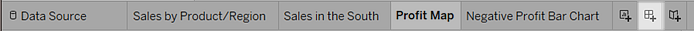

2. En el panel `Dashboard` de la izquierda, verás las hojas que creaste. Arrastra `Sales in the South` al dashboard vacío.

3. Arrastra `Profit Map` al dashboard y suéltalo encima de la vista `Sales in the South`.

La vista se actualizará para tener este aspecto:

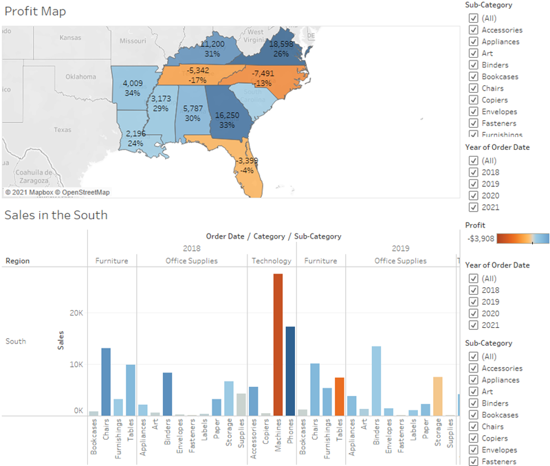

Ahora se pueden observar las dos vistas a la vez.

Sin embargo, el gráfico de barras tiene un aspecto confuso, lo cual no ayuda a que tu jefa comprenda los datos.

#### Organizar el dashboard

No resulta fácil ver los detalles de cada elemento de `Sub-Category` desde el gráfico de barras `Sales in the South` (Ventas del sur). Además, como tienes el mapa en la vista, probablemente tampoco necesites la columna de la región `South` (Sur) en `Sales in the South.

La resolución de estos problemas aportará más espacio para transmitir la información que necesitass.

1. En `Sales in the South` , haz clic con el botón derecho en el área de la columna situada debajo del encabezado de columna `Región` y desmarca `Mostrar encabezado`.

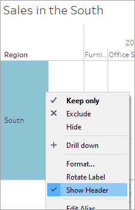

2. Repite este proceso para el encabezado de filas `Categoría`.

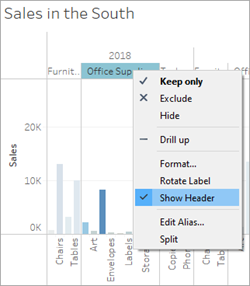

Ahora has ocultado del dashboard las columnas y filas que no necesitas, a la vez que conservas el desglose de los datos. El espacio adicional hace que sea más fácil ver los datos en el dashboard, pero puede mejorar aún más.

3. Haz clic con el botón derecho en el título `Profit Map` y selecciona `Ocultar título`.

El título `Profit Map` desaparece del dashboard, lo que aporta más espacio.

3. Repite este paso para el título de la vista `Sales in the South` .

5. Selecciona la primera tarjeta de filtro `Sub-Category` a la derecha de la vista y, en la parte superior de la tarjeta, haz clic en el icono Eliminar (  ).

6. Repite este paso para la segunda tarjeta de filtro `Sub-Category` y para una de las tarjetas de filtro `Año de fecha de pedido`.

7. Haz clic en la leyenda de color de `Ganancias` y arrástrala desde el extremo derecho al extremo inferior de `Sales in the South`.

8. Por último, selecciona el filtro `Año de fecha de pedido` restante, haz clic en la flecha desplegable correspondiente y selecciona `Flotante`. Colócalo en el espacio blanco de la vista de mapa. En este ejemplo, estáen el lado de la costa este, en el océano Atlántico.

Intenta seleccionar años distintos en el filtro `Year of Order Date`. Los datos se filtran rápidamente para mostrar que el rendimiento del estado varía según el año. Así está bien, pero podrías cambiarlo para que sea más fácil compararlo.

9. Haz clic en la flecha desplegable de la parte superior del filtro `Year of Order Date` y selecciona `Valor individual` (barra deslizante).

La vista se actualiza y tiene más o menos este aspecto: 

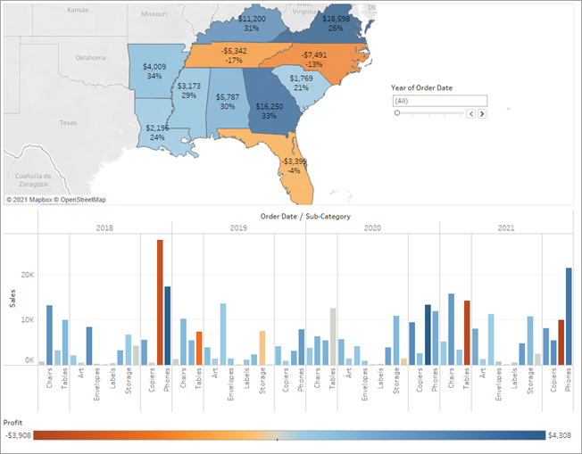

#### Diferenciar objetos flotantes frente a objetos en mosaico en un dashboard

Los objetos de un dashboard se pueden establecer en `Mosaico` o `Flotante`.

Los elementos en mosaico cambian de tamaño automáticamente para adaptarse a la zona donde son arrastrados. Los elementos flotantes se pueden mover y cambiar de tamaño libremente desde otros objetos del dashboard. Si lo deseas, puedes incluso tener elementos flotantes y en mosaico en el mismo dashboard.

¡Ahora el dashboard tiene un aspecto espectacular! Puedes comparar fácilmente las ganancias y las ventas por año. Se parece bastante a un par de imágenes en una presentación de diapositivas y ¡estás utilizando Tableau! Puedes hacer el dashboard más atractivo

#### Revisa tu avance: observa "Organizar el dashboard" en acción

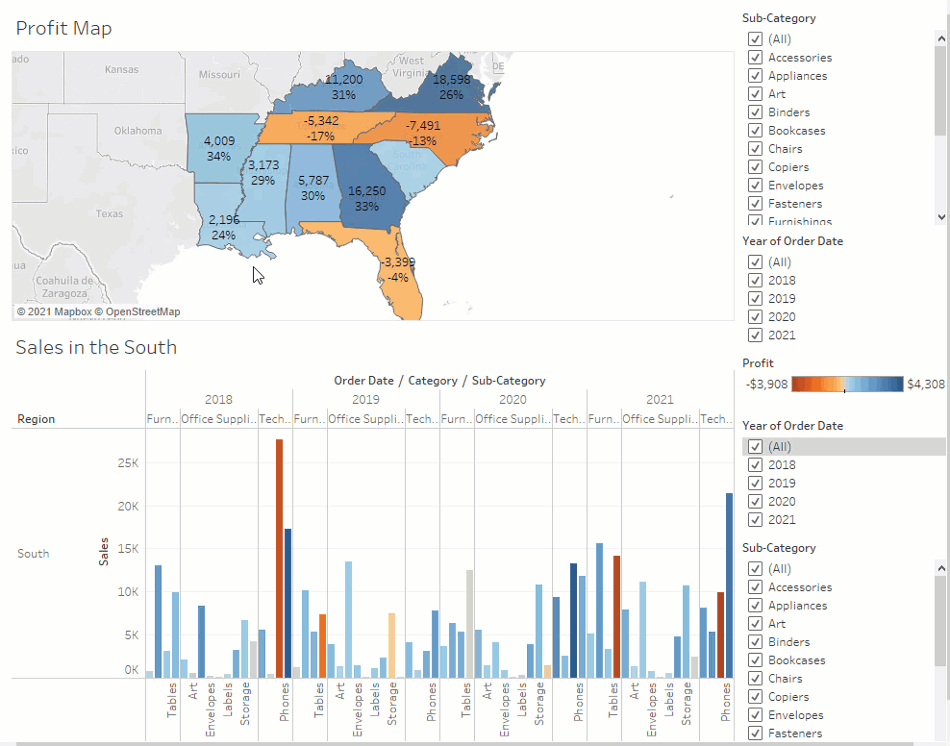

#### Añadir interactividad

¿No sería genial si pudieras ver qué subcategorías son rentables en determinados estados?

1. Selecciona `Profit Map` en el dashboard y haz clic en el icono `Usar como filtro` (), situado en la esquina superior derecha.

2. Selecciona un estado dentro de la región sur del mapa.

El gráfico de barras `Sales in the South`  se actualiza automáticamente y muestra solo las ventas por subcategoría del estado seleccionado. De esta manera, puedes darle un vistazo a qué subcategorías son rentables.

3. Haz clic en un área del mapa que no sean los estados del sur coloreados para borrar tu selección.

También es recomendable que los lectores puedan ver el cambio en ganancias según la fecha del pedido.

4. Selecciona el filtro `Año de fecha de pedido`, haz clic en la flecha desplegable correspondiente y selecciona `Aplicar a las hojas de trabajo > Hojas de trabajo seleccionadas`.

5. En el cuadro de diálogo `Aplicar filtro a las hojas de trabajo`, selecciona `Todo` en el dashboard y, a continuación, haz clic en `Aceptar`.

Esta opción indica a Tableau que aplique el filtro a todas las hojas de trabajo del dashboard que utilicen la misma fuente de datos.

Explora el rendimiento del estado según el año con el nuevo dashboard interactivo.

#### Revisa tu avance: observa "Agregar interactividad" en acción

En este ejemplo, filtra `Sales in the South` para que solo se muestren los artículos vendidos en North Carolina y explora las ganancias año por año.

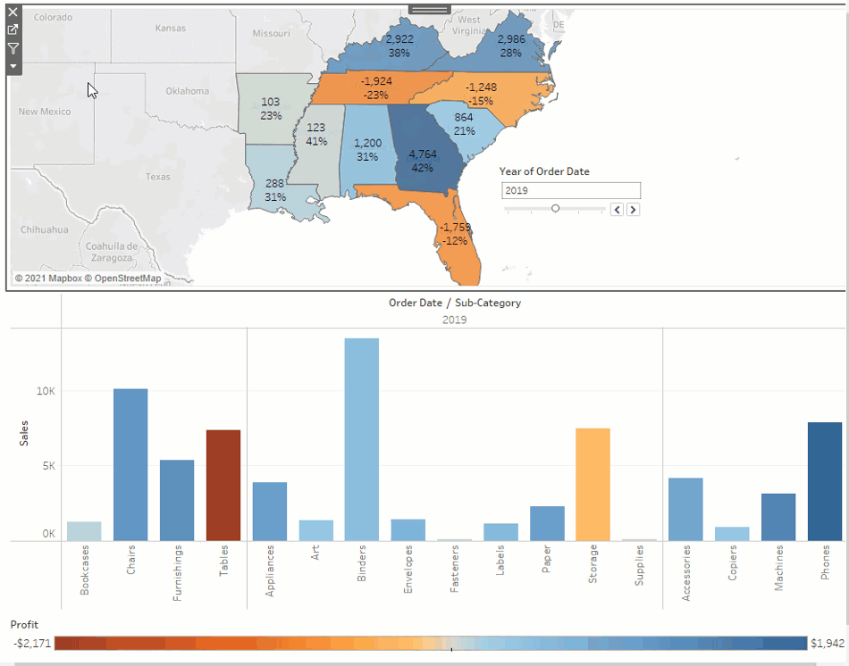

#### Cambiar nombre y listo

Cuando le muestras el dashboard a tu jefa, le encanta. Lo nombra "Ventas regionales y ganancias" y tú hace lo mismo haciendo doble clic en la pestaña `Dashboard 1` y escribiendo `Ventas regionales y ganancias`.

En sus investigaciones, tu jefa también detecta que la decisión de introducir máquinas en el mercado de North Carolina en 2021 fue una mala idea.

Su jefa se alegra de tener este dashboard en el que puede explorar la información, pero además te pide que crees un plan de acción claro al resto del equipo y una presentación con tus hallazgos.

Menos mal que conoces las historias de Tableau.

### Tarea 2. Crear una historia para presentarla.

Quieres compartir tus hallazgos con el resto del equipo. Es posible que, juntos, reconsideren la venta de `Machines` en North Carolina.

En lugar de tener que adivinar qué información útil le interesa al equipo e incluirla en una presentación, crea una historia en Tableau. De este modo, puedes explicar a los miembros del equipo el proceso con el que has descubierto los datos y tendrá la opción de explorar interactivamente los datos para responder a cualquier pregunta que planteen durante la presentación.

#### Crear el primer punto de la historia

Para la presentación, empieza con una introducción.

1. Haz clic en el botón `Nueva historia`.

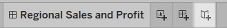

Se muestra un espacio con el siguiente mensaje: `Arrastra una hoja aquí`. Aquí crearás el primer punto de la historia.

Las historias en blanco se parecen mucho a los dashboards en blanco y, como un dashboard, puedes arrastrar hojas de trabajo para presentarlas. También puedes arrastrar dashboards para presentarlos en la historia.

2. En el panel `Historia`, arrastra la hoja de trabajo `Sales in the South` a la vista.

3. Agrega un subtítulo, como `Sales and profit by year`. Para hacerlo, edita el texto en el cuadro gris situado sobre la hoja de trabajo.

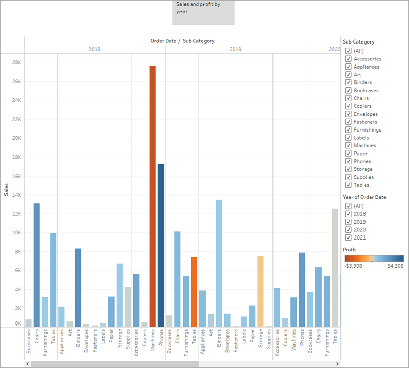

Este punto de la historia será una forma útil de poner al corriente a los asistentes.

Recuerda que quieres contar una historia sobre la venta de `Machines` en North Carolina, así que es el momento de centrarse en esos datos.

#### Resaltar las ventas de `Machines`

Para llegar hasta `Machines`, puedes aprovechar el filtro `Sub-Category` que se incluye en el gráfico de barras `Sales in the South`.

1. En el panel `Historia`, haz clic en `Duplicar` para duplicar el primer subtítulo.

Siga trabajando donde te quedaste: no olvides que el primer punto de la historia será exactamente como lo dejaste.

2. Puesto que contarás una historia sobre `Machines`, en el filtro `Sub-Category`, desactiva la selección para `Todos` y selecciona `Machines`.

Ahora los asistentes pueden identificar rápidamente las ventas y las ganancias de `Machines` por año.

3. Agrega un subtítulo para destacar lo que ven los asistentes, como, por ejemplo, `Machine sales and profit by year`.

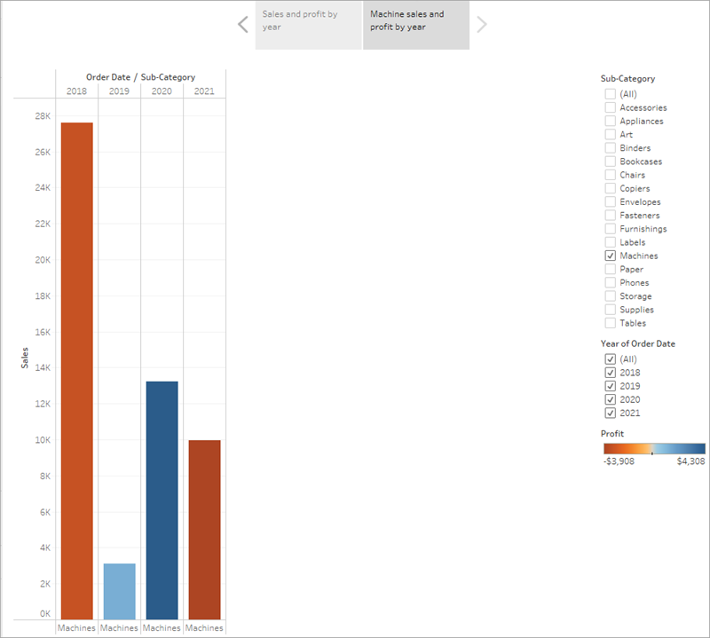

Has cambiado el foco hacia Machines correctamente, pero notas algo extraño: en esta vista puedes identificar qué estado contribuye más a la pérdida.
Resuelve esto en el siguiente punto de la historia incorporando el mapa.

####  ¿Qué es esta barra de herramientas pequeña que aparece bajo el subtítulo del punto de la historia?

La barra de herramientas `Historia` 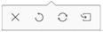 aparece por encima o por debajo del subtítulo del punto de la historia una vez que arrastres el primer punto de la historia en el lienzo y pases el ratón sobre el área del navegador. Úsala para revertir cambios, aplicar las actualizaciones pertinentes a un punto de la historia, eliminar un punto de la historia o crear uno a partir del punto de la historia personalizado actual. Todas las opciones están disponibles una vez que realices un cambio en el punto de la historia. De lo contrario, solo está disponible la opción de supresión.

#### Revisa tu avance: observa `Crear el primer punto de la historia` y `Destacar las ventas de máquinas` en acción.

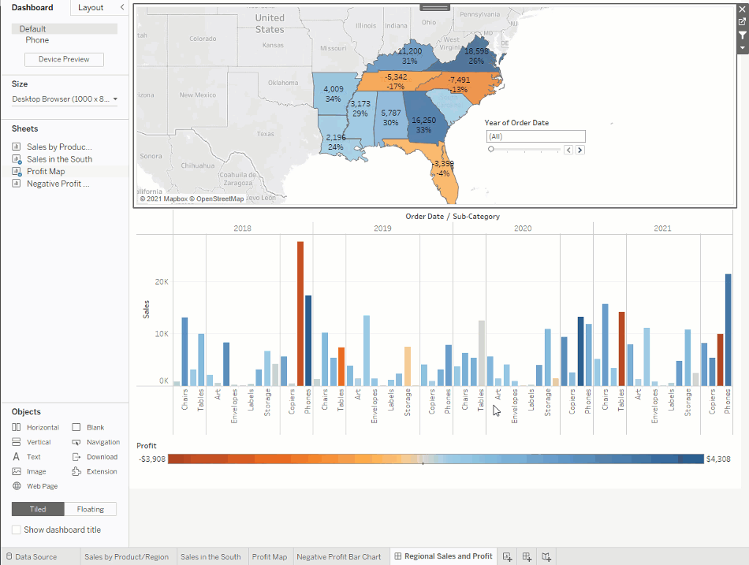

#### Argumentar el idea

La conclusión es que `Machines` en Carolina del Norte pierden dinero para tu empresa. Has descubierto esto en el dashboard que has creado. Solo con ver las ventas generales y las ganancias por año no se puede demostrar este argumento, pero las ganancias regionales sí que pueden.

1. En el panel `Historia`, selecciona `En blanco`. Después, arrastra el dashboard `Regional Sales and Profit` (Ventas y ganancias regionales) al lienzo.

Esto ofrece a los asistentes una nueva perspectiva de sus datos: las ganancias negativas captan el atención.

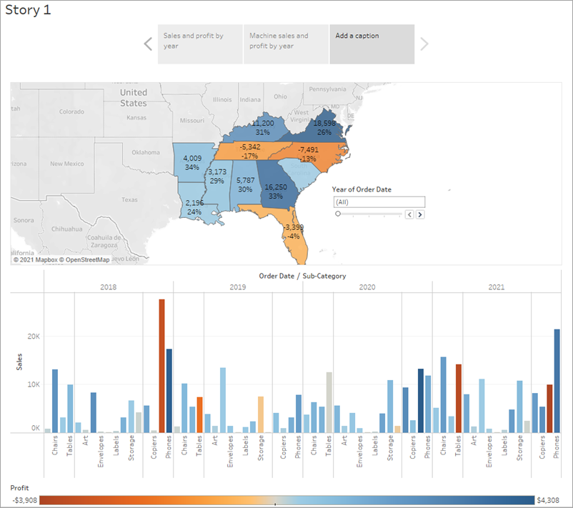

2. Agrega un subtítulo, como `Underperforming items in the South`.

Para restringir los resultados solo a North Carolina, empieza con un punto de la historia duplicado.

- Selecciona `Duplicar` para crear otro punto de la historia con el dashboard `Regional Profits`.
- Selecciona North Carolina en el mapa y observa que el gráfico de barras se actualiza automáticamente.
- Selecciona `Todo` en la tarjeta de filtro `Año de fecha de pedido`.
- Añade un subtítulo, por ejemplo `Profit in North Carolina, 2018-2021` (beneficios en Carolina del Norte 2018-2021).

Ahora puedes mostrar a los asistentes los cambios en las ganancias producidos al año en North Carolina. Para hacerlo, crea cuatro puntos de la historia:

- Selecciona `Duplicar` para empezar con el dashboard `Regional Profit` centrado en North Carolina.
- En el filtro `Año de fecha de pedido`, haz clic en el botón de flecha derecha para que aparezca 2018.
- Añade un subtítulo, por ejemplo `Profit in North Carolina, 2018`, y haz clic en `Duplicar`.
- Repite los pasos 2 y 3 para los años 2019, 2020 y 2021.

Ahora los asistentes se harán una idea de qué productos se introdujeron en el mercado de North Carolina y cuál fue el rentabilidad en el tiempo.

#### Revisa tu avance: observa `Argumentar la idea` en acción.

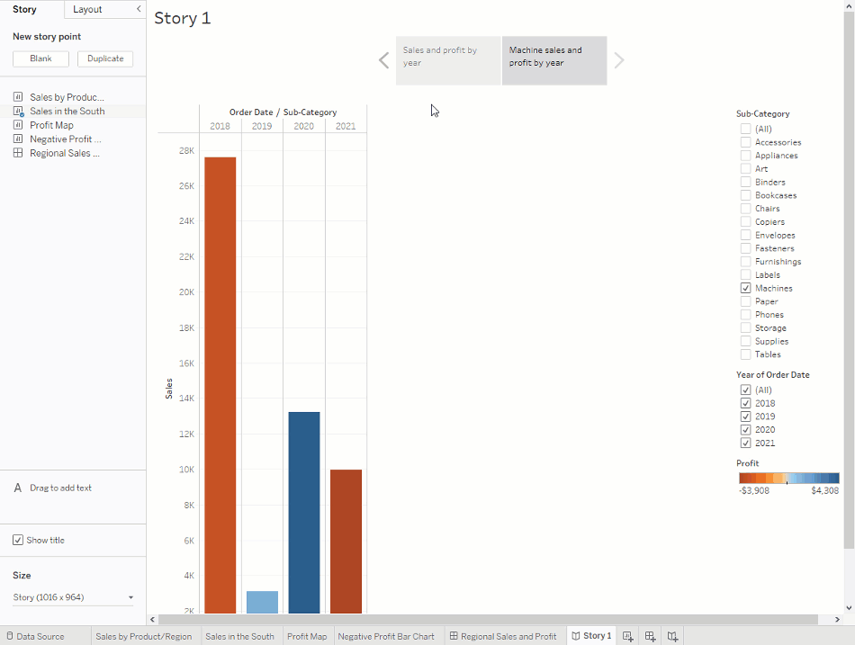

#### Retoques finales

En este punto de la historia, centrada en los datos de 2021, describe tus hallazgos. Agrega más detalles que solo un título.

1. En el panel de la izquierda, selecciona `Arrastrar` para añadir texto y arrástralo a la vista.

2. Introduce una descripción para el dashboard donde se enfatice el mal rendimiento de `Machines` de North Carolina, por ejemplo, "La presentación de `Machines` en el mercado de Carolina del Norte en 2021 ha provocado pérdidas de una cantidad significativa de dinero".

Para un efecto dramático, puedes situar el cursor sobre `Machines` en el gráfico de barras `Sales in the South` (Ventas en el sur) durante la presentación, para mostrar una descripción emergente útil: la pérdida de casi 4000 dólares estadounidenses.

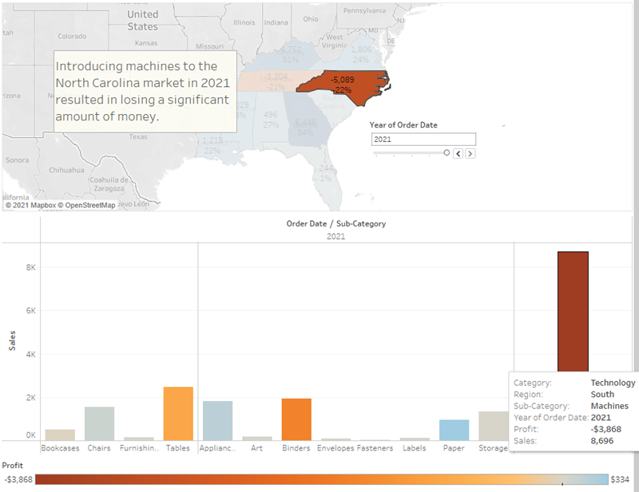

Y, ahora, para la última diapositiva, profundiza en los detalles.

3. En el panel `Historia`, haz clic en `En blanco`.

4. En el panel `Historia`, arastra `Gráfico de barras de ganancias negativas` a la vista.

5. En la tarjeta de filtro `Año de fecha de pedido`, filtra la vista solo hasta 2021.

Ahora verás fácilmente que la pérdida de ganancias por `Machines` procedía exclusivamente de Burlington, Carolina del Norte.

6. En la vista, haz clic con el botón derecho en la marca Burlington (la barra) y selecciona `Anotar > Marca`.

7. En el cuadro de diálogo `Editar anotación`, elimina el texto de relleno y escribe: "Las máquinas de Burlington supusieron unas pérdidas de casi 4000 dólares estadounidenses en 2021".
Haz clic en `Aceptar`.

8. En la vista, haz clic en la anotación y arrástrala para ajustarla donde aparezca.

9. Asigna a este punto de la historia el subtítulo: "¿Dónde esta perdiendo ganancias de máquinas en Carolina del Norte?"

10. Haz doble clic en la pestaña `Historia 1` y cambia el nombre a la historia, como "Mejorar las ganancias en el sur".

11. Revisa la historia (selecciona `Ventana > Modo de presentación`).

#### Ajusta al tamaño

¿Qué son las barras de desplazamiento que aparecen en la parte derecha o en la parte inferior del punto de la historia del dashboard mientras está en el modo de presentación?

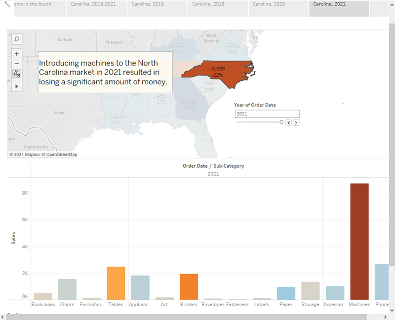

Parece que el dashboard es demasiado grande para la presentación. Presiona la tecla `Esc` para salir de la presentación y, a continuación, selecciona la hoja `Ganancias regionales` en la parte inferior del libro de trabajo.

En el panel izquierdo, debajo de `Dashboard`, cambia la selección de la lista desplegable `Tamaño de escritorio` a `Ajustar para mejorar las ganancias en el sur`. De esta forma, se cambiará automáticamente el tamaño del dashboard para visualizar la historia de forma óptima.

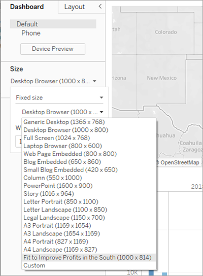

Selecciona `Ajustar para mejorar las ganancias en el sur` y después vuelve a activar el modo de presentación. Se ajustará correctamente el tamaño del dashboard.

#### Revisa tu avance: observa "Retoques finales" en acción.

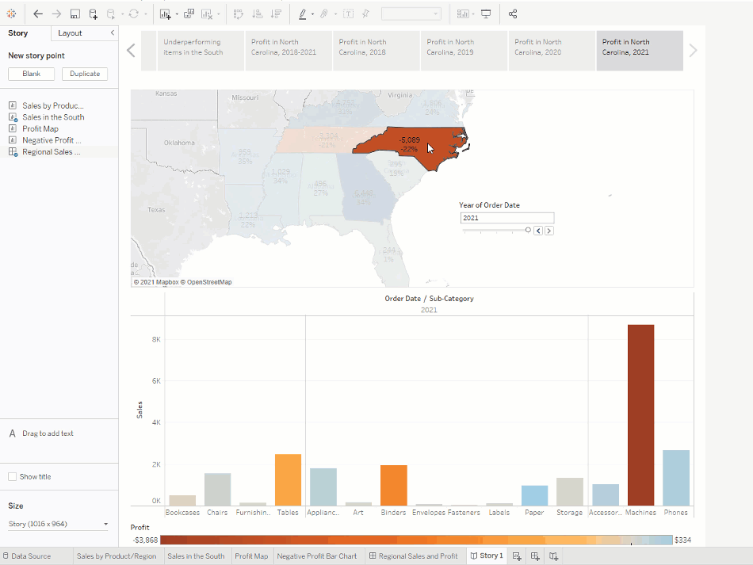
