# Práctica 5. Análisis avanzado

## Objetivos
Al finalizar la práctica, serás capaz de:
- Diseñar visualizaciones avanzadas.
- Crear un dashboard con gráficas y análisis avanzados.

## Objetivo visual 

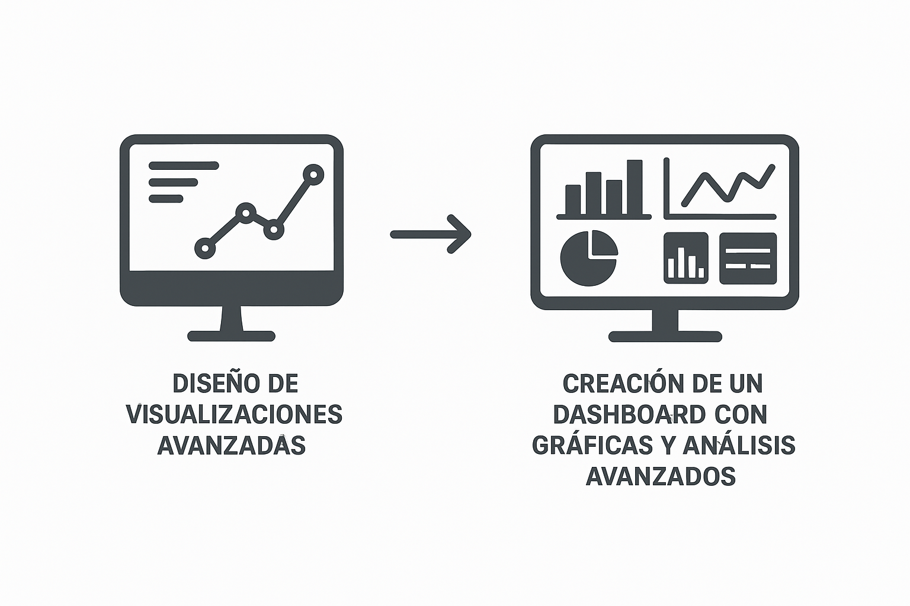

## Duración aproximada
- 120 minutos.

## Instrucciones 

### Tarea 1. Análisis avanzados

Para este desarrollo es necesario descargar la data de la carpeta **Segundo Proyecto**:

Pra continuar con el proyecto tienes que crear una carpeta y descargar el archivo `Data.zip`; una vez descargado, extrae sus archivos, los cuales tienen los siguientes nombres:

*Crear Carpeta -> "Dashboard - Recursos Humanos"*
*Data.xlsx*
*ESQUEMA_RRHH.jpg*
*Background.jpg*

Con la data en el escritorio, analiza el archivo tomando como base este diagrama: 

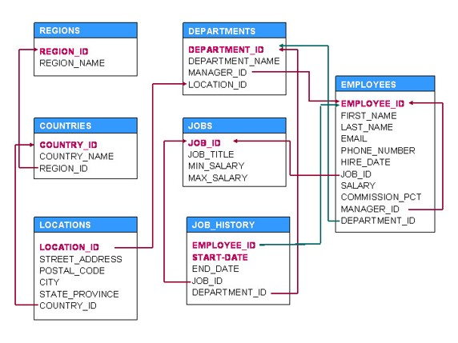

Una vez explicado el desarrollo y las relaciones necesarias, procede a iniciar tu proyecto.

Para ello, carga el archivo de Excel de nombre `Data` seleccionando el tipo de formato de archivo que utilizarás.

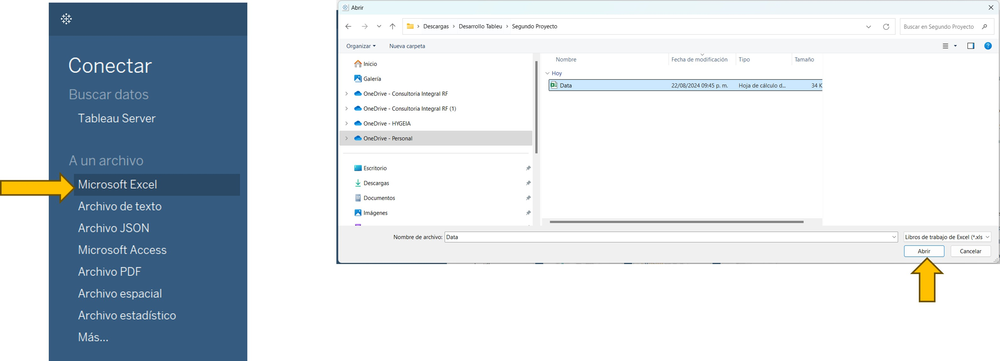

Con la data cargada, aparecerá de la siguiente manera:

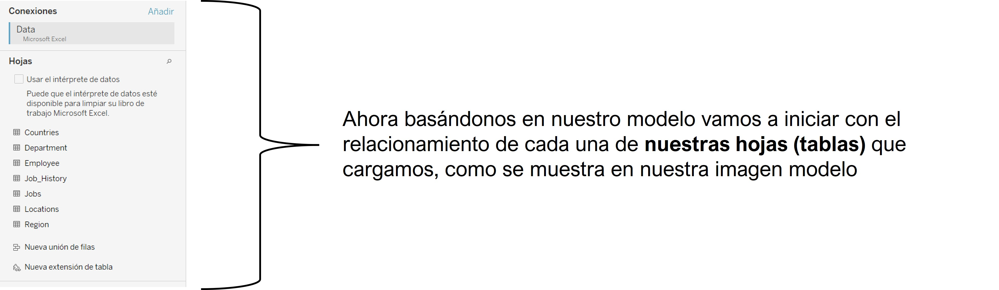

Lo primero que colocarás será la tabla de `Empleados` (`Employee`) y arrastra  también la de `Trabajo` (`job`) estas se relacionaran ambas con el campo `JOB ID`.

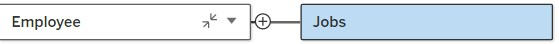

Ahora, arrastra el campo `Historial de trabajos` (`job_History`) y relaciónalo con la tabla de `Trabajo` ambos por el campo `JOB ID`.

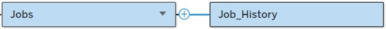

Arrastra la tabla `Departamento` (`Department`) y relaciónala con la tabla de Empleados, ambos por el campo `Departmen ID`.

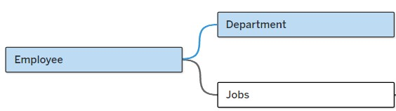

Arrastra la tabla `Ubicaciones` (`Locations`) y relaciónala con la tabla de `Departamento`, ambas por el campo Location ID.

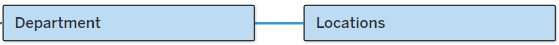

Arrastra la tabla `Estado` (`Countries`) y relaciónala con la tabla de `Ubicaciones`, ambas por el campo `Country ID`.

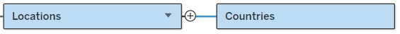

Finalmente, arrastra la tabla `Region` y relaciónala con la tabla de `Estado`, ambas por el campo `Region` ID.

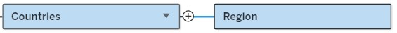

El resultado final de la data es el siguiente: 

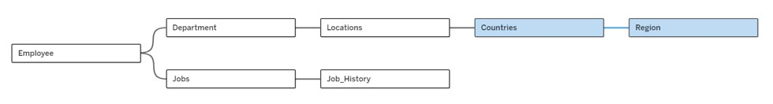

Para darle una mejor estructura al modelo de datos, ve tabla por tabla y oculta los campos innecesarios para el manejo de datos, estos campos solo ayudarían a relacionar y crear el modelo.

Estos campos serán todos los ID de las tablas como se muestra en la imagen:

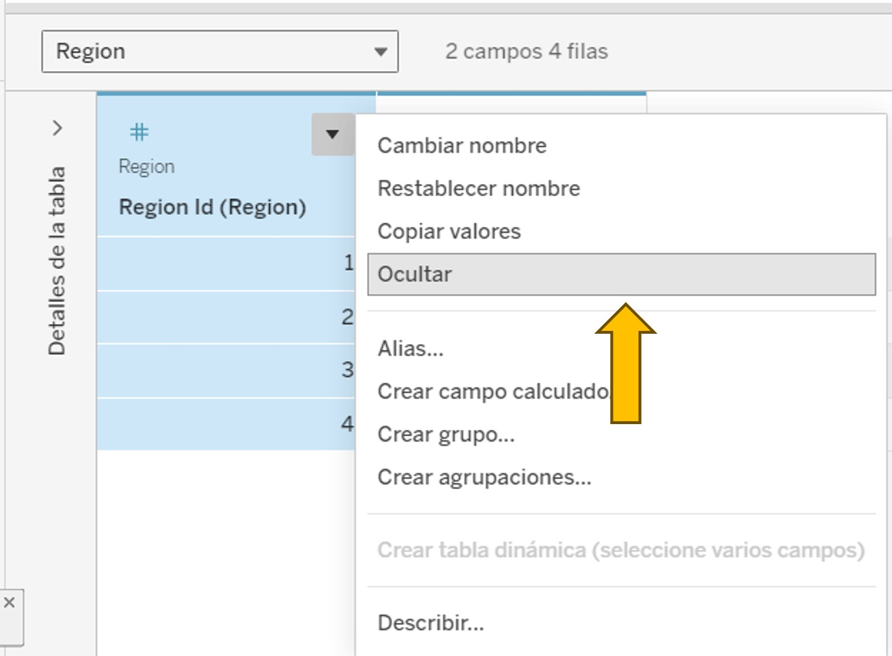

Ya que ocultaste estos campos innecesarios para el desarrollo, da clic sobre la `Hoja 1` y aparecerán  los datos de la siguiente manera:

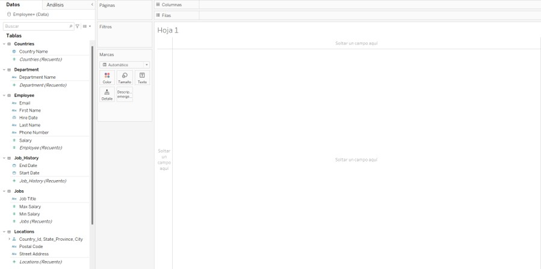

Prueba que está todo bien; para ello, en filas, coloca el campo `First Name` y como dato coloca el campo `Salary` para que presente el siguiente listado:

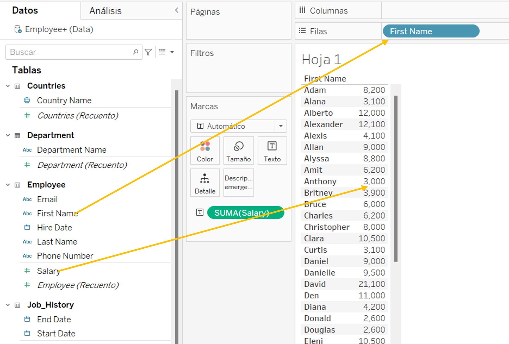

Ahora, crea un campo calculado donde unas el campo `First Name` más el campo `Last Name` de la siguiente manera.

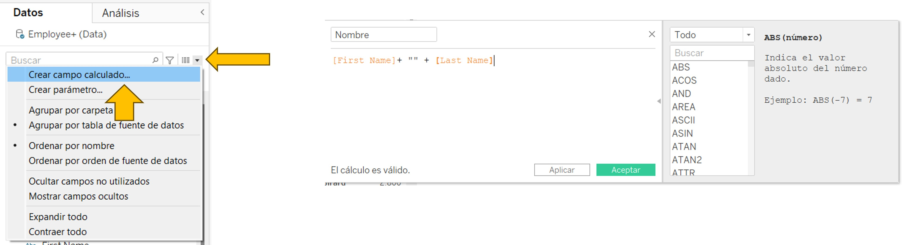

Ya que validaste que todo está en orden, remueve los datos anteriores de la tabla de trabajo y arrastra  el campo `Hire Date` (`Fecha de Contratacion`) y `Nombre` en columnas y en las filas coloca  el campo `Salary`.
Una vez hecho, presiona en formatear sobre `Nombre` y coloca los nombres centrados de manera horizontal como se muestra en la siguiente imagen.

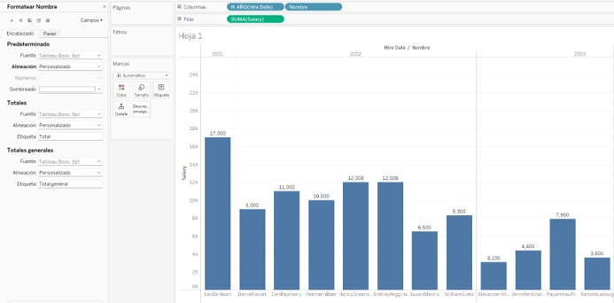

Creado el grafico de salarios, ve a la pestaña `Análisis`, para conocer más de esta herramienta.

| Herramienta  | Función |
| ------------- | ------------- |
| Pestaña de análisis  | Herramienta para explorar patrones, tendencias y detalles en datos. |
| Arrastrar y soltar objetos analíticos | Líneas, bandas, áreas, totales → destacan aspectos clave.  |
| Líneas de referencia  | Promedios, medianas, mínimos o máximos → contextualizan datos  |
| Barras de referencia  | Marcan rangos o límites específicos en la visualización |
| Líneas de tendencia  | Muestran comportamiento en el tiempo o frente a otra variable (lineal, exponencial, logarítmico) |
| Previsiones | Proyectan tendencias futuras con base en datos históricos |
| Cálculos rápidos de tabla  | Porcentajes, diferencias, totales → aplicados desde la pestaña `Análisis`.  |
| Resaltado | Reglas para identificar valores atípicos o áreas de interés  |
| Agrupación y clústeres  | Grupos automáticos según similitudes en los datos  |

Suelta y observa que se solicita un valor; para este ejemplo, coloca  $12,000  que será la línea constante, esta sirve para analizar los datos que sobrepasen este tope de valor, es por ello que a lo largo del gráfico debes colocar una línea horizontal con un valor de 12,000.

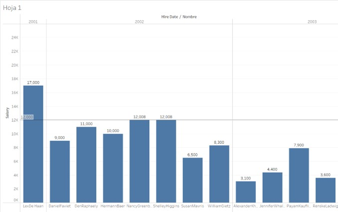

Esta constante también se puede formatear si fuera la necesidad desde cambiar el valor hasta personalizar la línea dando clic sobre él aparecerá un menú donde puedes acceder a estos ajustes como se muestra en la siguiente imagen:

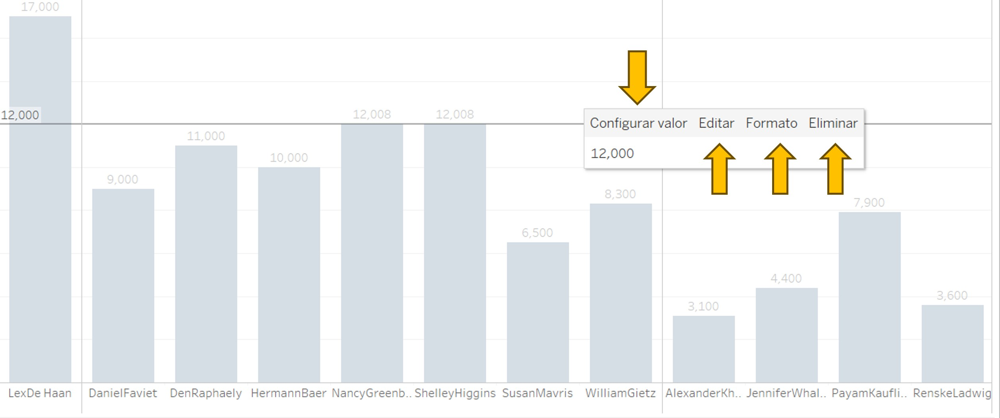

Da clic sobre la opción `Formatear`; en esta opción, puedes personalizar la línea desde la forma, color y grosor, como se muestra en la siguiente imagen: 

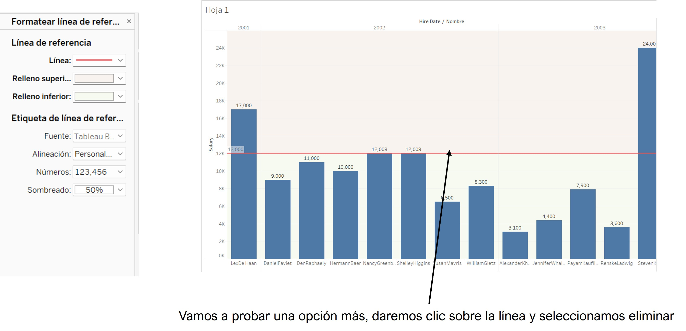

Ahora ve de nuevo a la pestaña de análisis y arrastra la opción de `Línea de Promedio`; aparecerá una opción donde debes especificar la línea de referencia que tomarás como se muestra en la siguiente imagen, donde seleccionarás como tabla: 

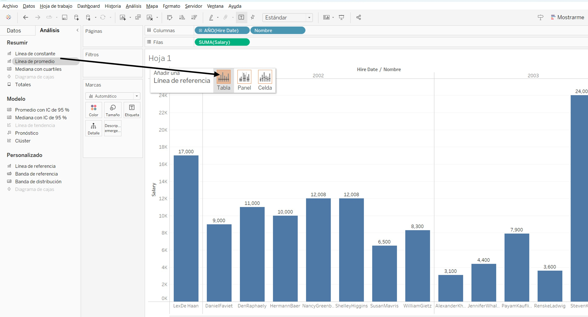

Si observas, aparece una línea igual de constante, solo que aquí señala el promedio de salarios que se tienen.

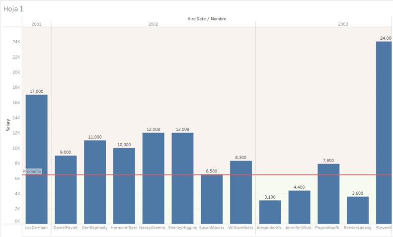

Ahora elimina la línea de nuevo. Dirígete a la pestaña de análisis, selecciona `Línea de Promedio` y la opción de `Panel` como se muestra en la imagen:

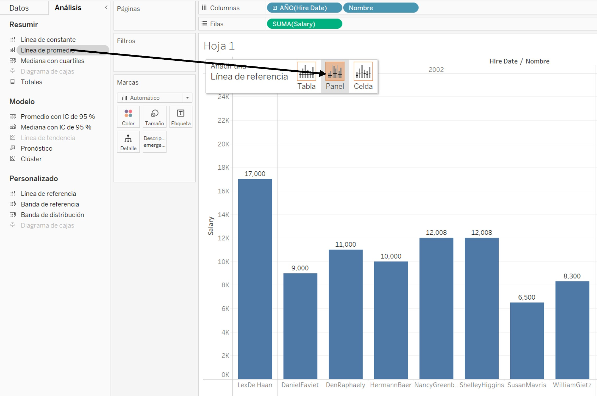

Ahora, esta opción muestra los promedios por panel por cada sección como se muestra en la imagen:

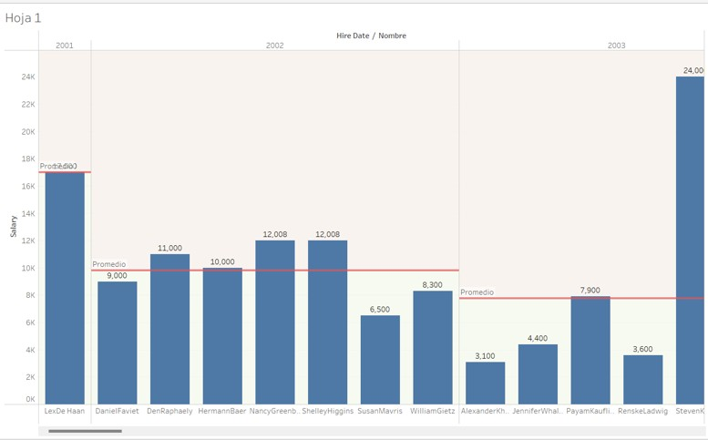

De nuevo, elimina la línea y ve por la última opción en línea de referencia, pero, esta vez, por celda:

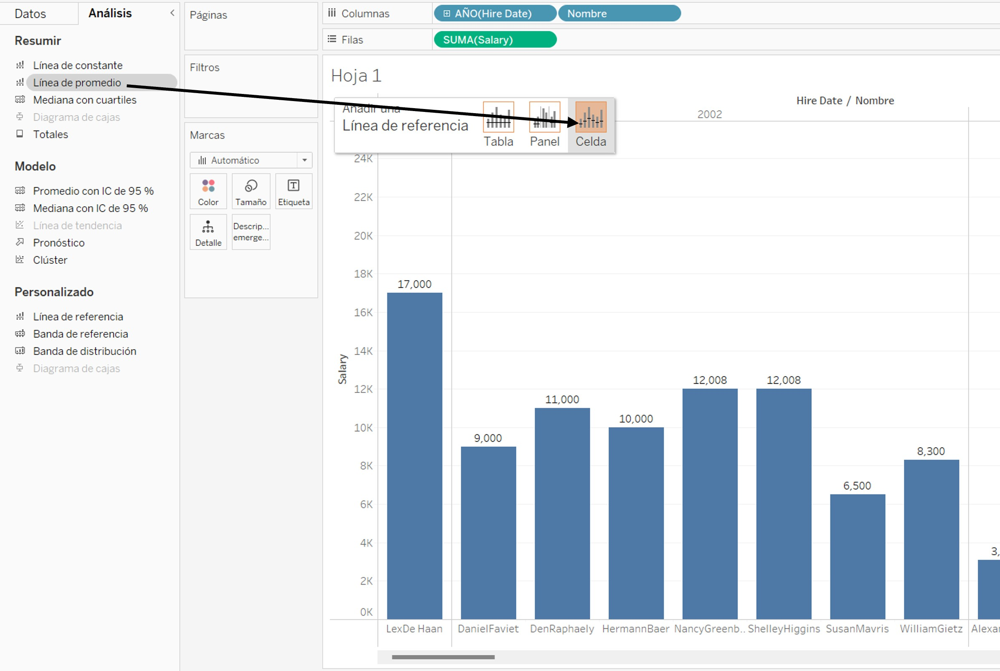

Justo esta opción te ayudará a ver el promedio por cada una de las celdas o columnas para realizar una visión de crecimiento más adecuada como se muestra en la imagen:

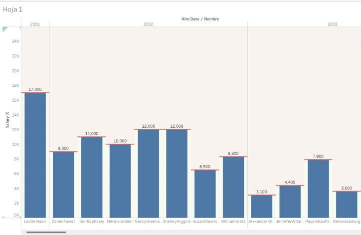

Ahora observa la configuración dada cuando arrastras la opción `Mediana con Cuartiles`, esta opción mostrará la media por grupo (año) el cuartil inferior y superior para brindar una media de salarios, como se muestra en la siguiente imagen:

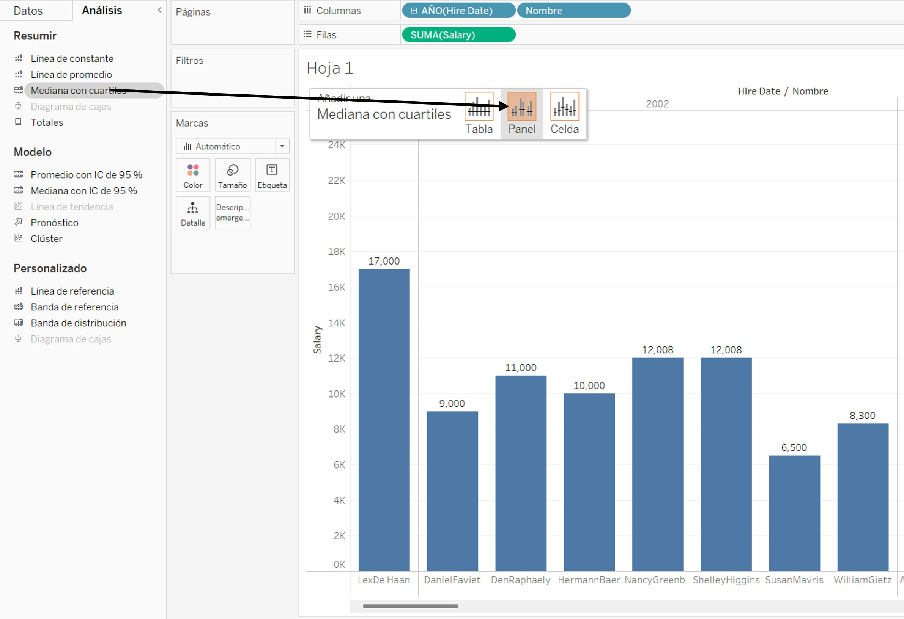

El resultado final es el siguiente:

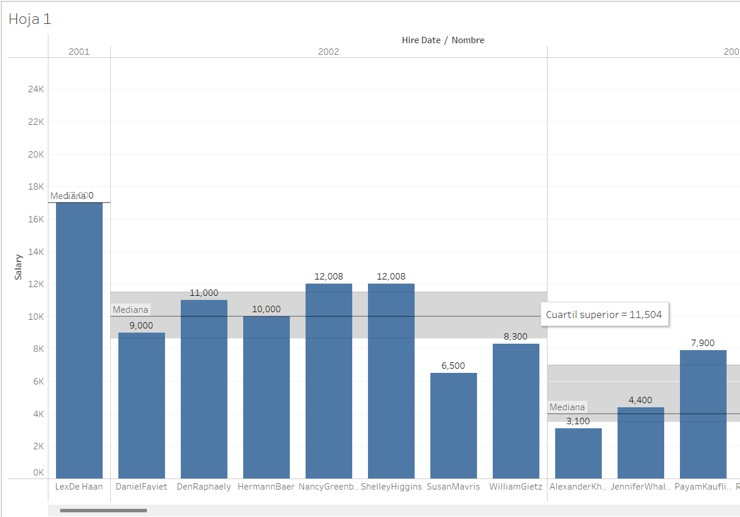

Ahora, conocerás el análisis de tipo de modelo, para este desarrollo crearás otra hoja a la que llamarás modelo y arrastrarás los campos años, nombre en el apartado de columnas y salario en la parte de filas como se muestra en la siguiente imagen:

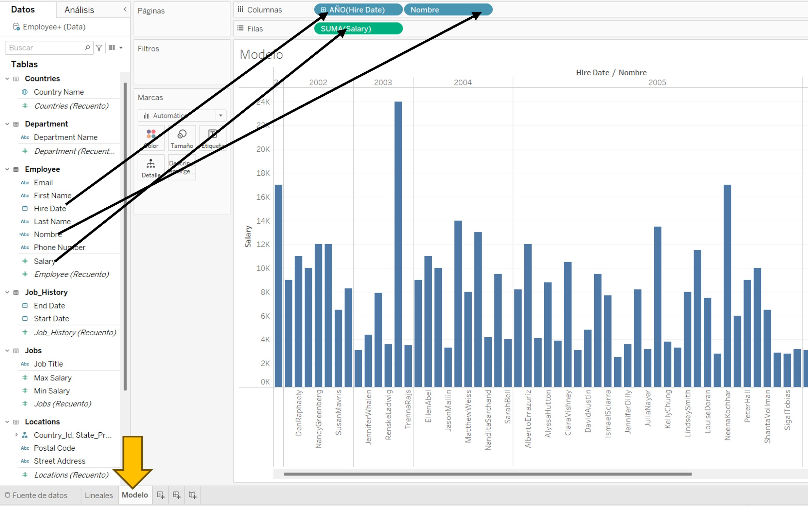

Ahora colocados los datos solicitados formatear el apartado de nombre dando clic derecho sobre nombre y selecciona  la opción Formatear como se muestra a continuación:

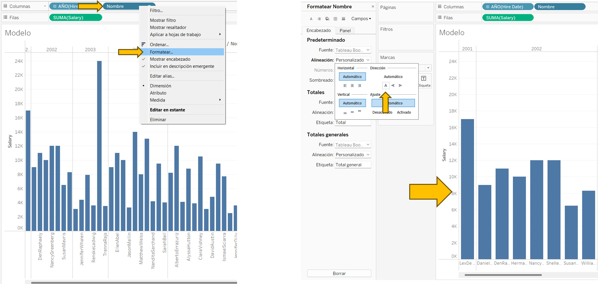

Ahora formateado los nombres, ir a la pestaña de análisis y selecciona  la primer opción Promedio por intervalo de confianza, este promedio es el que ayuda a estimar un determinado nivel de confianza mediante un estudio obtenido o un rango obtenido sobre una media y su representación gráfica es la siguiente, para ellos selecciona  la opción a nivel de panel, como se muestra en la siguiente imagen:

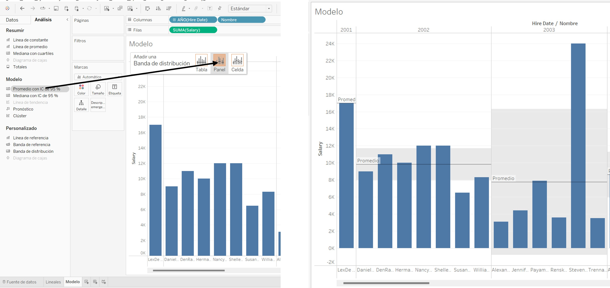

Eliminas el ejemplo anterior y Ahora análisis y arrastra  la opción Media con intervalo de confianza, este análisis ayudara a estimar el grado de imprecisión de la estimación; es inversamente proporcional al tamaño de la muestra, la estimación se hace para un determinado nivel de confianza, usualmente 95% o 99% y para poder realizarla solo basta con arrastrar hacia la gráfica y aparecerán las diferentes formas en la que la puedes representar para este ejemplo selecciona  la opción panel.

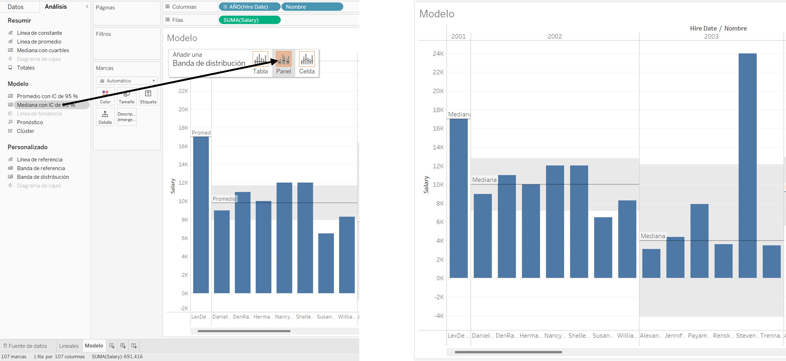

Ahora crear otra hoja de trabajo para trabajar las opciones de análisis a nivel tendencia para ellos nombra  con ese nombre la hoja, para este ejercicio será necesario arrastrar los campos Máximo salario a la parte de columnas y Mínimo Salario a la parte de Filas como se muestra en la imagen.

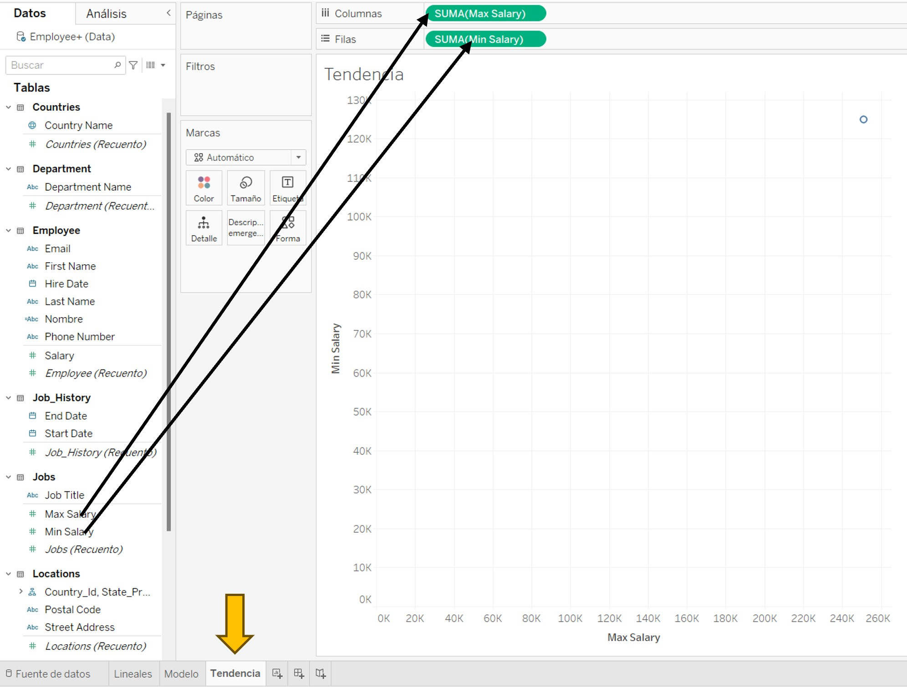

Ya con estos datos colocados en la tabla de trabajo, i  a la tabla de análisis y antes de trabajar con las opciones de tendencia agregar también año en el apartado de detalles en la caja de herramientas, como se muestra en la siguiente imagen.

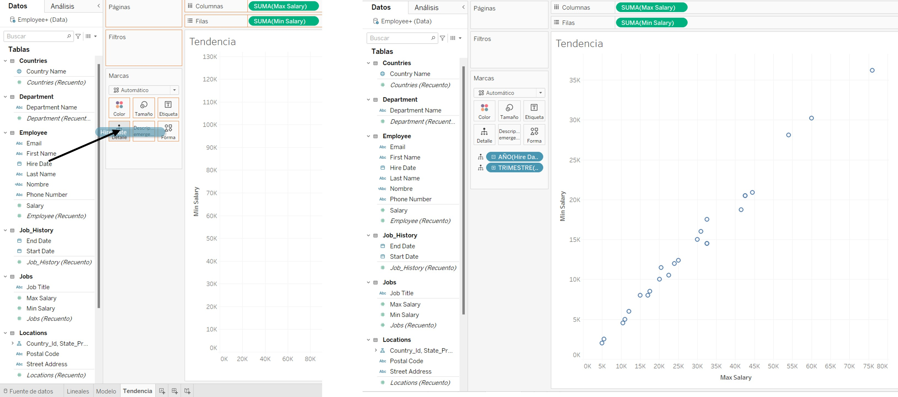

Ahora si con este último ajuste la pestaña de Análisis y observar que tenemos disponible ya Línea de Tendencia, Pronostico y Clúster, iniciar con la opción de línea de tendencia arrastra  la opción al gráfico y selecciona  la opción de manera lineal como se muestra en la siguiente imagen:

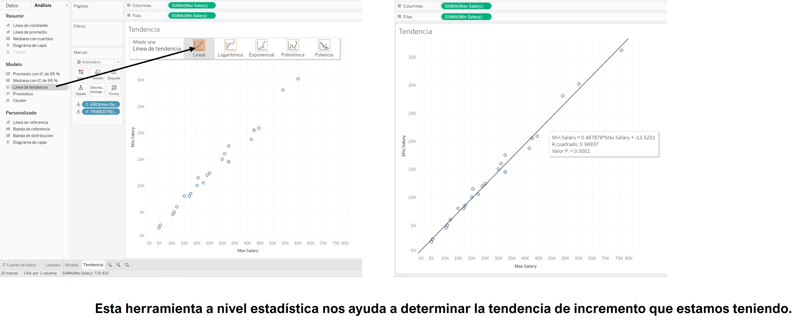

Para el siguiente ejercicio crear otra tabla de trabajo en la cual coloca  el nombre de Pronostico, creada esta nueva hoja de trabajo, arrastrar el campo de Año a columnas y Salario a filas,  en la opción mostrar seleccionar el grafico de barras y lo coloca  de manera Vertical como se muestra en la siguiente imagen:  

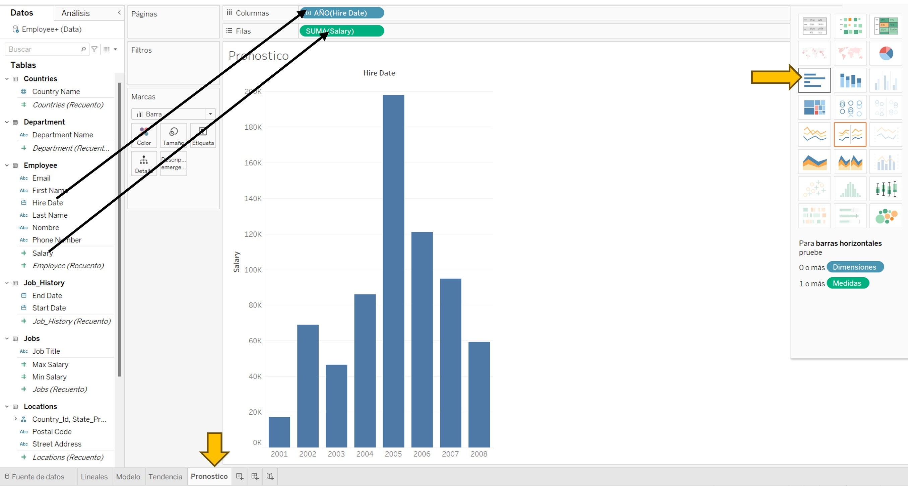

Una vez hecho la anterior ir a la opción de Análisis y arrastra  la opción de pronósticos a el grafico en automático aparecerá la opción pronostico ahí la solta  como mostras en la siguiente imagen:

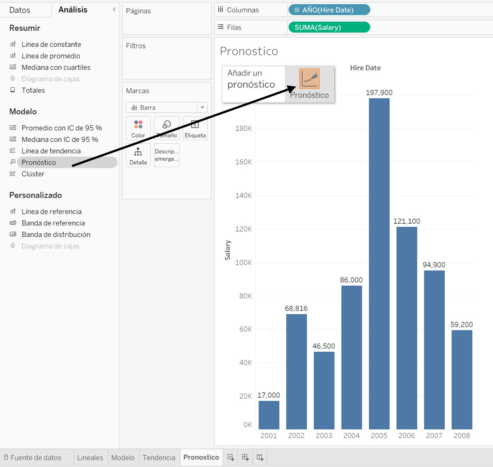

Al realizar lo anterior mostrar un pronóstico de salarios para el año 2008 y 2009 una potente herramienta para pronosticar ventas o comportamientos de mercado.

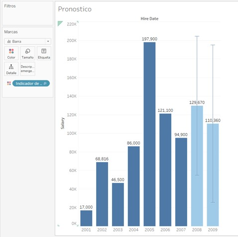

Ahora crear otra tabla de trabajo en la cual coloca  el nombre a esta hoja como clúster, para este análisis arrastra Nombre a la parte de columnas y Salario a la parte de las filas como se muestra en la siguiente imagen:

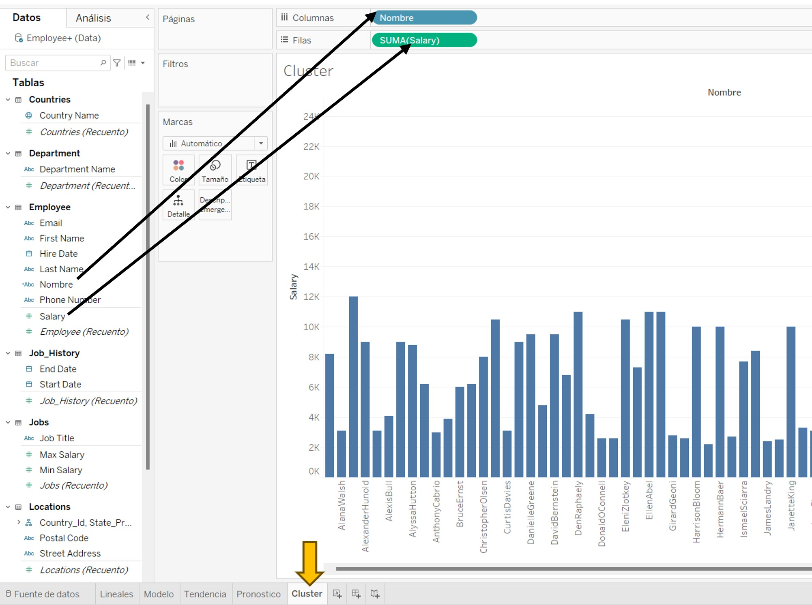

Una vez hecho lo anterior ir a la pestaña de análisis y arrastra  la opción de Clúster, lo que observas al realizar esta configuración es que agrupara los valores en base al crecimiento para ellos ordenar de manera Ascendente la información para obtener el resultado como muestra en la siguiente imagen: 

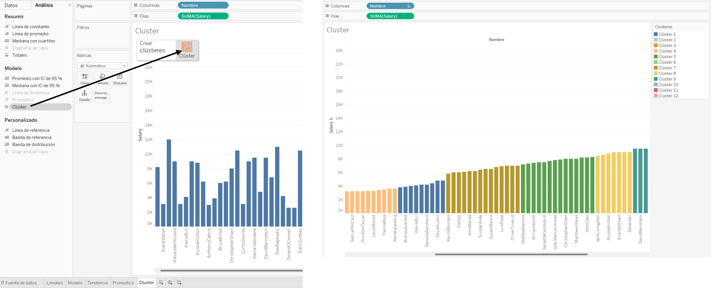

Ahora crear un análisis de tipo Personalizado para ello crear una nueva hoja de trabajo con este nombre PERSONALIZADO, para esta hoja arrastrar en la parte de columnas AÑO y NOMBRE en la parte de filas vas arrastra SALARIO justo como se muestra en la siguiente imagen:

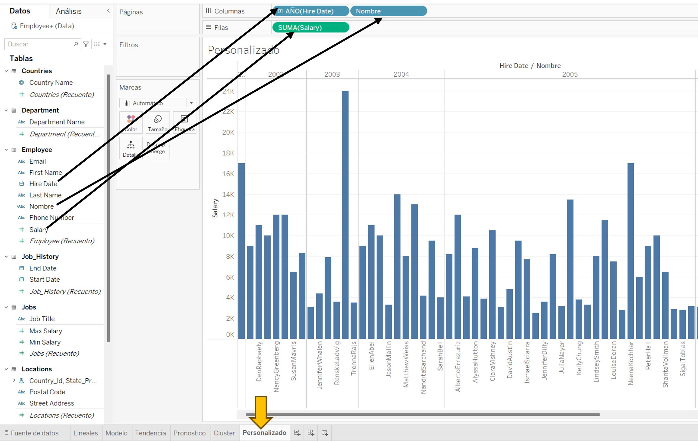

Echo lo anterior formatear el campo de nombre y coloca  la alineación de texto de tipo normal para que quede el grafico de la siguiente manera:

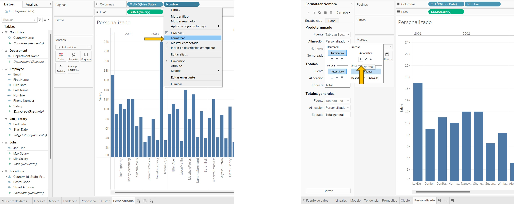

Una vez hecho el formateo dirigirnos a la pestaña de Análisis y arrastra la opción de línea de referencia que es igual que  las opciones de línea de constante y línea de promedio, arrastrarla y observar que aparecen también las opciones de formateo como las líneas,  seleccionar la parte de panel como se muestra en la siguiente imagen:

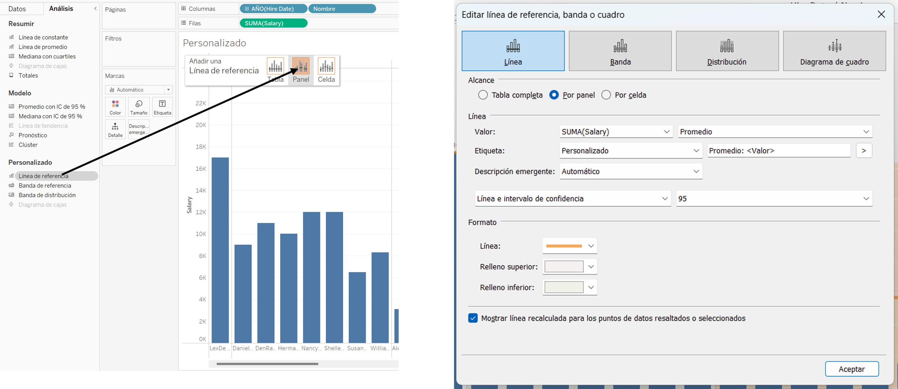

Al personalizar la línea de referencia quedara el grafico de la siguiente manera:

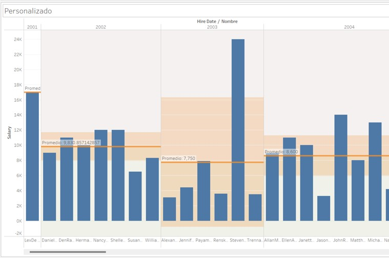

Ahora eliminemos la línea de referencia y arrastras la opción de banda de referencia , lo arrastra  a nivel de tabla y configura  como se muestra en la siguiente imagen:

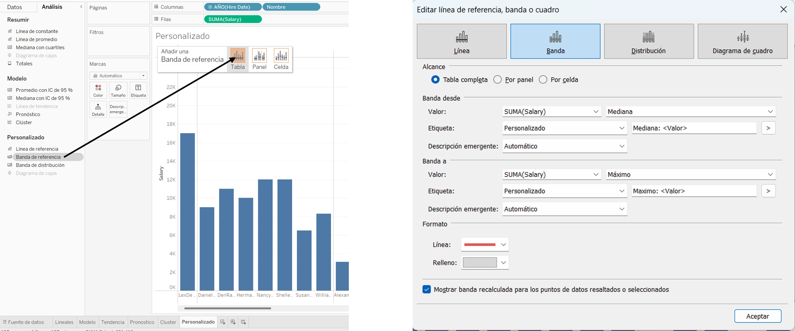

El resultado de esa configuración es el siguiente, donde mostrara el máximo y la media del salario:

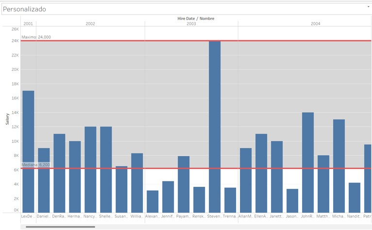

Ahora utilizar la opción de Banda de Distribución y aplica  la siguiente configuración como se muestra en la imagen:

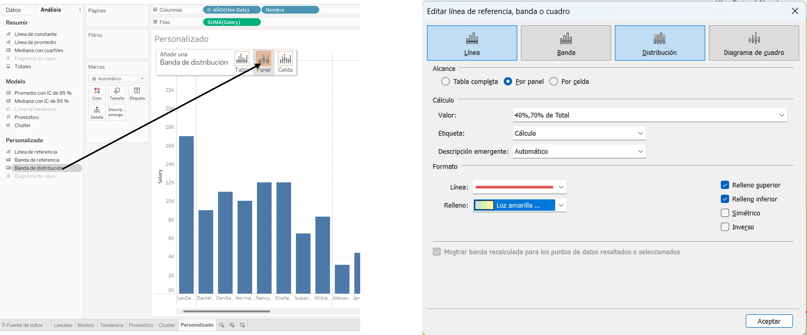

El resultado final es el siguiente: 

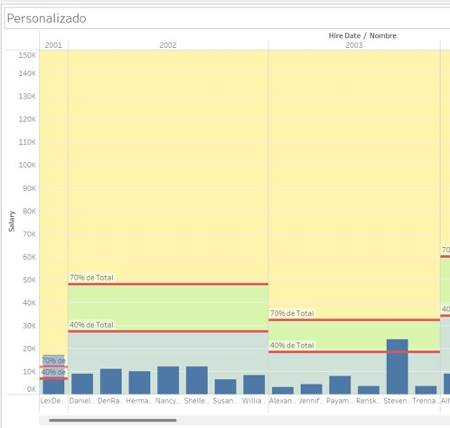

Ahora revisar el Diagrama de Caja, para ello crear otra hoja de trabaja con el nombre de Diagrama y arrastrar en columna Año y en filas Salario, después ir a mostrar y selecciona  el grafico de líneas continuas.

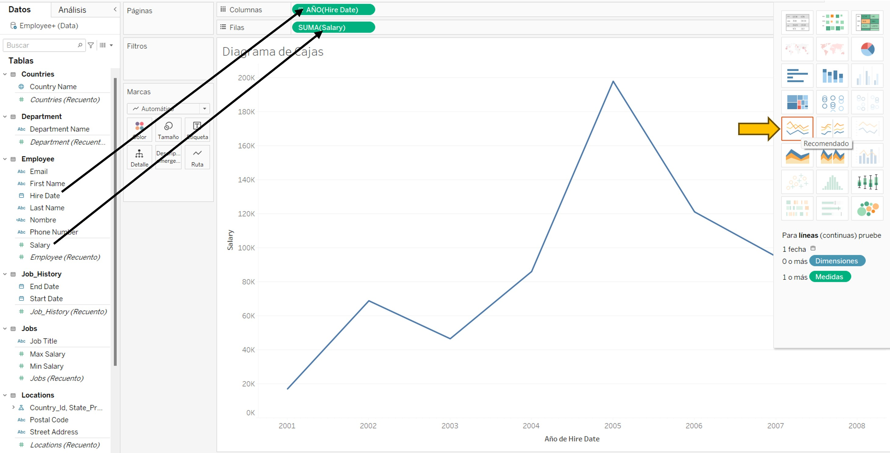

Una vez hecho lo anterior arrastras desde la pestaña de análisis la opción de Diagrama de caja y realizas la siguiente configuración: 

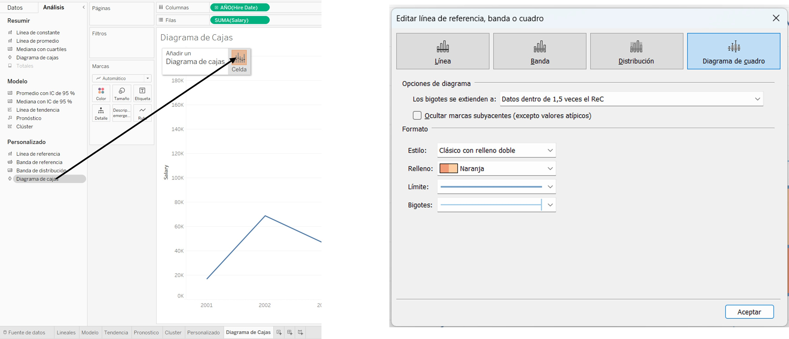

El resultado final seria 

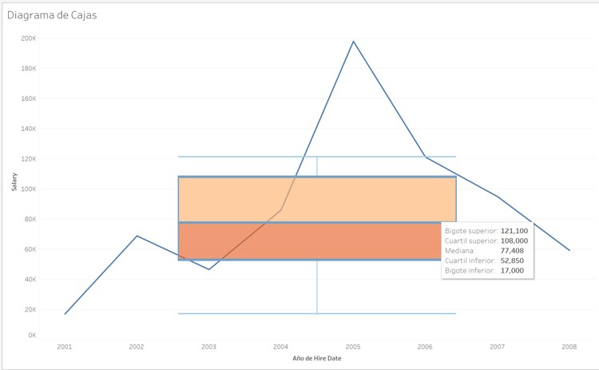

Ahora para este siguiente desarrollo, vas  a crear gráficos avanzados con los cuales  configura  con una seria de combinaciones, para esto crear una nueva hoja y le coloca  el nombre de Donas, creada esta nueva hoja arrastrar el campo `Job Title` en la parte de filas y Salarios en la parte de Datos como se muestra en la siguiente imagen:

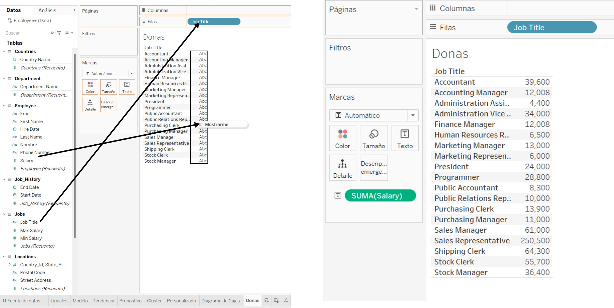

Ahora en la parte de Mostrar establecer el Grafico Circular y después coloca  la vista completa para obtener el siguiente resultado: 

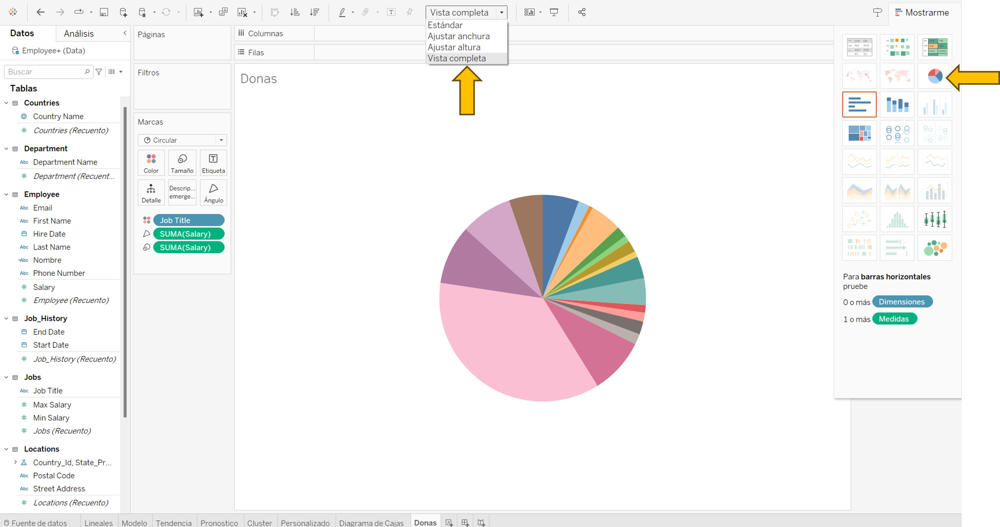

Ahora dar doble clic sobre la parte de columnas y coloca  le número 1 , después da  clic nuevamente y coloca  el numero 2 esto para crear 2 gráficos de pastel, realizada esta parte observar que en la parte de Marcas aparecen los 2 gráficos, edita  el grafico 2 donde quita  el campo `Job Title` y Salario para que quede un círculo gris y en el grafico 1 solo aumenta  el tamaño de este.

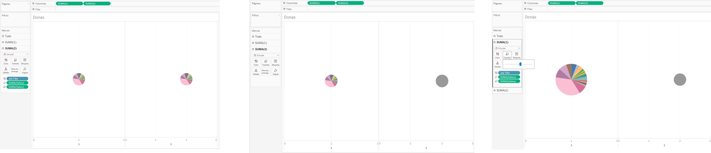

Ahora donde tenemos el 1 y 2 en columna da  clic sobre cada uno y selecciona  la opción dimensión, Ahora da  clic sobre el eje 2 y selecciona  la opción que dije Eje Doble

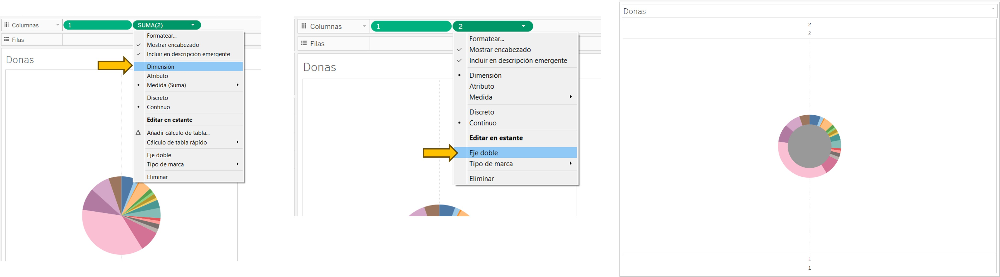
Ahora dar clic sobre marcas y selecciona  el eje 2 en el cual personaliza  su color de gris a blanco y adapta  su tamaño en lo posterior i  a eje 1 y selecciona  mostrar etiquetas como se muestra en las siguientes imágenes:

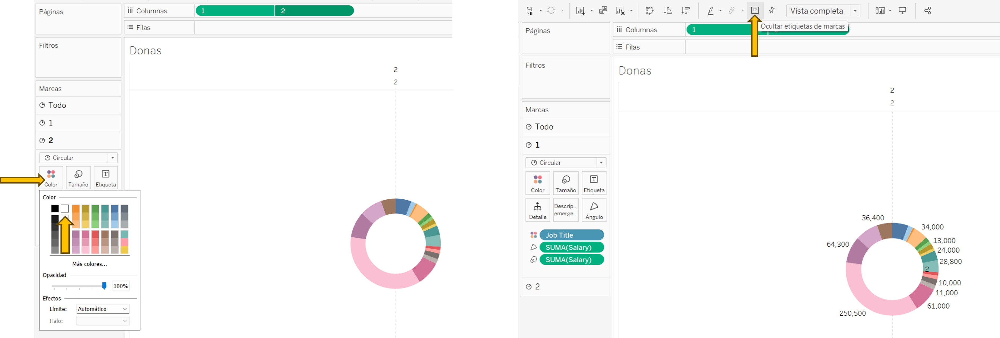

Personalicemos más este grafico de pastel, desactivar las etiquetas y en el eje 1 arrastrar a el módulo de etiquetas el campo `Job Title` y en el eje 2 vas arrastra a etiquetas el campo Salario dando como resultado las siguientes imágenes:

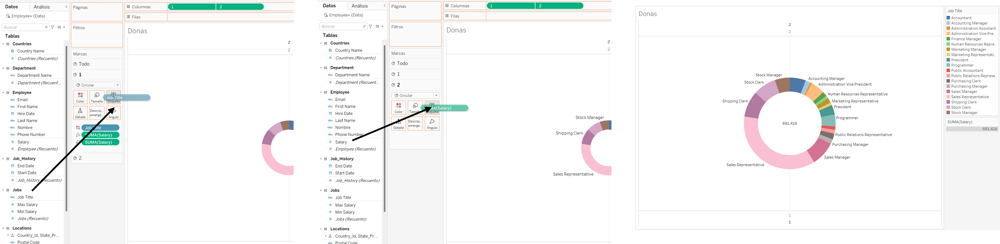

Ahora crear una nueva hoja y coloca  como nombre porcentaje, vas arrastra a la parte de columnas años, en la parte de filas salario, aplica  dentro de marcar en la parte de colores el Puesto (`Job Title`), 

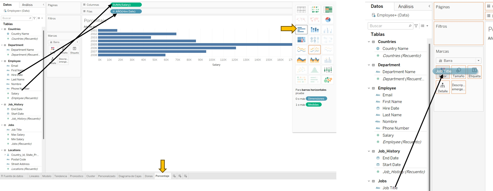

Creado lo anterior es necesario formatear el salario a nivel porcentaje del total para ellos da  clic sobre salario en la parte de columnas y selecciona  la opción de cálculo rápido y aplica  la opción de porcentaje en el Total.

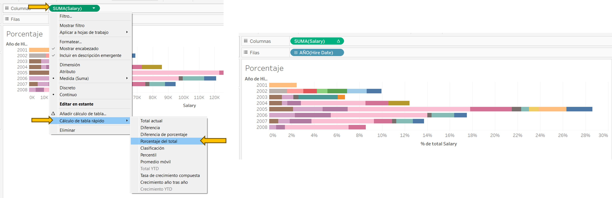

personalizar una más este grafico para ellos da  clic de nuevo sobre salario y selecciona  la opción Calculo Usado y coloca  la opción Tabla a lo Largo, posteriormente i  a Marcas y en la parte de color selecciona  el límite y coloca  líneas negras además activa  las etiquetas para obtener el siguiente resultado: 

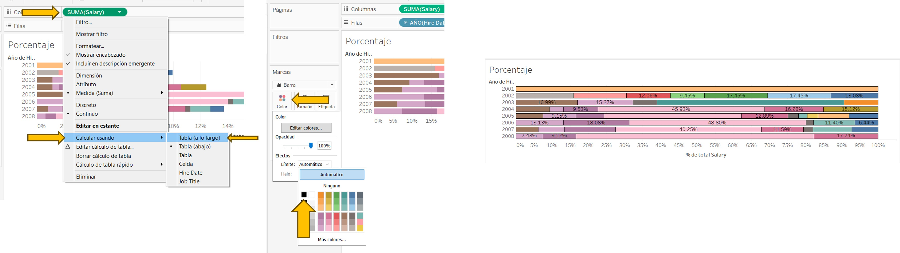

Ahora crear otro tipo de grafico para ellos coloca  a una nueva hoja el nombre de Grafico Totales, arrastrar el campo `Job Title` en la parte de filas, también coloca  Nombre y en la parte de filas coloca  el salario: 

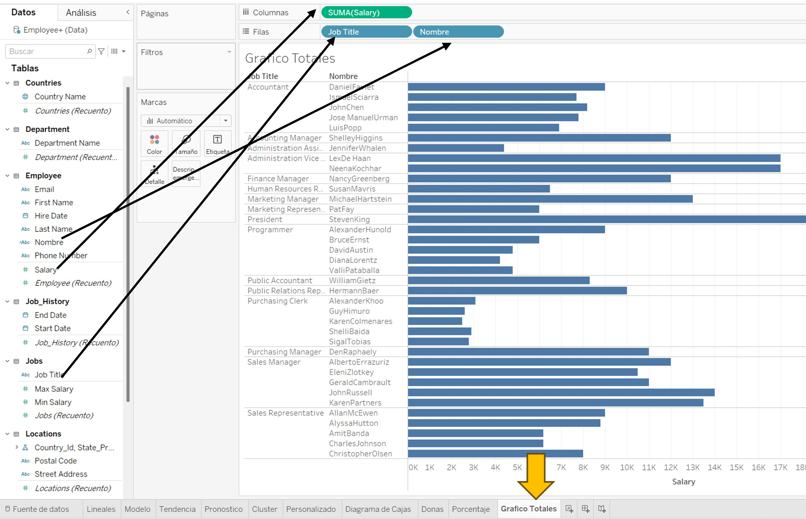

Ahora presionando la tecla control y arrastras de columna la parte de salario, observa  que va a crear una segunda columna con esa data, Ahora en esa segunda columna da  clic y selecciona  cálculo de trabajo rápido y selecciona  clasificación  

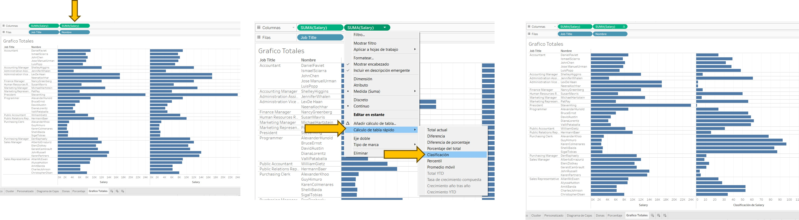

Ya que formateas la segunda columna de barras por clasificaciones, Ahora dar de nuevo clic sobre el segundo campo valor de salario en columna y selecciona  calcular usando y después nombre, por último da  de nuevo clic derecho a esta segunda columna y da  clic en mostrar filtro, esto ayudara a activar un filtro de clasificación de salarios, Una vez hecho esto elimina  la segunda columna y observar que puedes organizar los valores dependiendo el número de clasificación de 1 hasta 5 o de 1 hasta 10.

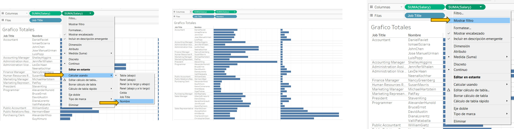

El resultado después de eliminar la segunda columna de salario y aplicado el filtrado es el siguiente: 

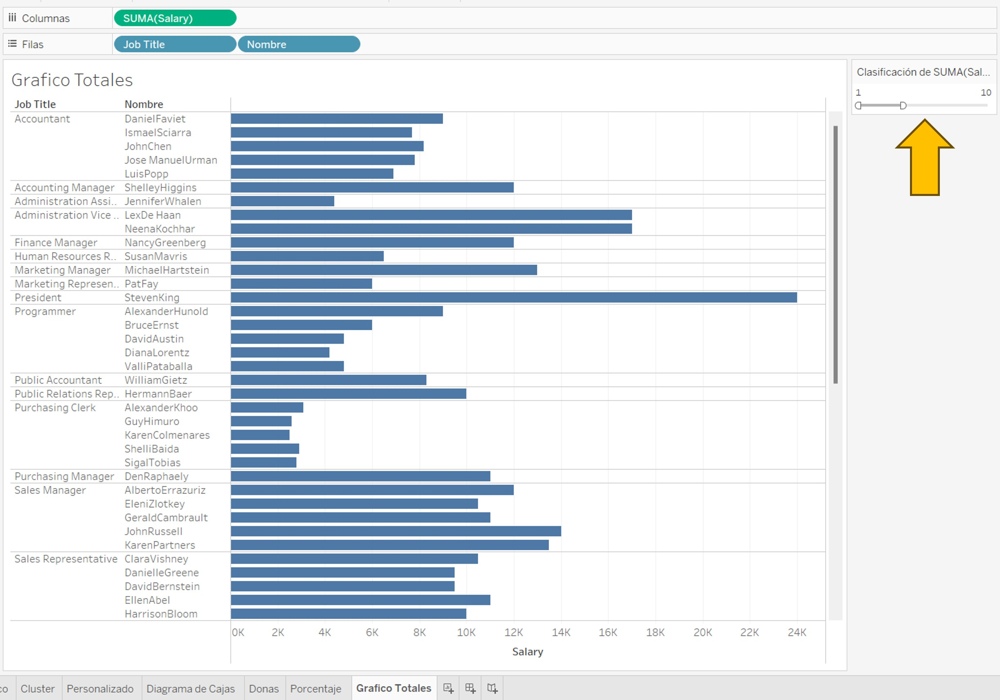

Ahora crear otra hoja nueva de trabajo donde le coloca  le nombre de Lollipop, aquí arrastra en la parte de filas el título de trabajo(`Job Title`), en columnas coloca  Salario y con la tecla control arrastra  el campo de columnas salario para crear 2 columnas en el grafico como se muestra a continuación:

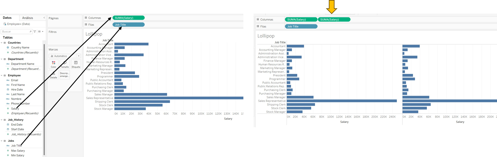

Ahora en la segunda opción de salario da  clic sobre él y selecciona  la opción Eje doble para que aparezca el siguiente resultado:

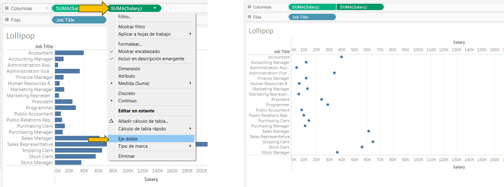

Una vez hecho lo anterior observar en la caja de nombre marcas aparecen varias casillas Todo, Sumada de salario 1 y Suma de salario 2, personaliza la segunda opción de Salario donde establece  en la lista desplegable donde dice Automático selecciona  la opción circulo y en la primera opción de salario en la misma lista desplegable selecciona  grafico de barra y obtend  el siguiente resultado:

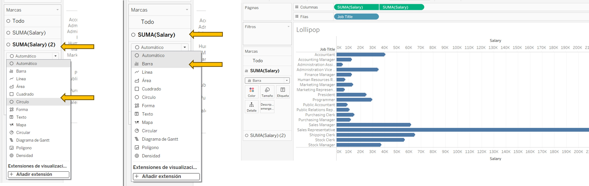

Una vez hecho lo anterior realizar algunos ajustes a la primera opción de salario dentro de la caja de Marcas, primero reducir un poco el tamaño hasta una línea atrás, después cambiar de color y coloca  un límite ahí mismo en colores de color negro, Ahora ha  lo mismo en la segunda opción de salario solo que aquí agrandar hasta una línea después y las demás modificaciones aplicaran igual con distinto color como se muestra en la siguiente imagen:

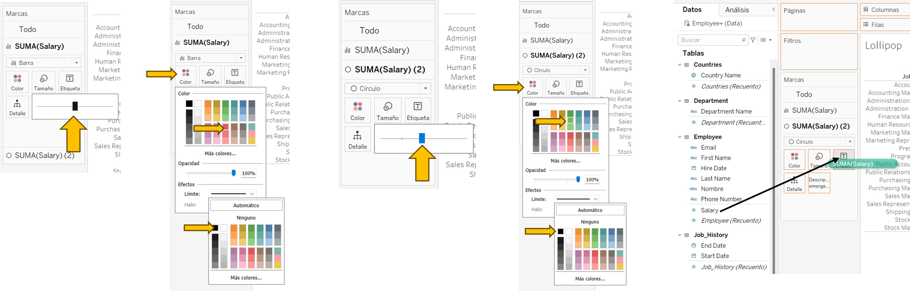

Una vez hecho lo anterior el resultado será el siguiente:

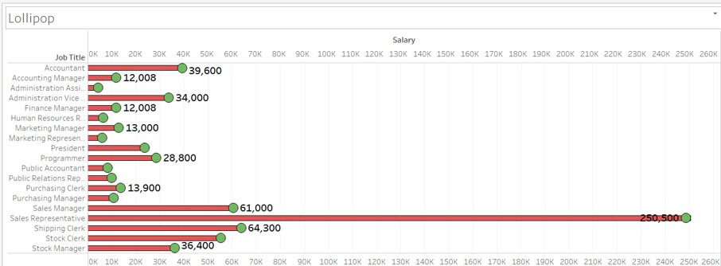

Ahora crear una nueva hoja que le coloca  de nombre World Cloud, aquí arrastra  en filas lo Títulos de trabajo y en la parte de columnas coloca  el Salario, Ahora i  a mostrar y selecciona  el grafico de mapa de calor como se muestra en la imagen:

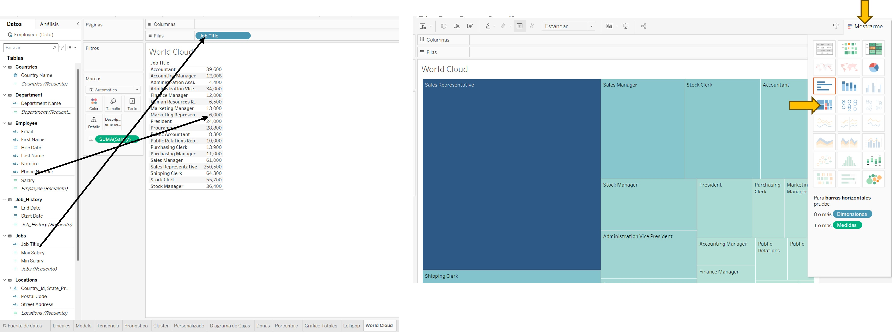

Creado lo anterior irnos a la caja de marcas y en la lista desplegable seleccionar la opción que dice Texto y cambiara totalmente el grafico a los nombres de los puestos de trabajo en la parte del filtrado activado a mano derecha cambia  el color a rojo como se muestra en la siguiente imagen: 

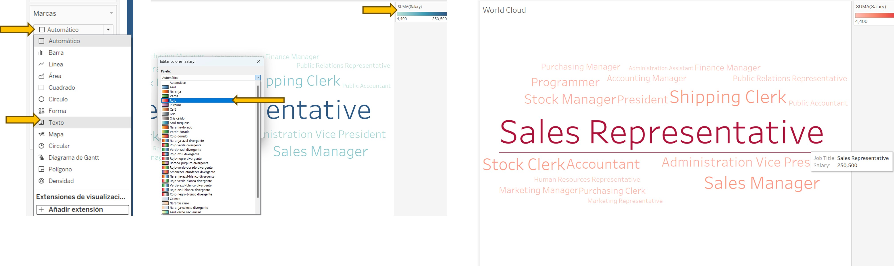

Ahora crear otra hoja de trabajo que la nombra  Línea Diferencial, para este grafico presionando la tecla Control seleccionar `Job Title`, Max `Salary`, Min `Salary` , así se quedaran señalados i  a la herramienta de mostrar y selecciona  la opción de Tabla de Texto como se muestra en las siguientes imágenes:

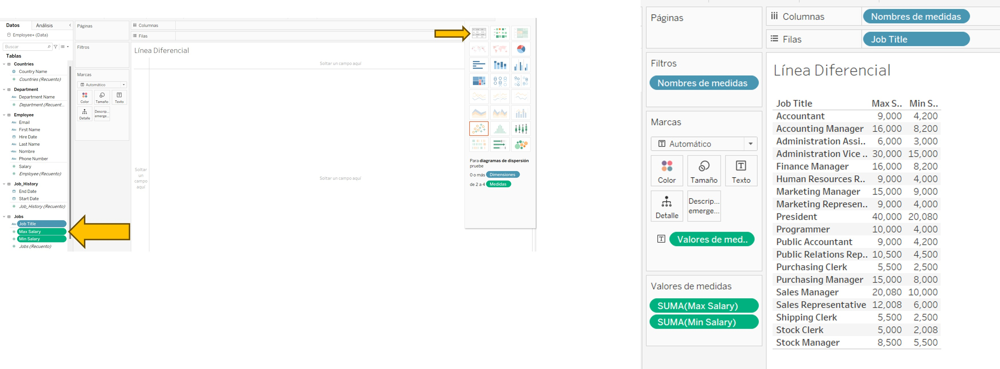

Ahora si miras bien creo medida en automático el gráfico, para ello la medida que está en marcas arrastrarla a la parte de Columnas y la de Columnas la arrastrar a colores para que generar el siguiente grafico:

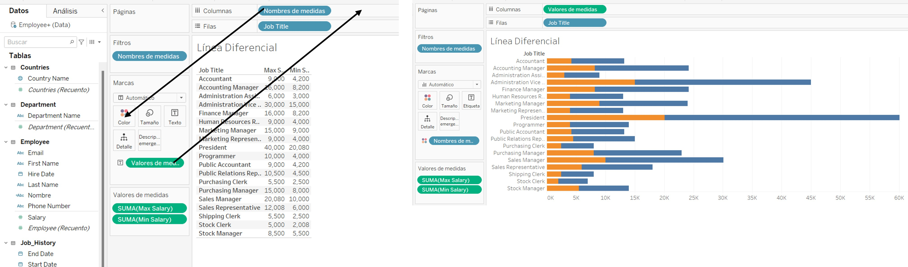

Ahora con la tecla control duplicar la medida que está en la parte de columnas y a la segunda medida da  clic y selecciona  eje doble, Ahora en la parte de marcas de nuevo activa Todo, Medida 1 y Medida 2, en la Medida 2 sobre la lista desplegable selecciona  la opción de líneas para que muestre el siguiente gráfico.

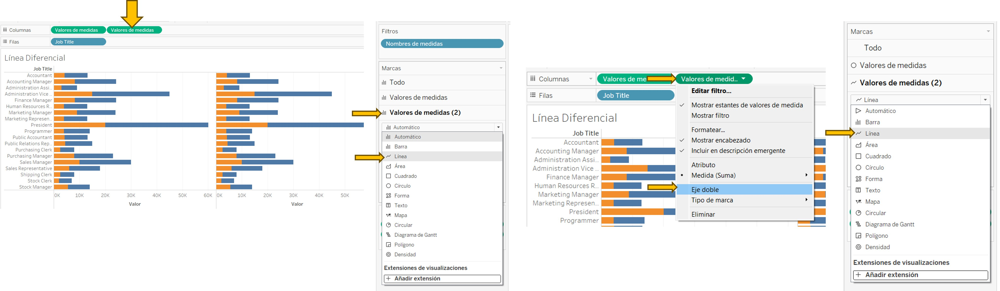

El resultado que obtend  será un gráfico de línea, Ahora ir a la herramienta de Marcas y arrastra  nombre de medida hacia la opción de ruta para obtener el siguiente grafico:

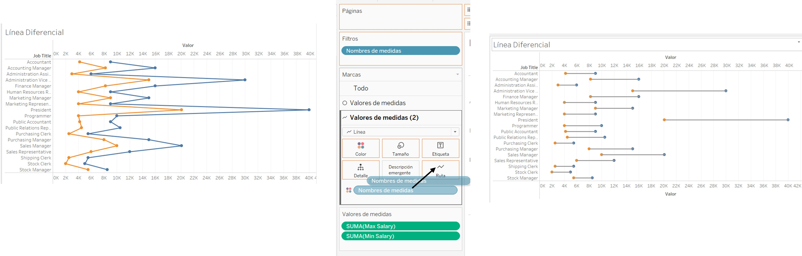

Ahora como ultimo toque ir a el valor de medida 1 y modificar el tamaño un poco más grande, Una vez hecho esto dar clic derecho sobre el grafico y presiona  la opción sincronizar eje y obtend  el siguiente resultado:

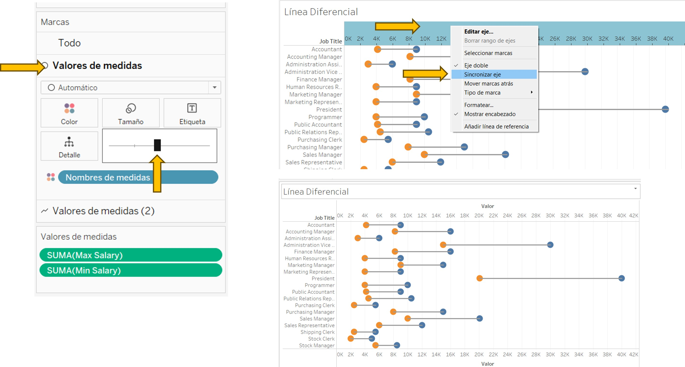

Ahora crear otra hoja a la cual la nombra  Barra dentro de Barra, aquí arrastrar el campo `Country Name` a filas y salario al campo de valores, en la parte de la herramienta mostrar selecciona  el grafico de barra para obtener el siguiente resultado:

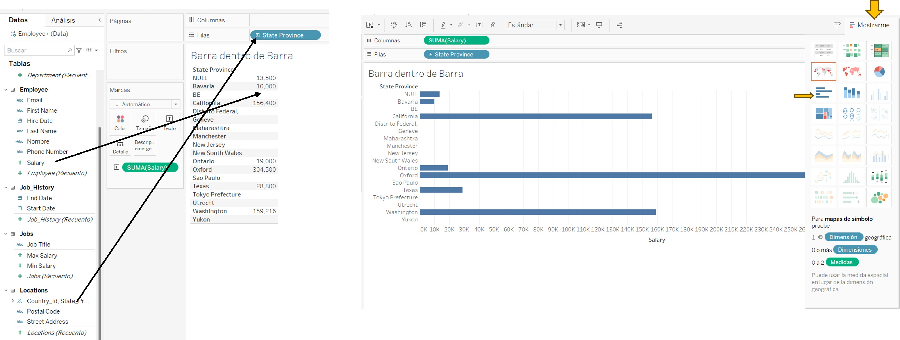

Una vez hecho lo anterior, Ahora vas arrastra a colores el campo de año , echo eso dar clic sobre año y activa  el filtrado por año como se muestra en la imagen: 

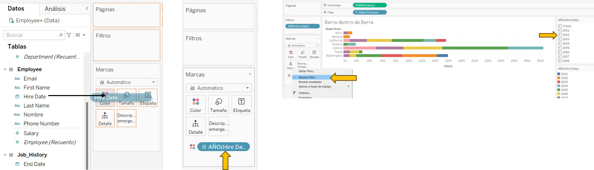

Ahora configurar las barras para ellos i  al menú de análisis, i  a la opción Apilar Marcas y lo desactiva ,  Ahora en la herramienta de marcas con la letra control arrastra  años y lo coloca  sobre la opción de tamaño y mostrara el siguiente grafico:

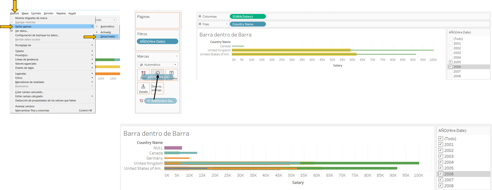

Ahora crear el ultimo grafico avanzado y nombra  a esta hoja como Barra de Colores – `Unicode`, arrastrar el campo de `Job Title`, Nombre  a la parte de filas  y salario a la parte de Datos.

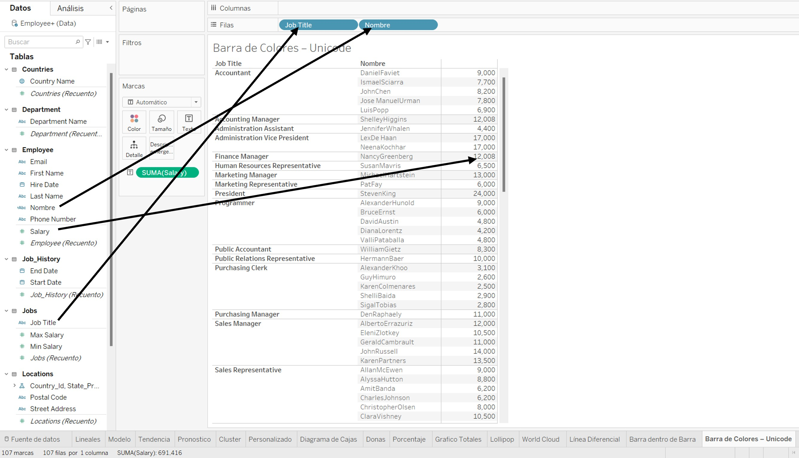

Ahora en la herramienta de mostrar seleccionar grafico en barra y este lo configura  de forma Descendente

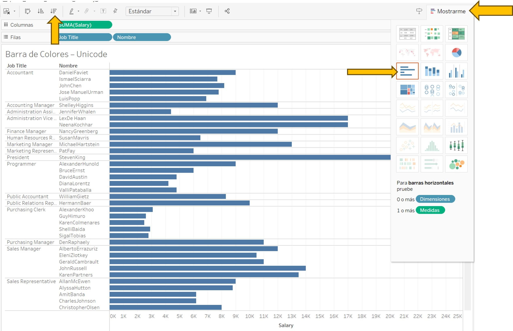
Ahora con la tecla control selecciona `Job Title` y Nombre para crear una dimensión y los arrastra  a la opción de colores.

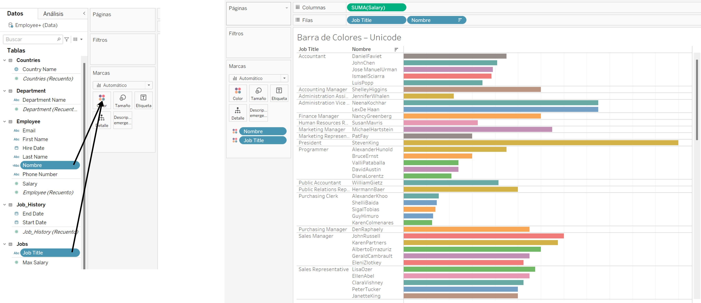

Ahora personalizar invertir las cosas de la medida dentro de Marcas subi  `Job Title` y abajo quedara nombre a demás coloca  la opción de marcas como se muestra en la siguiente imagen:

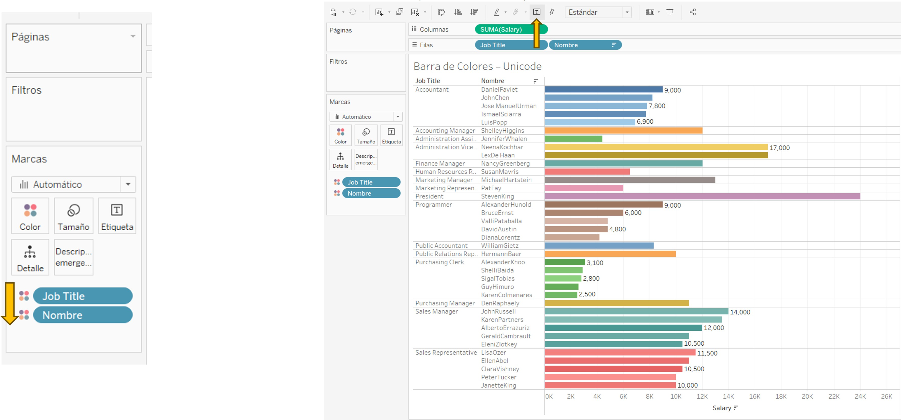

Ahora crear un código que ayude a crear un top de los mejores salarios y que le ponga una imagen a cada uno de ellos para ello i  al siguiente web site que utiliza  para estas imágenes:
http://xahlee.info/comp/unicode_circled_numbers.html

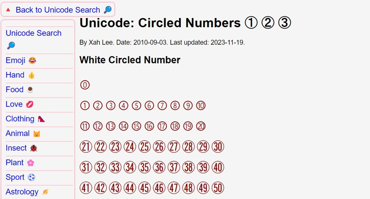

Ya en sitio web necesitar los numero del 1 al 3, pero antes de hacer eso ir de nuevo a el Tableau y realiza  la siguiente programación y para ellos crea  un campo calculado dando clic sobre la pestaña que está al lado de buscar dentro de la data,

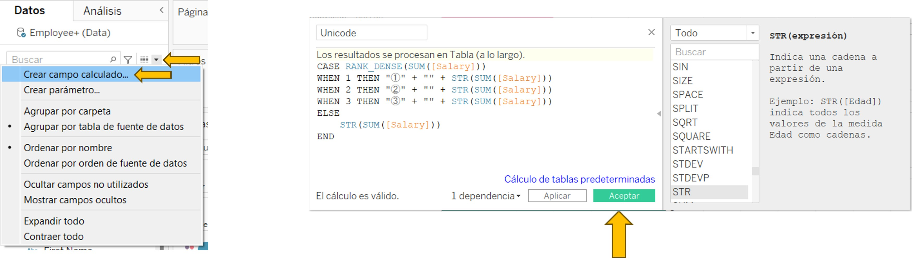

*OJO:* Coloca  los números del sitio web entre comillas doble en la instrucción que programas.

Ahora creado este campo calculado arrastrarlo al campo etiquetas dentro de la herramienta Marcas:

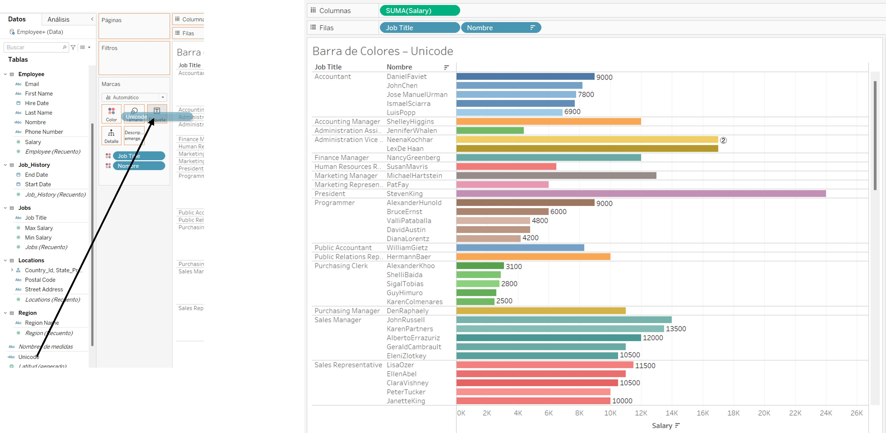

También  puedes programar el top por título de trabajo para ellos i  a la herramienta de Marcas y da  clic cobre `Unicode`, aquí selecciona  editar cálculo de tabla y aparecerá un cuadro de dialogo donde activa  A nivel más Profundo y la opción de reiniciado cada selecciona  `Job Title`

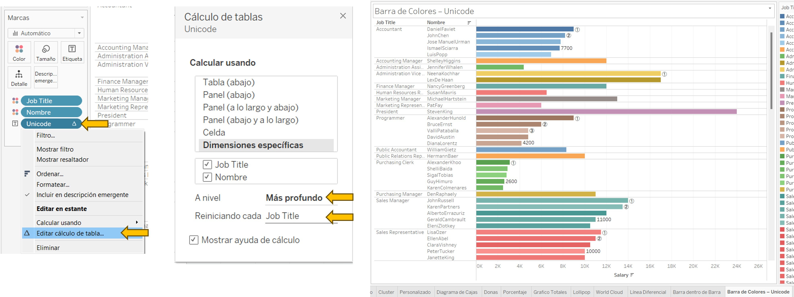

### Tarea 2. Práctica Libre

Objetivo: Desarrollar un dashboard de control que permita a los usuarios visualizar y analizar datos de manera eficiente, utilizando diversas funcionalidades de Tableau como filtros, gráficos dinámicos, y acciones interactivas. El objetivo es que los participantes adquieran habilidades prácticas en la creación de dashboards que faciliten la toma de decisiones basada en datos, aplicando buenas prácticas de diseño y usabilidad.
Instrucción: En base a lo aprendida hasta el momento es necesario realizar un dashboard donde combinemos las diferentes gráficas, tablas, filtros, colores que ayude a transmitir la historia que el data set está trasmitiendo:
1.- Utilizarás las bases de datos que se te proporcionaran.
2.- Este `Dashboard` debe de ser lo más parecido a la imagen 

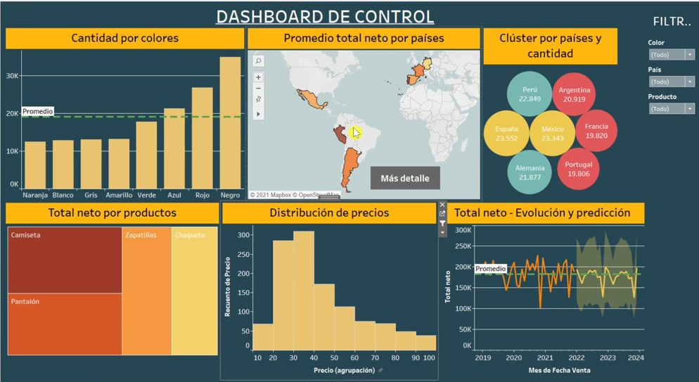
