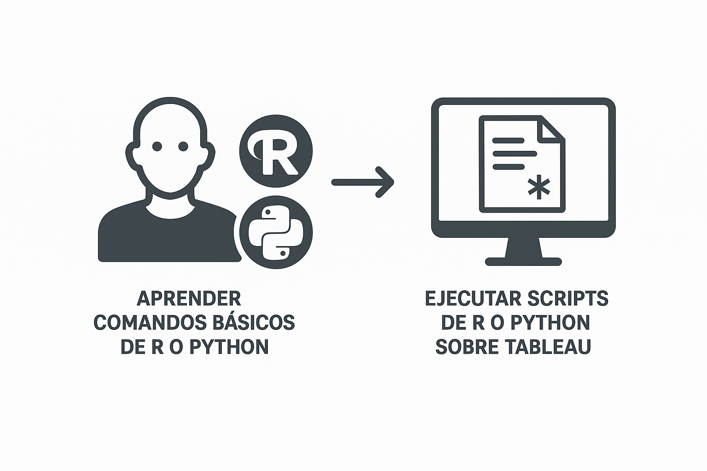
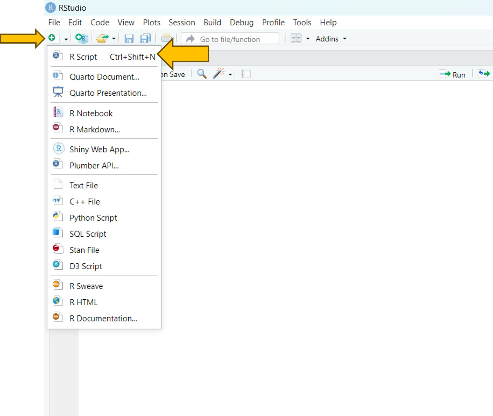
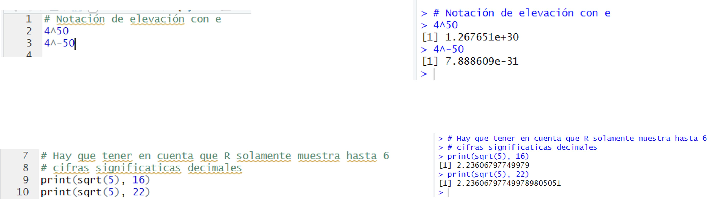
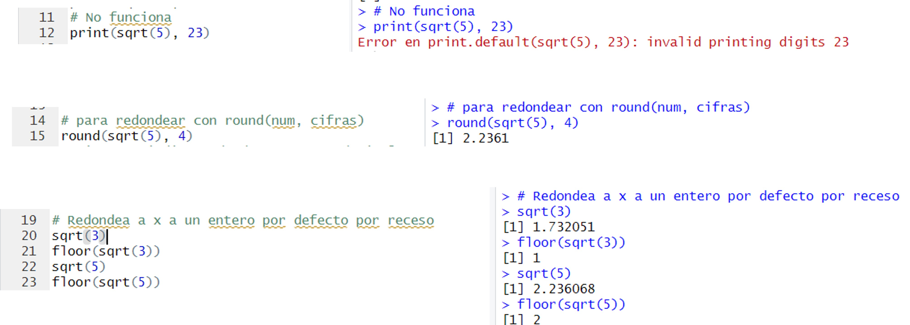
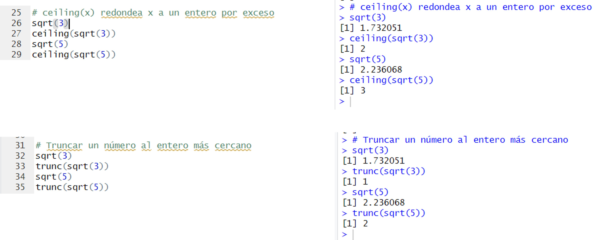
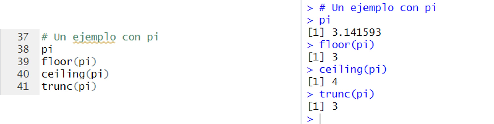
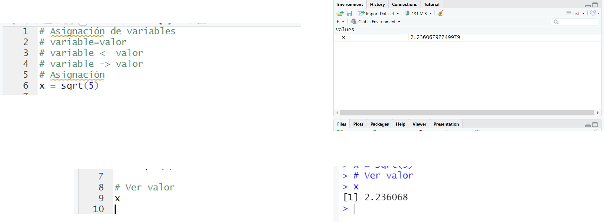
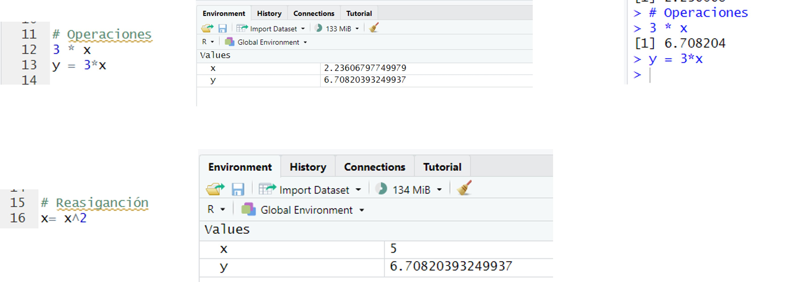
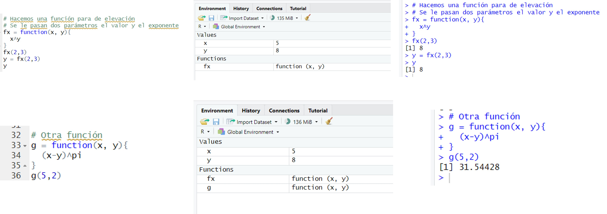

# Práctica 6. Implementación de una integración con R o Python

## Objetivos
Al finalizar la práctica, serás capaz de:
- Aprender comandos básics de R o Python.
- Ejecutar scripts de R o Python sobre Tableau.

## Objetivo visual 

## Duración aproximada:
- 60 minutos.

## Instrucciones 

### Tarea 1. Configuración inicial

En esta tarea, explorarás el tema de programación en la herramienta  REstudio combinada con Phyton. Para ello, abre el entorno de REstudio y crea un archivo Script como se muestra en la imagen. Este archivo ayudará a traducir o interpretar los comando que teclees.

Creada la hoja de Script, puedes iniciar con las primeras instrucciones de  funciones de redondeo; para ello, teclea cada una de las siguientes instrucciones.

Ahora, teclea cada una de las siguientes  instrucciones.

Después, teclea cada una de las siguientes instrucciones.

De nuevo, teclea cada una de las siguientes instrucciones.

Ahora, prueba las instruccionespara la asignación variables y definición de funciones.

Ahora, prueba las instruccionespara la asignación variables y definición de funciones.

Ahora, prueba las instruccionespara la asignación variables y definición de funciones.

