# Proyecto Final

## Objetivo de la práctica:
Al finalizar la práctica, serás capaz de:
1.	Conectar orígenes de datos
2.	Realizar transformaciones
3.	Crear vistas
4.	Diseñar Dashboards

## Objetivo Visual 

## Duración aproximada:
- 120 minutos.

## Instrucciones 

### Tarea 1. Analisis de datos

1. Para este primer ejercicio es necesario descargar el material de la carpeta de nombre Primer Proyecto / Data, mismo que ya tiene en su alcance con el material que se les proporciono. 

2. Lo primero que vamos a realizar es analizar la data que se nos está proporcionando y realizar nuestra primera inspección de limpieza de datos:

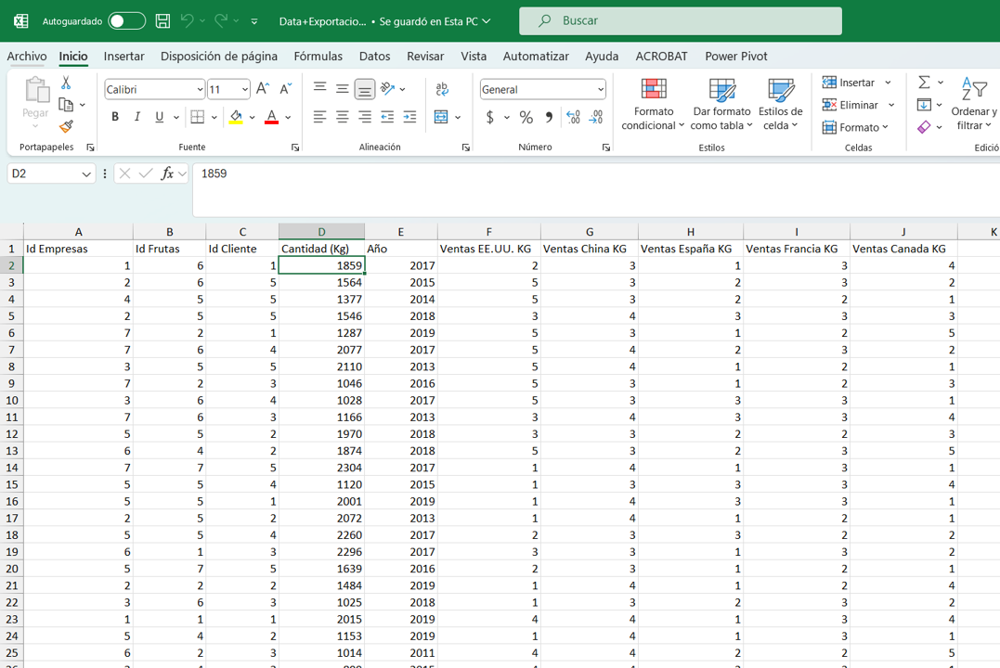
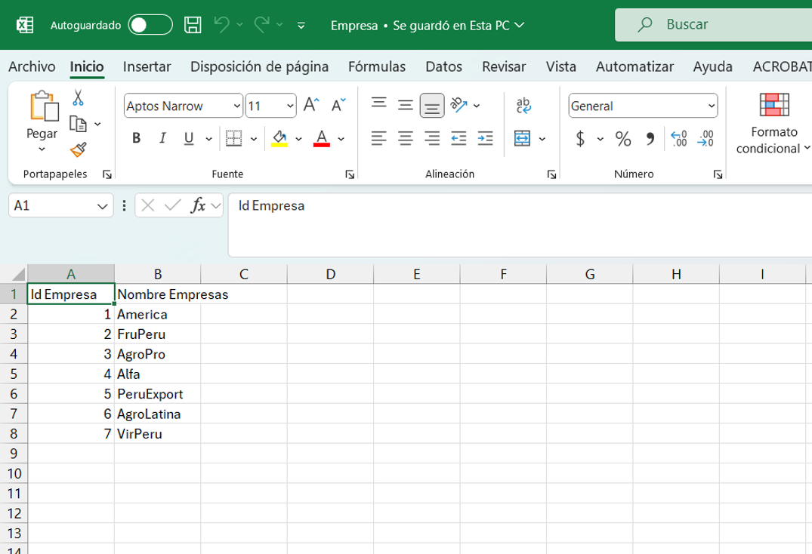
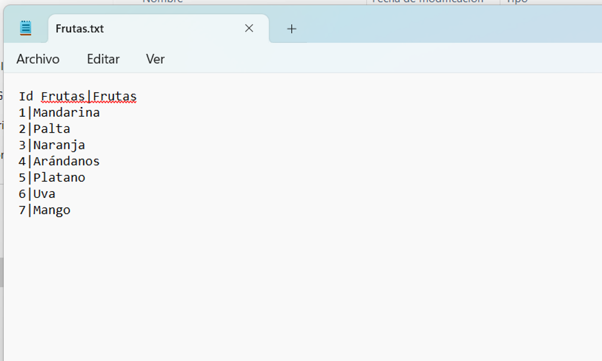

### Tarea 2. Desarrollar un dashboard

*Objetivo:* Desarrollar una Dashboard que nos permita analizar la cantidad de Toneladas de fruta que se han exportado a los clientes de distintos países.

¿ Que se requiere ? 
- Cantidad de Toneladas por Cliente.
- Cantidad de Toneladas por Empresa.
- Cantidad de Tonelada de Clientes por Fruta.
- Ganancias de Exportación por País.
- % de las Ganancias de los Países del Monto Total.
- % de las Exportaciones en Toneladas por País.

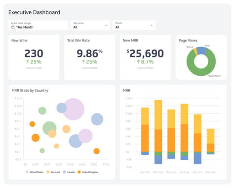

Ya que conocemos el objetivo y los puntos que nos están solicitado, es momento de organizar la data por lo cual te pido crear una carpeta dentro de equipo de cómputo donde organicemos de la siguiente manera los archivos:
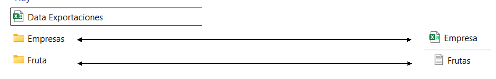

Lo primero es organizar nuestro archivo para posterior mente a esto ahora si vamos a crear nuestra conexión de nuestra data a nuestra aplicación Tableau.

Lo primero que tenemos que hacer es conectar los distintos archivos de data que tenemos en nuestro desarrollo para ellos vamos a abrir nuestra aplicación de Tableau Desktop e iremos a la primera pantalla junto donde aparecen el letrero CONECTAR

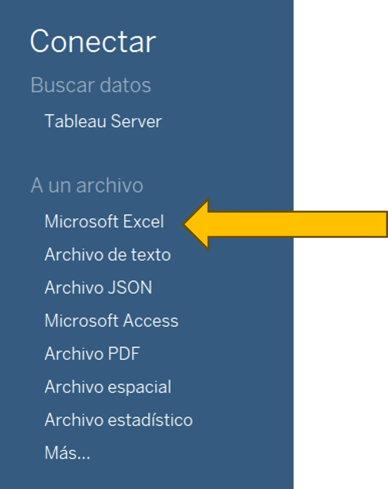

Vamos a conectar primero nuestra data generada en Excel (Data Exportaciones), presionamos abrir 

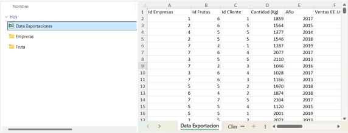

al dar clic en abrir nos colocara nuestra data ya en nuestra paleta de datos , ahora vamos a exportar esta información a nuestro aplicativo, arrastrando primero DATA EXPORTACIONES y posteriormente CLIENTES.
OJO Observemos que cuando arrastramos ambas hojas (data) en automático el aplicativo crea una conexión, crear una relación entre ambas tablas.

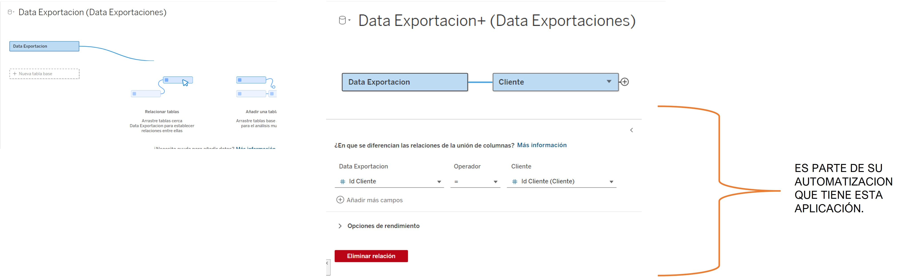

Ahora nos toca crear la conexión con nuestro archivo TXT. de nombre FRUTAS, para ello procederemos a realizar lo siguiente:  

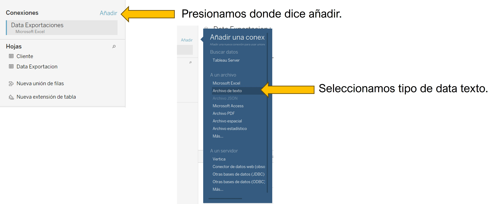

Ya que seleccionamos el tipo de data como texto, seleccionaremos nuestro texto formateado de FRUTAS dando clic en abrir.

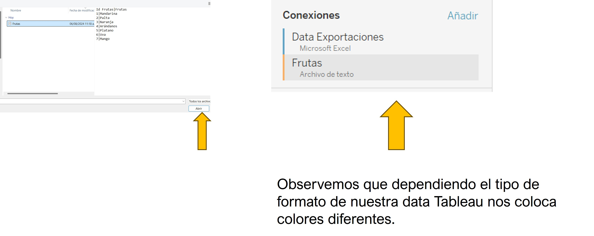

Realicemos el mismo proceso que realizamos con nuestra data de Excel, arrastremos a nuestra paleta de trabajo y observemos que en automático de nuevo crea esta relación de información.
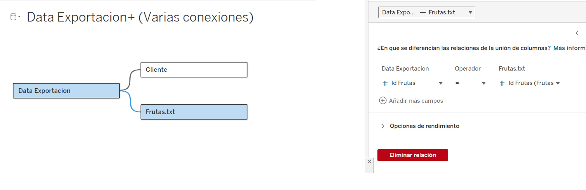

Llego el momento de unir nuestra última data el CSV de nombre Empresas a nuestro proyecto en Tableau. 
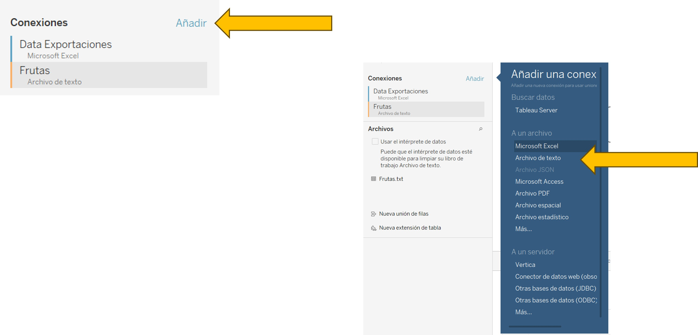

Ya que dimos clic sobre data CSV , seleccionamos la carpeta empresas y damos clic sobre el archivo Empresas.
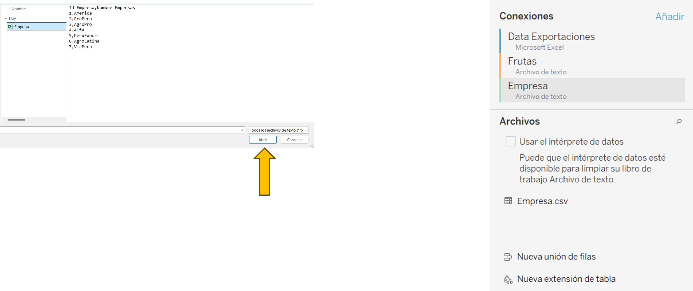

Llego el momento crear esta conexión de datos, vamos a arrastrar nuestro archivo y observemos que sucede, este archivo debemos de enlazarlo directo a nuestro archivo principal.
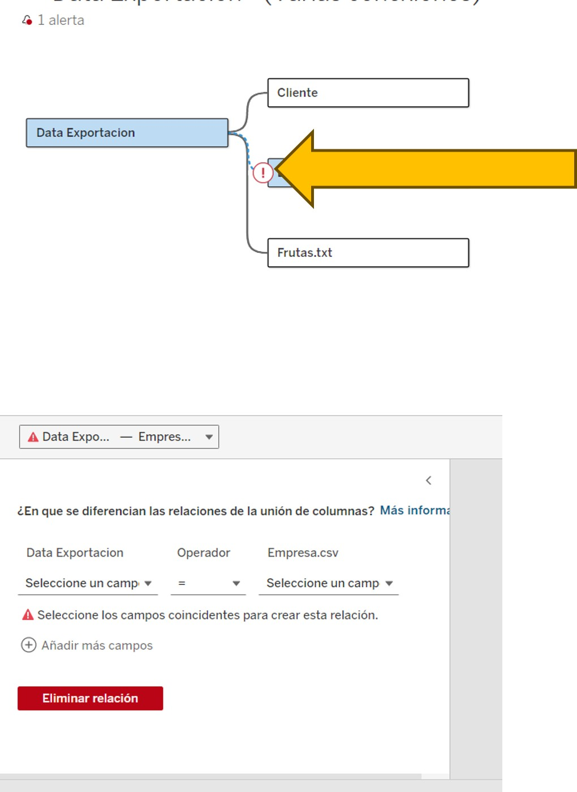

Si observamos bien nos presenta un error al realizar nuestra relación , no identifica que campos unir, aquí la importancia de conocer nuestra data con la que vamos a trabajar para brinda una estructura correcta en esta primera fase y muy importante porque es nuestro cimiento de nuestro Dashboard.

¿ Como solucionarlo ?, es sencillo equipo vamos a unir nuestra data de ambos archivos con el campo Id Empresas.

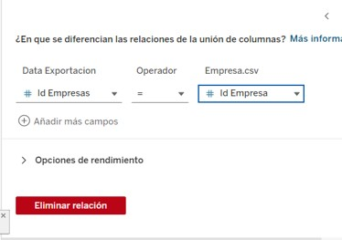

Ahora que ya tenemos nuestras conexiones en nuestras diferentes conexiones de datos, llego el momento de realizar nuestra visualización de datos, lo primero es que vamos a aplicar un filtro a nivel Origen.

Vamos a irnos a la pestaña de Hoja1 y vamos a seleccionar de nuestros datos DATA EXPORTACION seleccionaremos el cambo CANTIDAD EN KG

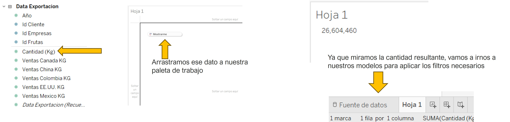

Ya que estamos en nuestra pestaña de fuente de datos, vamos a dar clic en añadir filtros.
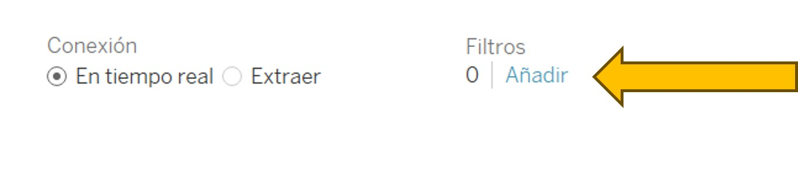

Nos aparecerá la pantalla donde podemos aplicar los filtros, presionaremos en el botón añadir, nos aparecerán los distintos campos en los cuales podemos crear el filtrado, seleccionaremos CANTIDAD KG, esto nos activara un filtro de cantidades numérica en las cuales podemos coocar las diferentes variables.

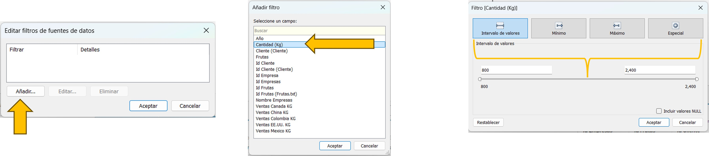

Ahora apliquemos otro filtro, pero a nivel producto, seleccionaremos el campo FRUTAS, observemos que en automático nos aparece los distintos tipos de fruta a seleccionar de nuestro catálogo, para este ejercicio dejare sin seleccionar Palta y Plátano , lo que el filtro hará es solo darme el total de KG de esas frutas que seleccionamos.
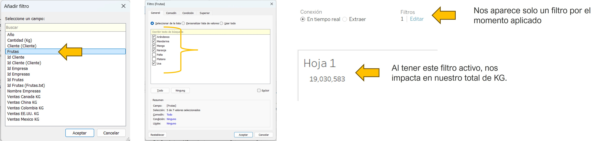

Justo si queremos visualizar este dato más a detallado y validar que en verdad está tomando solo las frutas que seleccionamos, deberemos de colocar en la parte de filas el campo frutas para que nos desglose ese total entre las frutas seleccionadas.
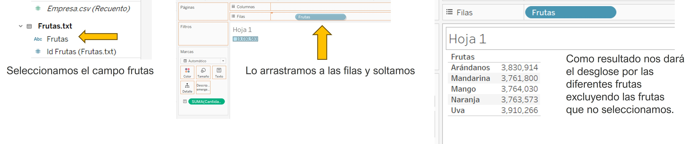

Ahora aplicaremos teniendo nuestro filtro a nivel dato, un filtro a nivel vista, para ellos vamos a nuestra hoja 1 y nos posicionamos en nuestros datos de las frutas, observemos que al dar clic sobre nos habilita un filtrado donde podemos mantener solo ese producto o excluir de la lista ese producto.

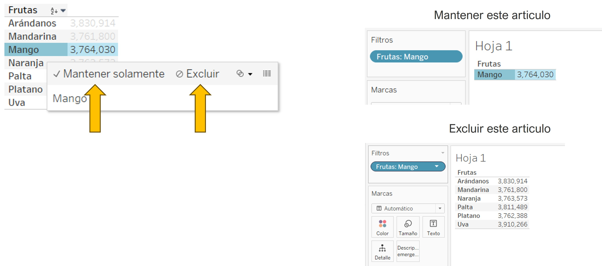

También podemos mostrar nosotros nuestro filtro a nuestra tabla de trabajo, para ellos debemos de arrastrar al campo de filtros el dato de FRUTAS y podríamos también arrastrar la medida de TOTALES que ya se encuentra programada, pero ojo debemos presionar control para pasar nuestra medida a un filtro, como se muestra en las siguientes imágenes.

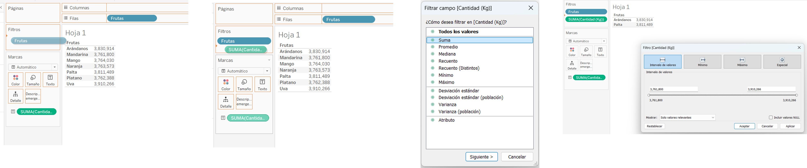

Estos filtros también podemos mejorarlos y configurarlos a necesidad del usuario, para ello nos posicionamos sobre el filtro y daremos clic sobre la flechita del filtro de frutas como se muestra en las imágenes.

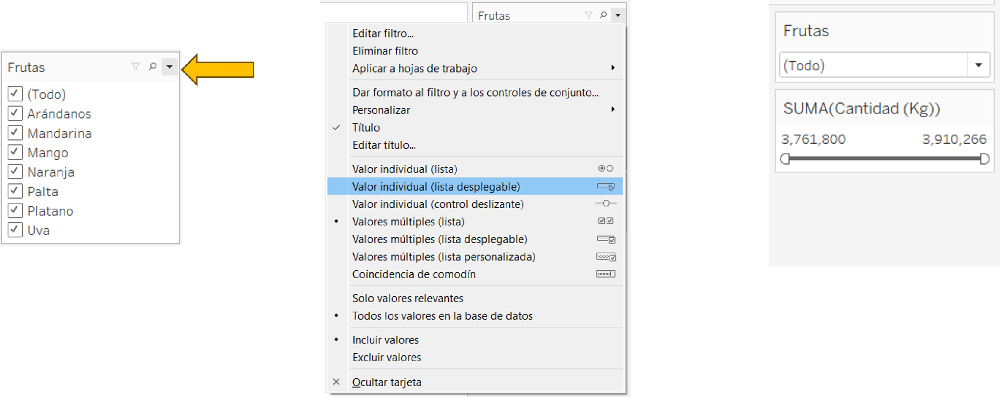

Ahora que aprendimos como colocar a más detalle nuestros filtros utilizando nuestra información llego el momento de ir armando nuestro primer proyecto , para ellos vamos a iniciar a combinar información en columnas y filas para que vallamos aprendiendo como utilizar estos campos con nuestros datos formateados.

Lo primero es que vamos a colocar en columnas nuestro dato de FRUTAS y en filas el campo o dato NOMBRE DE EMPRESAS.

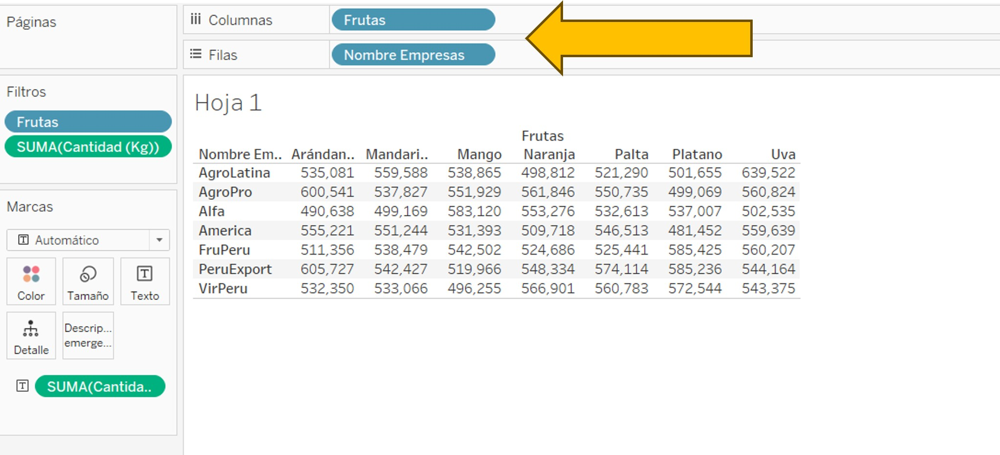

*Instrucción (Actividad sin instrucción guiada)*: En base a la base de datos que limpiamos anteriormente vamos a exportarla a nuestro programa de Tableau Desktop y vamos a crear lo siguiente Tabla de ventas total  por Cedis , Tabla de venta por VP Y Master y por último una Tabla de ventas por Articulo por Cedis

### Tarea 3. Análisis y Filtros en Tableau

Ahora que ya tenemos un reporte general, vamos a ir desglosando este reporte , ahora vamos a iniciar la representación de los datos en modo de grafica para eso necesitamos colocar los siguientes datos en filas y columnas:

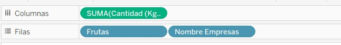

Y de nuestro modelo de datos vamos arrastra de nuestra bd  DATA EXPORTACION el campo AÑO a la parte de Paginas.

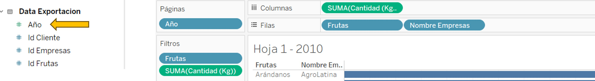

El resultado que obtendremos de colocar esta configuración será una gráfica en barras de la siguiente manera:

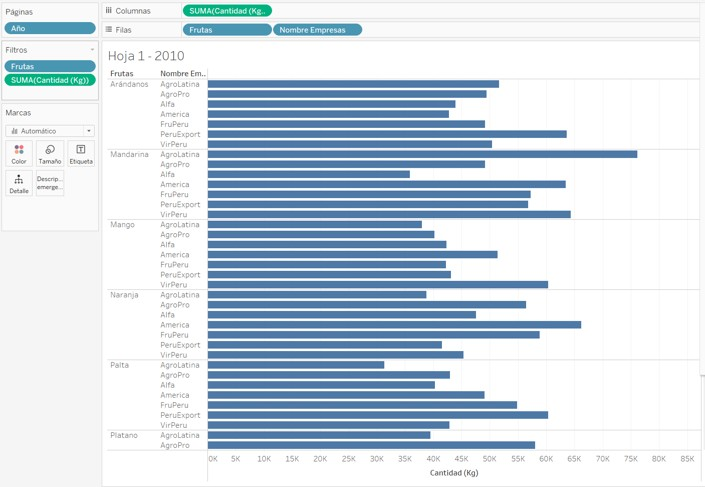

Ahora para facilitar la lectura de nuestros storytelling vamos a utilizar las herramientas para personalizar nuestro gráfico, para una mejor lectura las barras las colocaremos de manera vertical utilizando la siguiente herramienta: 

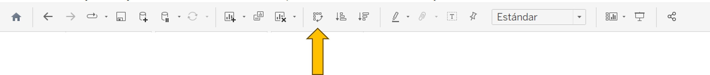

El resultado al realizar este ajuste es el siguiente: 

El resultado al realizar este ajuste es el siguiente: 

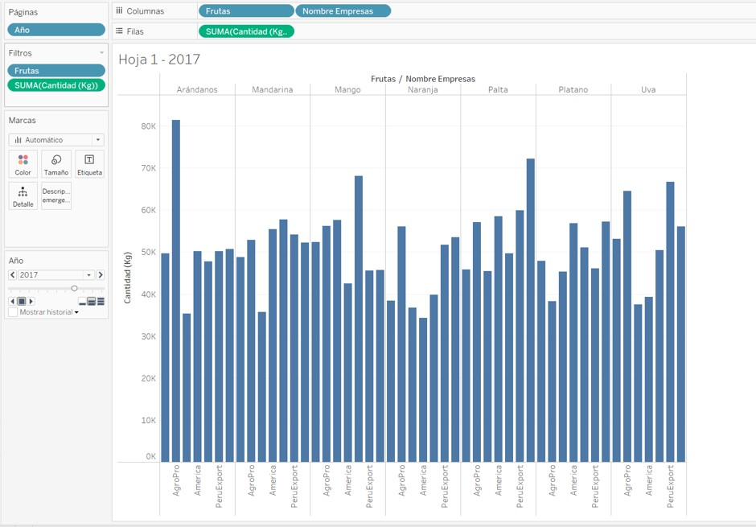

Ahora vamos a trabajar con la información y pivotearemos datos para que nos ayuden a personalizar la información que necesitamos mostrar, vamos a crear otra hoja de trabajo en esta hoja nueva de trabajo necesitamos crear una tabla de datos que nos muestre las ventas por cliente y país.
Para ellos arrastraremos clientes a filas:

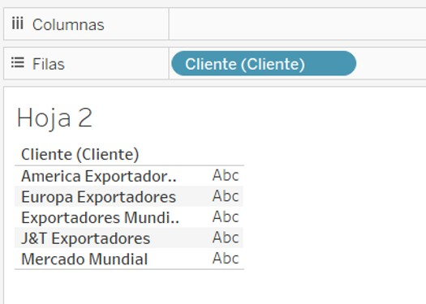

Y donde nos aparece el Abc ahí colocaremos de nuestra data de nombre Exportaciones, las ventas generadas en Canadá.

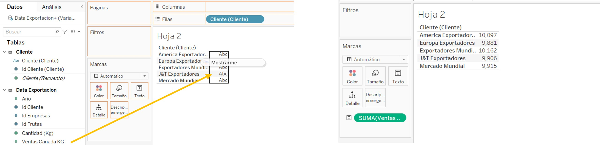

Ahora aplicamos los mismo para los demás países, pero en vez de moverlos donde estaba el Abc , los colocaremos abajo en la parte de marcas sobre la opción de Texto:

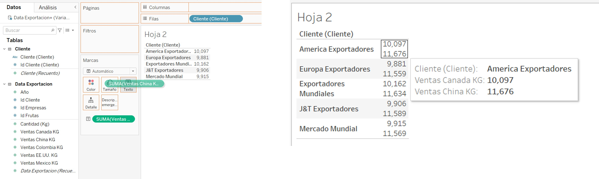

Al mover este dato la representación de este no es tan amigable, por lo cual es necesario hacer la transformación de esta información a tablas de texto para ellos nos iremos a la opción mostrar y seleccionaremos la opción tabla de texto:

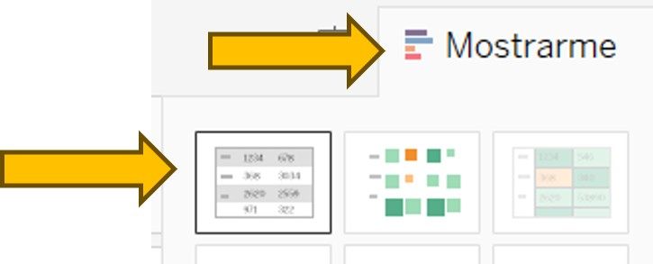

El resultado de seleccionar la tabla de texto es el siguiente:

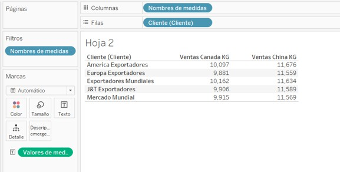

Teniendo esta configuración realizada, podríamos incluir los demás datos en la parte de nombre Valores de Medida hay colocaremos el resto arrastrándolos.

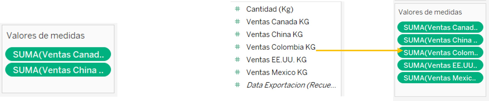

El resultado que debemos de visualizar es el siguiente:

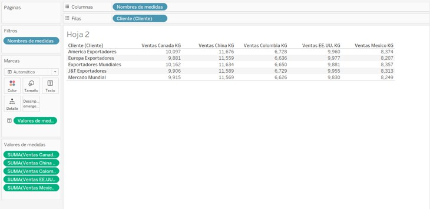

Aquí la reflexión imaginemos que son alrededor de 30 países, estarlos agregando uno por uno sería un trabajo muy estresante y una inversión de tiempo horrible.

Para ese tipo de eventualidades y manejo de la información Tableau tiene una herramienta que se llama pívot , algo parece sido a Excel pero este en lo particular esta para el tema de desarrollo de datos o estructuración de datos.
Para utilizar esta herramienta nos iremos a nuestras fuentes de datos y seleccionaremos nuestra fuente de nombre DATA EXPORTACIONES.

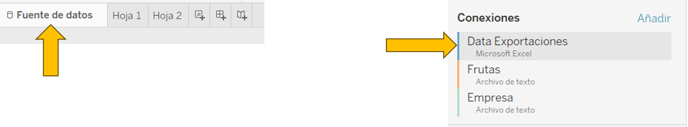

Dentro de nuestros datos de exportaciones seleccionaremos las ventas iniciando en E.E.U.U y finalizando en Canadá , cada una la sombrearemos y daremos clic derecho para seleccionar en el menú que nos aparecerá la opción pivotar ( Crear tabla dinámica). 

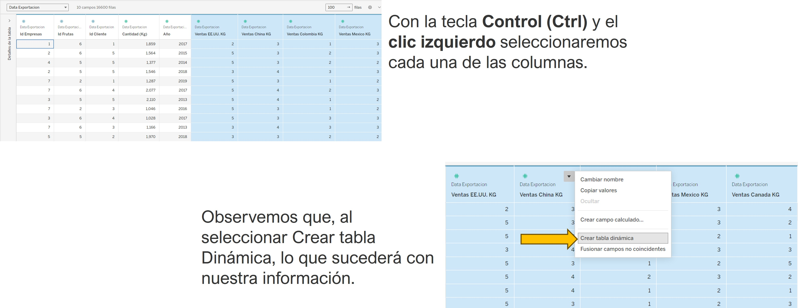

Realizado lo anterior nuestra data tendrá cambios como se muestra en la siguiente imagen:

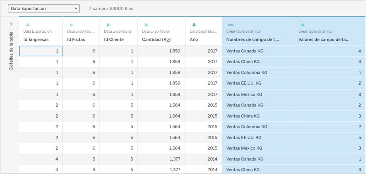

Si observamos bien, nuestros datos se simplifican y nos crea dos campos, el primer campo el nombre de las ventas por país y el segundo campo el número de ventas.

Si bien los datos así son funcionales podemos organizar nuestra data de una manera más flexible que nos pueda ayudar a simplificar y transparentar lo que nosotros queremos comunicar en nuestro storytelling.
Nosotros de nuestra nueva columna, solo necesitamos extraer los países para poder crear una estructuración más idónea y nos ayude a estructura la información correctamente.
Para ellos nos vamos a posicionar sobre esa columna y daremos clic sobre la pestaña de opciones para que nos despliegue las herramientas de división.

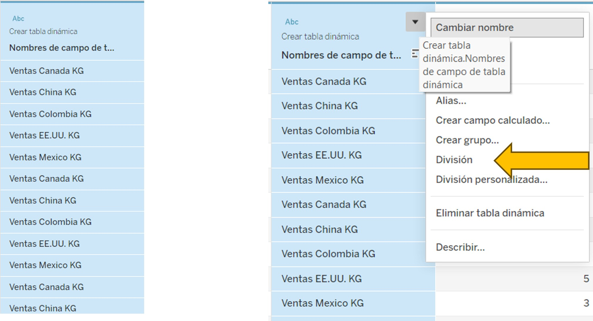

Realizado lo anterior observemos que nos crea en automático una columna con los países que tenemos en nuestro campo pívot

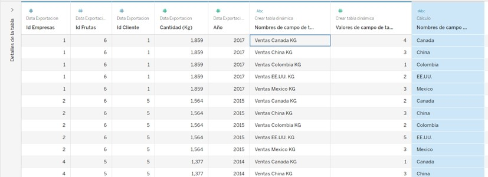

Ahora renombremos esta columna y nuestra pívot, ocultamos esa columna.

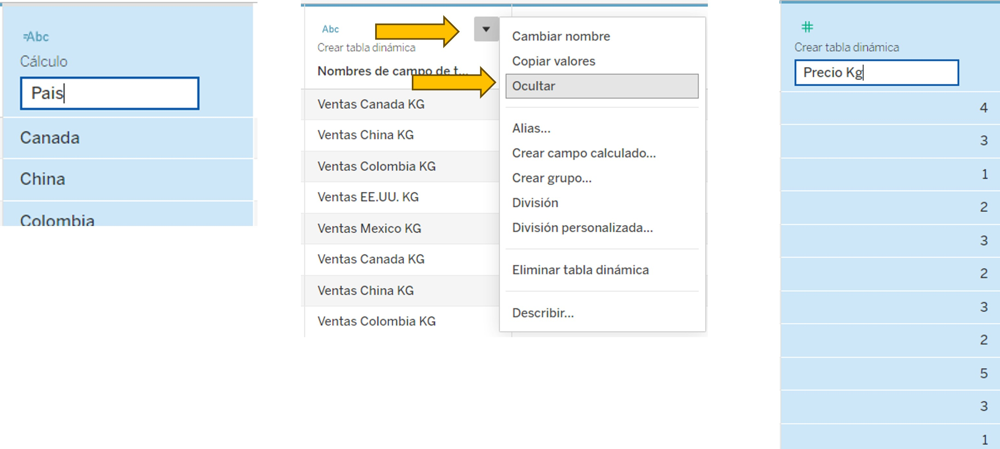

Realizado el ajuste anterior nuestra hoja nos aparecerá todo en rojo, no te asustes, esto es porque recuerda que creamos una medida. 

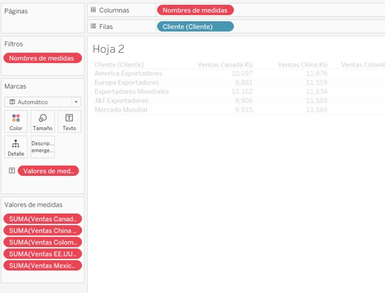

Ya con la medida podemos realizar la siguiente configuración para nuestro reporte.

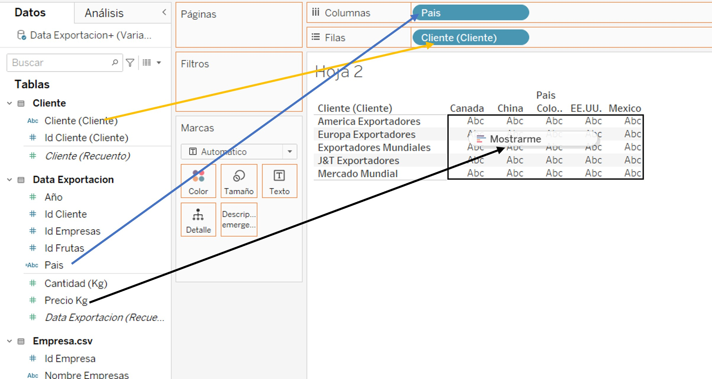

Nuestra visualización quedara de la siguiente manera:

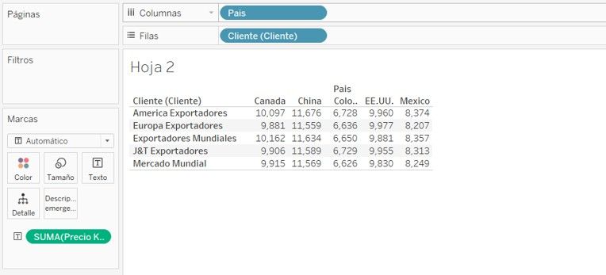

Para nosotros crear una medida en nuestros campos es necesario posicionarnos sobre el modelo de datos y a continuación sobre el campo donde deseamos agregar la medida.
Para este ejemplo crearemos una medida al campo Cantidad KG vamos a crear una medida en la cual los kilogramos los convertiremos a toneladas de la siguiente manera.

Nos posicionamos sobre nuestros datos de Data Exportación – campos Cantidad KG, daremos clic derecho y seleccionaremos crear una medida.

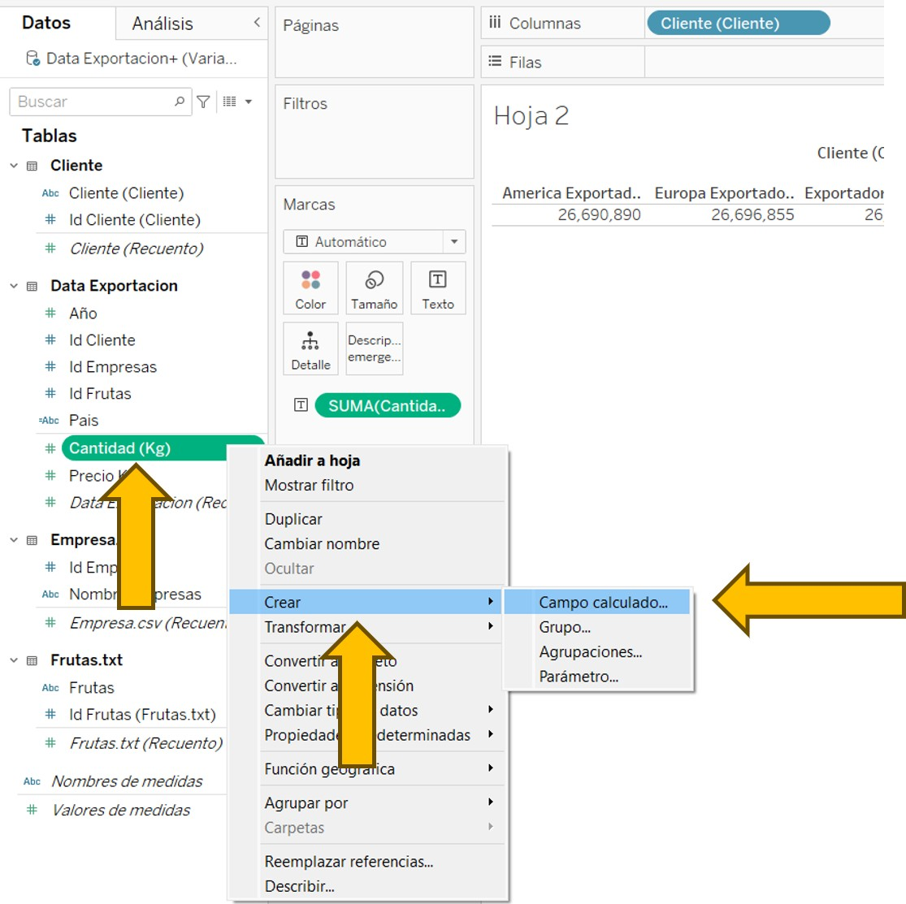

Ahora que ya sabes crear filtros, nos tocara crear medidas con nuestra información y jugar con las tarjetas que podemos desarrollar para nuestra Dashboard.

Para ellos en esta primera etapa necesitamos colocar el campo de clientes en la parte de columnas y el acampo de kilogramos lo colocaremos sobre cliente para obtener la siguiente visualización.

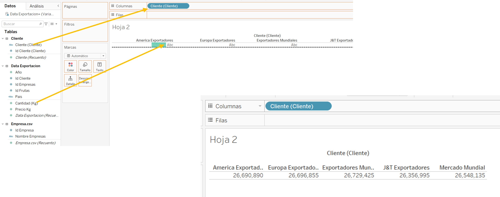

Cuando demos clic sobre crear campo calculado nos aparecerá la siguiente pantalla.

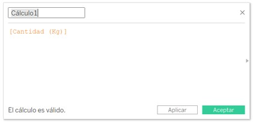

Aquí es donde colocaremos las instrucciones para realizar dicha acción, iniciaremos con nombrar este campo calculado como Cantidad (Tonelada)

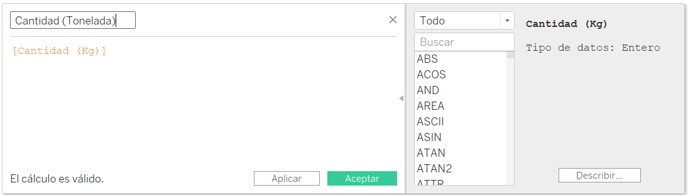

Ya con el nombre ahora en la parte de las operaciones colocaremos lo siguiente, una tonelada es igual a 1000 KG por lo tanto tenemos que dividir nuestro campo Cantidad (KG) entre mil.

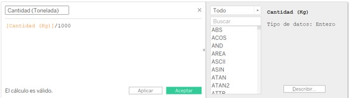

Aceptamos y ya nos aparecerá este nuevo campo en nuestro modelo.
Movemos el campo hacia texto y miremos que sucede.

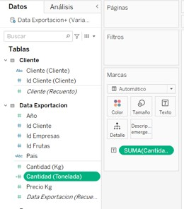

Nos mostrara nuestra tarjeta aparte de los KG también aparecen las Toneladas:

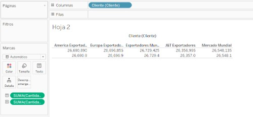

Ahora imagínate que te piden redondear este valor de tonelada, para ello vamos al campo que creamos de cantidad tonelada y editamos la medida, para redondear agregaremos a la formula la instrucción ROUND y en ella especificamos la cantidad de decimales de la siguiente manera:

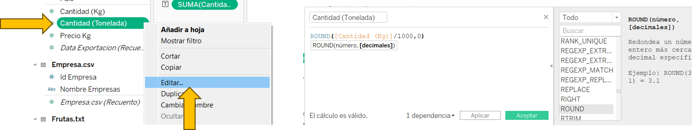

Si observamos bien este redondeo que aplicamos no nos ayudó mucho en el tema de los valores:

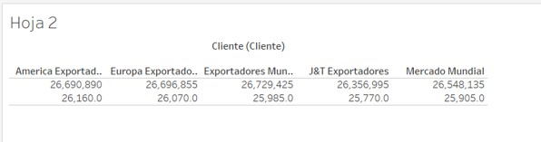

Analicemos la raíz de nuestra información porque a nivel aplicativo no creo que sea el error, esto viene desde la raíz, vamos al Excel de Data Exportaciones para entender los datos

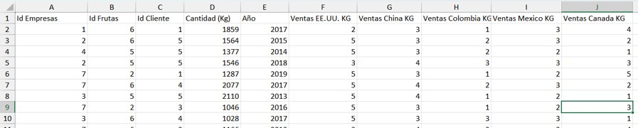

Lo primero será activar filtros y filtrar la primera empresa para ellos debemos de validar que numero de empresa es America Exportadores y filtramos el Id cliente número 3

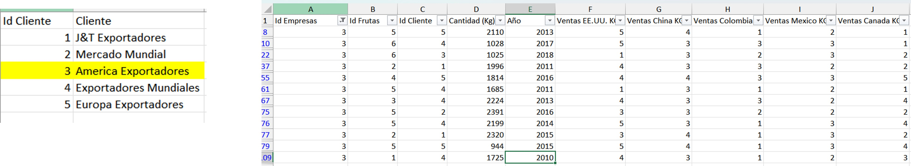

Ahora seleccionemos todos los datos de nuestra columna D de nombre Cantidad (KG).

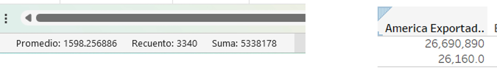

Observemos que el promedio de datos nada que ver con los datos que tenemos en nuestro informe.

¿Equipo la pregunta del millón porque está pasando esto ?, ¿Acaso los datos los introducimos o exportamos mal ?

Ahora vamos con la REPUESTA, recuerdan que creamos una pívot y 5 filas las unimos a una sola, entonces si esa cantidad que nos da Excel la multiplicamos por 5 nos dará la misma cantidad.

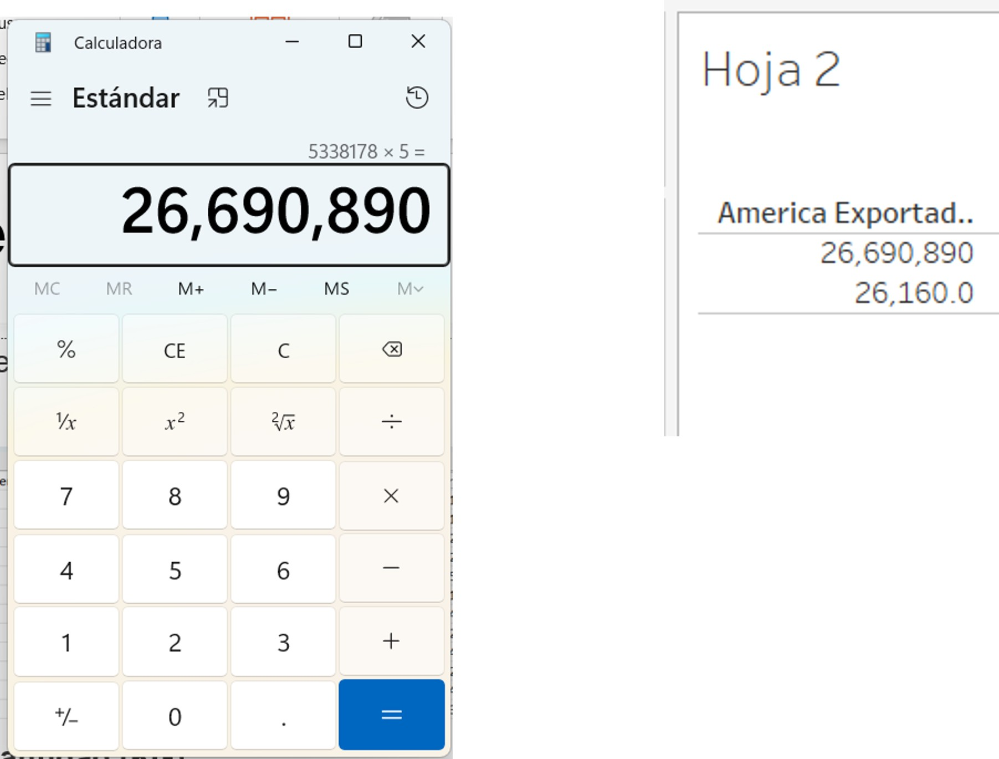

La explicación lógica resuelta pero como presentamos esta información, tenemos que realizar unos ajustes en nuestra formula de la medida, donde colocaremos la suma de las cantidades de KG divididas entre 1000 y ahí aplicaremos nuestra instrucción de ROUND y quedara de la siguiente manera equipo:

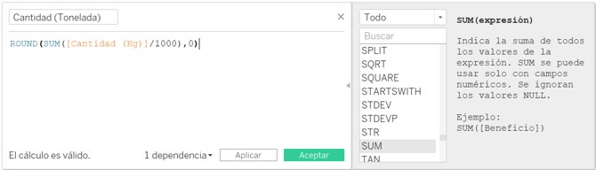

El resultado es :

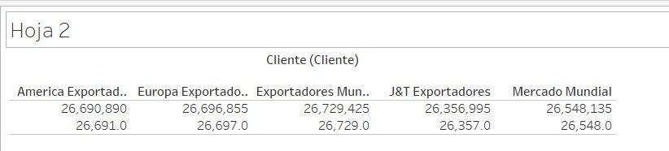

