# Proyecto final

## Objetivos
Al finalizar la práctica, serás capaz de:
- Conectar orígenes de datos.
- Realizar transformaciones.
- Crear vistas.
- Diseñar dashboards.

## Objetivo visual 

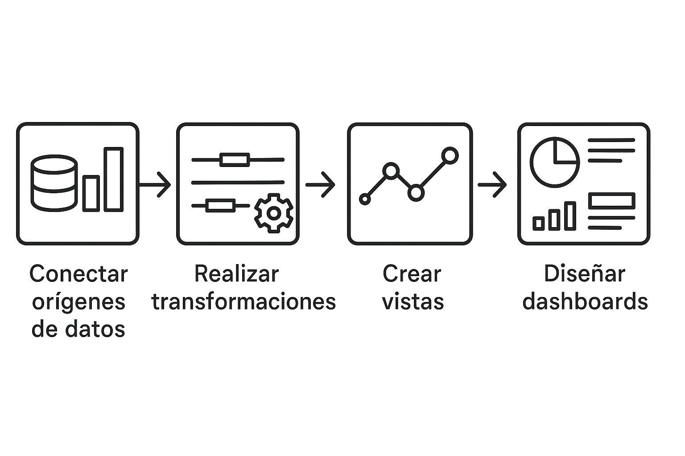

## Duración aproximada
- 120 minutos.

## Instrucciones 

### Tarea 1. Conexión y preparación de datos
1.	Para este primer ejercicio, descarga el material de la carpeta Primer Proyecto / Data, que ya tienes disponible en el material proporcionado.
2.	Analiza la data proporcionada y realiza una primera inspección para la limpieza de datos.

### Tarea 2. Limpieza de datos

Desarrolla un dashboard que permita analizar la cantidad de toneladas de fruta exportadas a clientes de distintos países.

Requerimientos:

- Cantidad de toneladas por cliente.
- Cantidad de toneladas por empresa.
- Cantidad de toneladas de clientes por fruta.
- Ganancias de exportación por país.
- % de las ganancias por país respecto al monto total.
- % de las exportaciones en toneladas por país.

Organiza la data creando una carpeta en tu equipo para estructurar los archivos. 

Luego, conecta los distintos archivos en Tableau.

- Abre Tableau Desktop, ve a la primera pantalla junto donde aparece `CONECTAR`.

- Conecta el archivo Excel Data Exportaciones.

- Arrastra `DATA EXPORTACIONES` y, posteriormente, `CLIENTES`.

•	Conecta el archivo TXT FRUTAS.

Ya que seleccionaste el tipo de data como texto, selecciona el texto formateado de `FRUTAS` dando clic en `Abrir`.

Realiza el mismo proceso que realizaste con la data de Excel, arrastra a la paleta de trabajo y observa que, en automátic,o de nuevo crea esta relación de información

Une la última data el CSV de nombre Empresas al proyecto en Tableau.

Haz clic sobre `Data CSV`, selecciona la carpeta `Empresas` y da clic sobre el archivo `Empresas`.

Crea esta conexión de datos, arrastra el archivo y observa qué sucede. Debes  enlazar este archivo directo al archivo principal.

Presenta un error al realizar la relación, no identifica qué campos unir. De aquí la importancia de conocer la data con la que se trabajará, para brindar una estructura correcta en esta primera fase y porque es el cimiento del Dashboard

¿Cómo solucionarlo? Es sencillo:  une la data de ambos archivos con el campo ID `Empresas`.

Luego que ya tienes las conexiones en las diferentes conexiones de datos, llegó el momento de realizar la visualización de datos. Lo primero es  aplicar un filtro a nivel ` Origen `.

Ve a la pestaña de `Hoja1` y selecciona los datos `DATA EXPORTACION ` selecciona el cambio `CANTIDAD EN KG`. 

Ya que estás en la pestaña de fuente de datos, da clic en `añadir filtros`.

Aparecerá la pantalla donde puedes aplicar los filtros, presiona el botón `añadir`. Aparecerán los distintos campos, en los cuales puedes crear el filtrado, selecciona ` CANTIDAD KG `, esto activará un filtro de cantidades numérica en las cuales puedes colocar las diferentes variables.

Luego aplica otro filtro, pero a nivel producto; selecciona el campo `FRUTAS`. Observa que en automático aparecen los distintos tipos de fruta a seleccionar en el catálogo. 
Para este ejercicio, deja sin seleccionar `Palta` y `Plátano`; el filtro dará el total de KG de las frutas seleccionadas.

Si quieres visualizar este dato más detallado y validar que en verdad está tomando solo las frutas que seleccionaste, debes colocar en la parte de filas el campo `frutas` para que desglose el total de las frutas seleccionadas.

Luego aplica, teniendo el filtro a nivel dato, un filtro a nivel vista. Para ello, dirígete a la hoja y posiciónate en los datos de las frutas; observa que al dar clic, habilita un filtrado donde puedes mantener solo ese producto o excluir de la lista el producto.

También puedes mostrar el filtro a la tabla de trabajo, para ello debes arrastrar al campo de filtros el dato de `FRUTAS` y también arrastrar la medida de `TOTALES` que ya se encuentra programada. Sin embargo, debes presionar `control` para pasar la medida a un filtro, como se muestra en las siguientes imágenes. 

También puedes mejorar estos filtros y configurarlos a necesidad del usuario; para ello, posiciona sobre el filtro y da clic sobre la flecha del filtro de `FRUTAS`  como se muestra en las imágenes.

Luego que aprendiste cómo colocar a más detalle los filtros utilizando la información, llegó el momento de armar el primer proyecto; para ello, comienza a combinar información en columnas y filas para que vayas aprendiendo cómo utilizar estos campos con los datos formateados.

Lo primero es colocar en columnas el dato de `FRUTAS` y en filas el campo o dato `NOMBRE DE EMPRESAS`.

#### Actividad sin instrucción guiada
Exporta la base de datos previamente limpiada al programa Tableau Desktop y crea lo siguiente:

- Una tabla de ventas total por CEDIS.
- Una tabla de ventas por VP y Master.
- Una tabla de ventas por artículo por CEDIS.

### Tarea 3. Análisis y filtros en Tableau

Cuando tengas un reporte general, desglosa este reporte. Inicia la representación de los datos en modo de gráfica, para eso necesitas colocar los siguientes datos en filas y columnas.

Del modelo de datos, arrastra de la bd `DATA EXPORTACIÓN` el campo `AÑO ` a la parte de `Páginas`.

El resultado que obtendrás de colocar esta configuración será una gráfica en barras como la siguiente.

Luego, para facilitar la lectura los _storytelling_ utiliza las herramientas para personalizar el gráfico. Para una mejor lectura, coloca las barras de manera vertical utilizando la siguiente herramienta.

El resultado es el siguiente.

Luego, trabaja con la información y pivotea los datos para que ayuden a personalizar la información que necesitas mostrar. Crea, en una nueva hoja de trabajo, una tabla de datos que muestre las ventas por cliente y país. Para ello, arrastra `clientes` a filas.

Donde aparece el _Abc_, coloca en la data `Exportaciones `, las ventas generadas en Canadá.

Luego, aplica lo mismo para los demás países, pero en vez de moverlos donde estaba el _Abc_, colócalos abajo, en la parte de marcas sobre la opción de ` Texto `.

Al mover este dato, su representación no es tan amigable, por lo cual es necesario transformar esta información a tablas de texto; para ello, ve a la opción `mostrar` y selecciona la opción `Tabla de texto`.

El resultado es el siguiente.

Teniendo esta configuración realizada, puedes incluir los demás datos en la parte de nombre `Valores de Medida`, ahí coloca el resto arrastrándolos.

El resultado es el siguiente.

Imagina que son alrededor de 30 países, agregarlos uno por uno sería un trabajo muy estresante y una inefectiva inversión de tiempo.

Para ese tipo de eventualidades y manejo de la información, Tableau tiene una herramienta que se llama pívot, parecido a Excel, pero especializado en el tema de desarrollo o estructuración de datos.

Para utilizar esta herramienta, ve a las fuentes de datos y selecciona la fuente de nombre `DATA EXPORTACIONES`.

Dentro los datos de exportaciones, selecciona las ventas, iniciando en E.E.U.U y finalizando en Canadá; sombrea cada una y da clic derecho para seleccionar la opción pivotar (crear tabla dinámica) en el menú que aparecerá. 

Realizado lo anterior, la data tendrá cambios como se muestra en la siguiente imagen.

Los datos se simplifican y se crean dos campos: el primero con el nombre de las ventas por país y el segundo con el número de ventas.

Si bien, los datos así son funcionales, puedes organizar la data de manera más flexible que pueda ayudar a simplificar y transparentar lo que quieres comunicar en el _storytelling_.

De la nueva columna, solo necesitas extraer los países para crear una estructura más idónea que ayude a organizar la información correctamente.

Para ello, posiciónate sobre esa columna y da clic sobre la pestaña de opciones para que despliegue las herramientas de división.

Realizado lo anterior, observa que crea en automático una columna con los países que tienes en el campo pívot.

Luego, renombra esta columna y la pívot y oculta esa columna.

Realizado el ajuste anterior, la hoja aparecerá toda en rojo, esto es porque que creamos una medida. 

Ya con la medida, puedes realizar la siguiente configuración para el reporte.

La visualización quedará de la siguiente manera.

Para crear una medida en los campos, es necesario posicionarte sobre el modelo de datos y, a continuación, sobre el campo donde deseas agregar la medida.

Para este ejemplo, crea una medida al campo `Cantidad KG` en la cual los kilogramos los convierte a toneladas de la siguiente manera.

Posiciónate sobre los datos de `Data Exportación – campos Cantidad KG`, da clic derecho y selecciona `Crear una medida`.

Ahora que ya sabes crear filtros, crea medidas con la información y juega con las tarjetas que puedes desarrollar para la Dashboard.

Para ello, en esta primera etapa, necesitas colocar el campo de clientes en la parte de columnas y el campo de kilogramos colócalo sobre `Cliente` para obtener la siguiente visualización.

Cuando des clic sobre `Crear campo calculado` aparecerá la siguiente pantalla.

Aquí, coloca las instrucciones para realizar dicha acción, inicia con nombrar este campo como `Cantidad (Tonelada)`.

Ahora, en la parte de las operaciones, coloca lo siguiente: una tonelada es igual a un Kg; por lo tanto, tienes que dividir el campo `Cantidad (KG) ` entre mil.

Acéptalo y aparecerá este nuevo campo en el modelo. Mueve el campo hacia texto y mira qué sucede.

Mostrará la tarjeta aparte de los Kg, también aparecerán las toneladas.

Ahora, imagínate que te piden redondear este valor de tonelada, para ello, ve al campo que creaste de cantidad tonelada y edita la medida. Para redondear, agrega a la fórmula la instrucción `ROUND` y, en ella, especifica la cantidad de decimales de la siguiente manera. 

Este redondeo que aplicaste no ayudó mucho en el tema de los valores.

Analiza la raíz de la información porque a nivel aplicativo no podría ser el error, esto viene desde la raíz. Regresa al Excel de Data Exportaciones para entender los datos.

Lo primero será activar filtros y filtrar la primera empresa, para ello, debes de validar que número de empresa es America Exportadores y filtra el Id cliente número 3.

Luego, selecciona todos los datos de la columna D de nombre Cantidad (Kg). 

Observa que el promedio de datos no coincide con los datos que tienes en el informe. ¿Porque está pasando esto ?, ¿acaso los datos los introdujiste o exporta mal? 

Recuerda que creaste una pívot y uniste 5 filas a una sola, entonces si la cantidad que da Excel la multiplica por 5, dará lo mismo. 

Ahora, debes realizar unos ajustes en la fórmula de la medida: coloca la suma de las cantidades de Kg divididas entre 1000 y ahí aplica la instrucción de `ROUND ` y quedará de la siguiente manera.

El resultado es:

### Tarea 4. Dashboards e historias

La primera tarjeta presenta dos datos, las cantidades en kilogramos y las cantidades en toneladas, pero quieres quedarte solo con toneladas; por lo tanto, en esta primera tarjeta, quita la cantidad en kilogramos. 

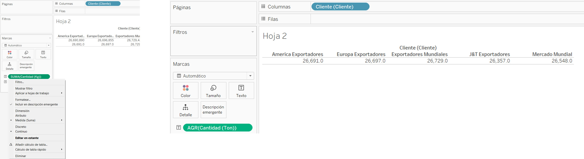

Ya tienes la representación de los datos que necesitas, ahora personaliza la tarjeta: el primer dato a modificar es el título  `Clientes`, el cual debes eliminar de la siguiente manera. 

Haz clic derecho sobre el título y presiona donde dice ocultar: 

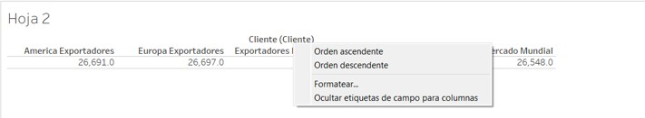

El resultado queda como en la siguiente imagen: 

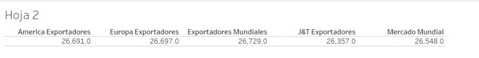

Luego, cambia el nombre de la hoja presionando sobre `Hoja 2 ` y colócale el nombre de `TONELADAS POR CLIENTE`: 

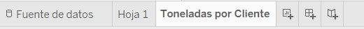

Observa que al momento de hacer el cambio, el título de la paleta de trabajo también cambió de hoja a `Toneladas` por `Cliente`, también personaliza ese título y colócalo como `Descripción – Toneladas Clientes`, de la siguiente manera: 

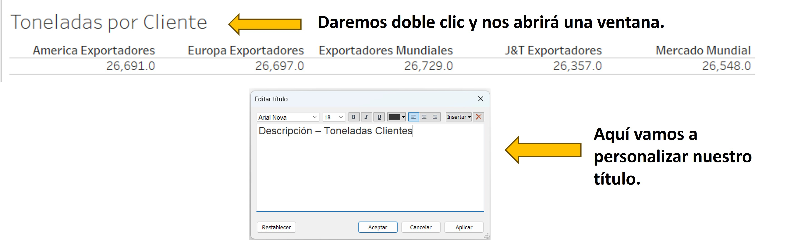

Personalizado el título, haz clic en aceptar y el resultado será el siguiente: 

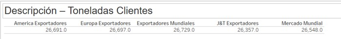

Luego formatea los valores de la tarjeta; para ello, da clic derecho sobre el primer valor y aparecerán las siguientes opciones: 

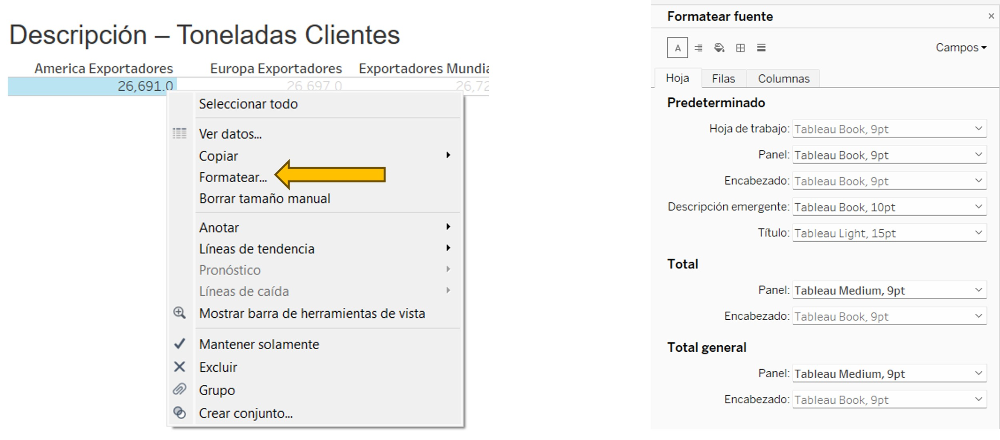

Lo primero que realizarás con esta herramienta es personalizar los títulos de cliente; para ello, observa en la siguiente imagen qué dato es el que quieres formatear:

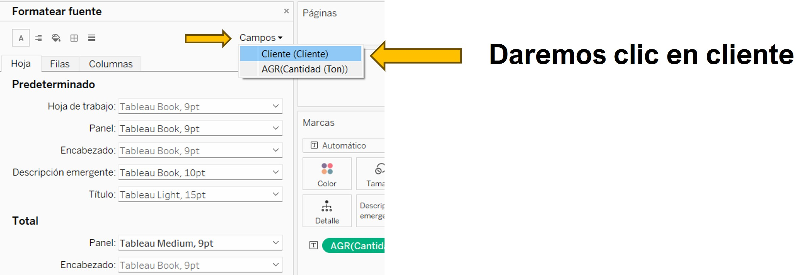

Luego, selecciona el campo `cliente`, haz las siguientes modificaciones en el panel de personalización: 

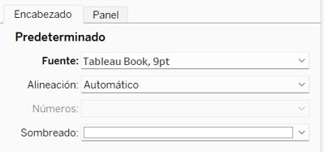

El resultado será el siguiente:

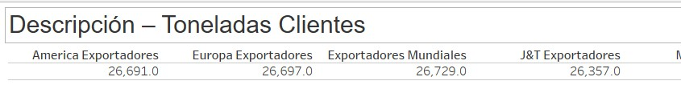

A continuación, centra el texto del campo `clientes`, da clic en la opción de `Alineación` y selecciona la alineación central:

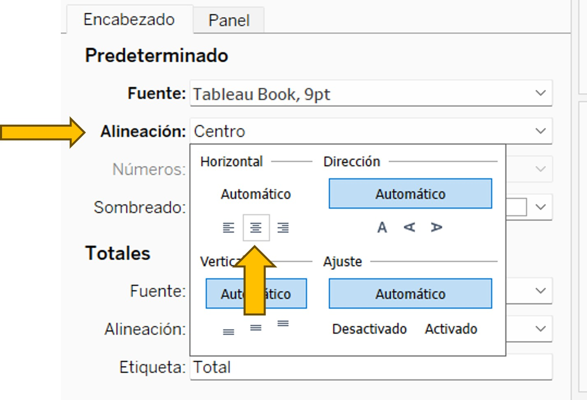

El resultado es :

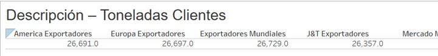

El texto de cliente ya está alineado y formateado, ahora toca seleccionar las cantidades en toneladas, para ello, selecciona el primer campo:

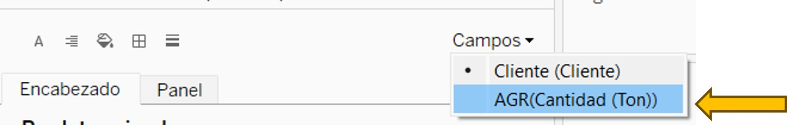

Procede a colocar el siguiente formateo:  

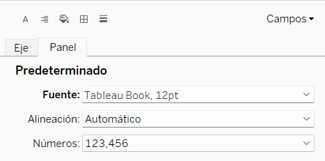

Para alinear, selecciona la opción `alineación` de la siguiente manera:

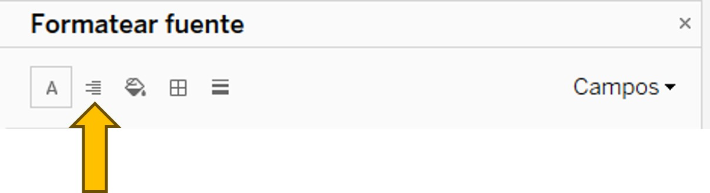

Selecciona `alineación` y justo en esa opción, la sección de `Predeterminado` y en panel coloca `alineación central` como se muestra en la imagen:

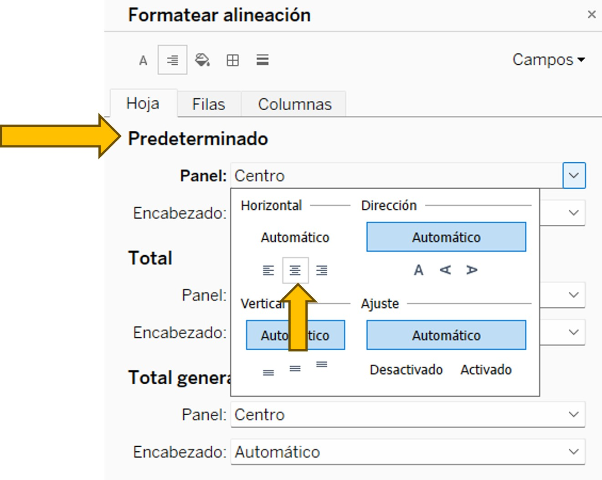

Obtendrás el siguiente resultado:

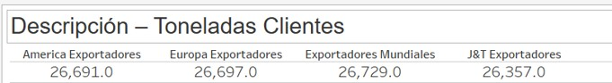

Luego, quita las líneas divisoras de los datos. Para realizar este ajuste, da clic sobre la opción `Límites` y busca la opción `Divisor de Filas`, aquí quita estas líneas como en las siguientes imágenes: 

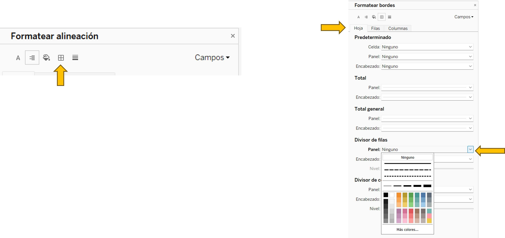

El resultado es el siguiente sin estas líneas divisoras. Cabe recalcar que puedes colocar el formato que más te agrade.

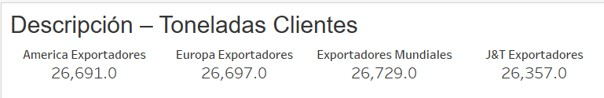

Luego formatea el valor. Como ves, aparece un decimal en 0; el cual debes quitar de la siguiente manera: selecciona en la parte de campos cantidad en toneladas, ya que esta seleccionada ve a la pestaña de panel, ahí busca la opción de números, da clic y selecciona la opción `Números Estándar `.

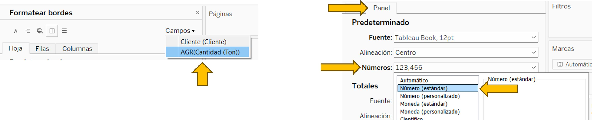

Realizado ese formateo, el resultado es el siguiente:

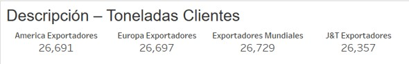

Parte de la personalización es la organización los datos. Hay bastantes datos o campos innecesarios para el dashboard, por lo tanto, hay que ocultarlos desde la fuente de datos de la siguiente manera:

Primero, en la pestaña de fuente de datos:

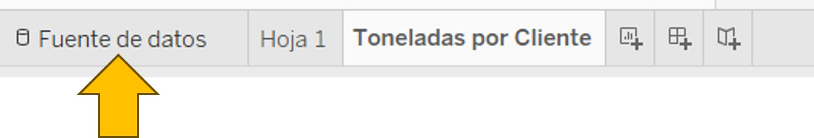

Dentro de la pestaña `Datos`, comienza trabajando con la conexión denominada Data Exportaciones. En esta conexión, elimina todos los campos de tipo ID. Luego, procede a ocultarlos. Para hacerlo, selecciona el primero, que corresponde a `Id Empresas`, haz clic en su pestaña de opciones y elige la opción `Ocultar`, tal como se muestra en la imagen. Una vez realizado este paso, repite el mismo procedimiento para los demás campos de ID.

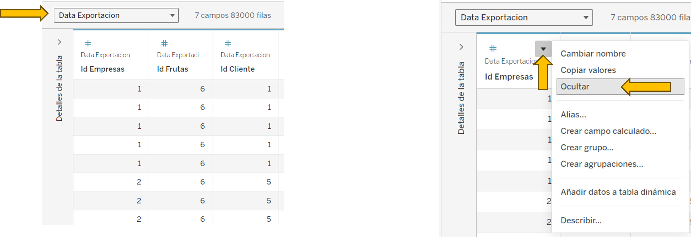

El resultado es el siguiente:

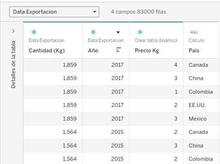

Luego realiza lo mismo: oculta todos los ID de las demás conexiones (`Clientes`, `Empresas`, `Frutas`).

El resultado esperado es el siguiente:

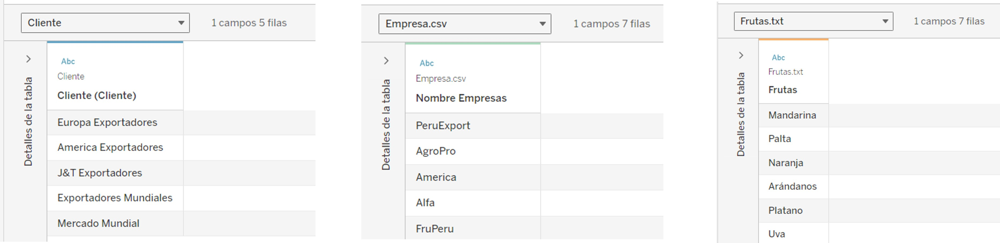

Si necesitas mirar los valores ocultos, puedes visualizarlos dando clic sobre el engrane como se muestra en la siguiente imagen; con esto, aparecerán habilitados y sombreados estos campos ocultos.

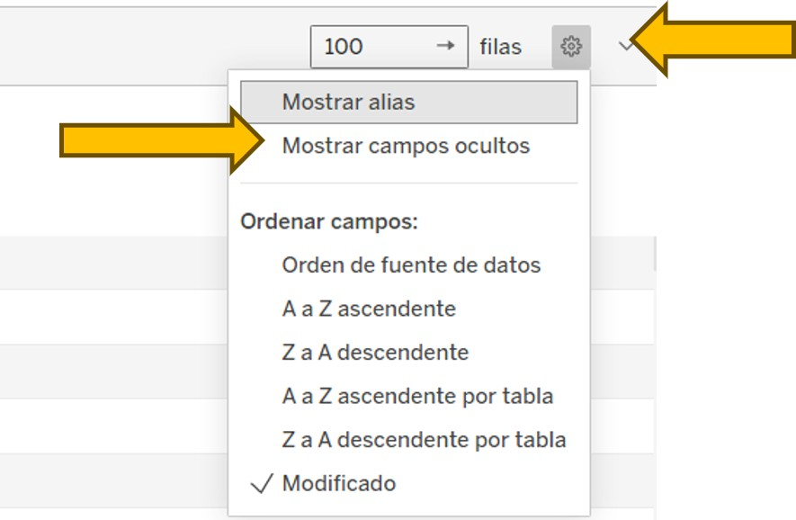

Ahora la pregunta del millón, ¿esto para que me sirve? Observa un antes y un después en la tabla de trabajo a nivel `campos`:

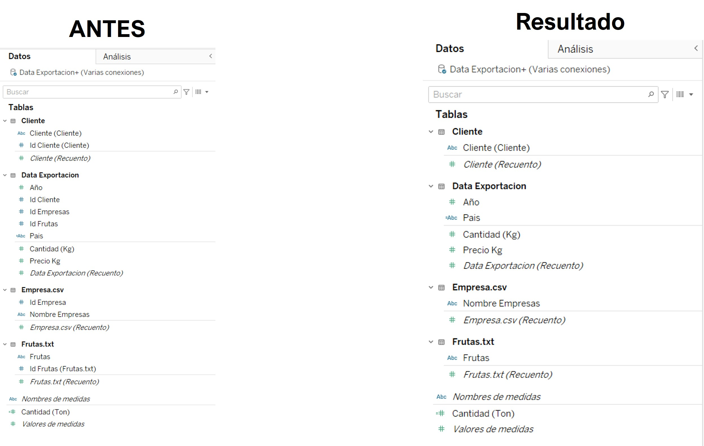

Esta organización de la información ayudará a identificar los campos y los valores a utilizar en el Dashboard de manera más fácil.

Realizado lo anterior procede a crear un diagrama de barra personalizado, para ello inicia creando una nueva hoja en la tabla de trabajo.

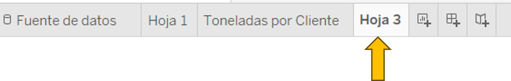

Creada la hoja colócale el nombre de `Toneladas de frutas  por cliente`.

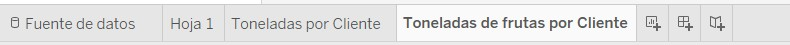

Ahora, arrastra el campo de clientes a la columna y en la parte de valores, coloca el campo `Cantidad (Toneladas) `.

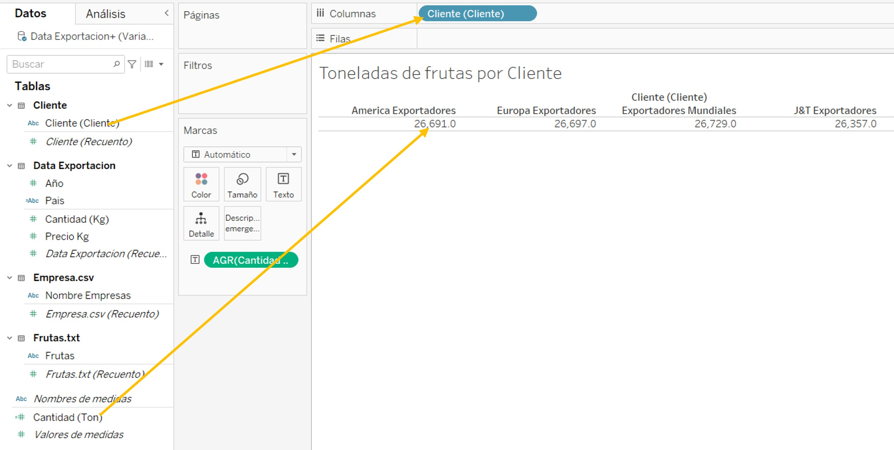

Ahora, dirígete al menú `MOSTRAR` y selecciona `Barras Horizontales` y rota este gráfico con la opción de rotación 

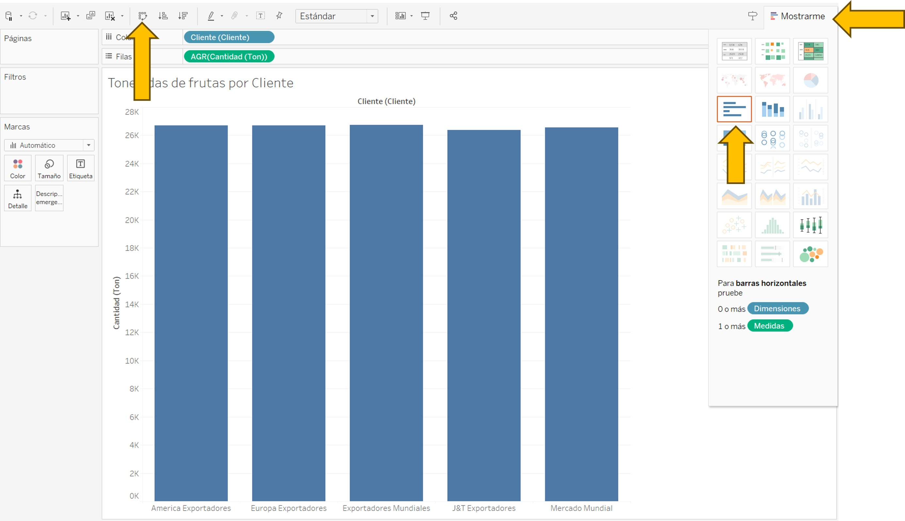

De esta forma, en el eje Y se muestran las toneladas y en el eje X los distintos clientes. Ahora, también necesitas visualizar la exportación correspondiente a las diferentes `FRUTAS`. Para ello, arrastra el campo `FRUTAS` a la sección de columnas y activa la herramienta `Mostrar etiquetas`.

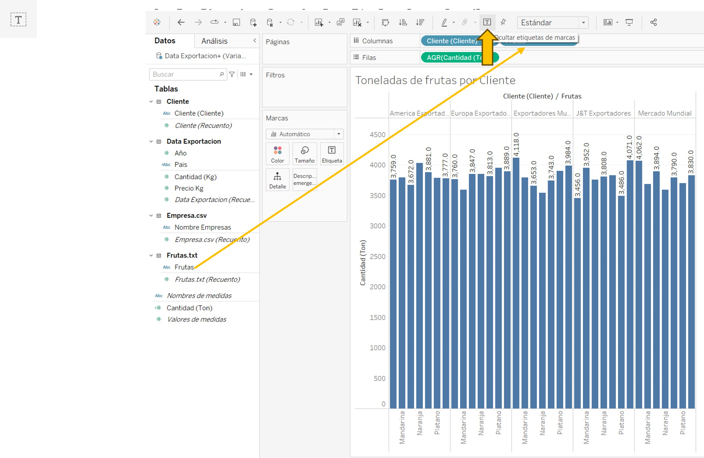

El desarrollo debe quedar como en la siguiente imagen.

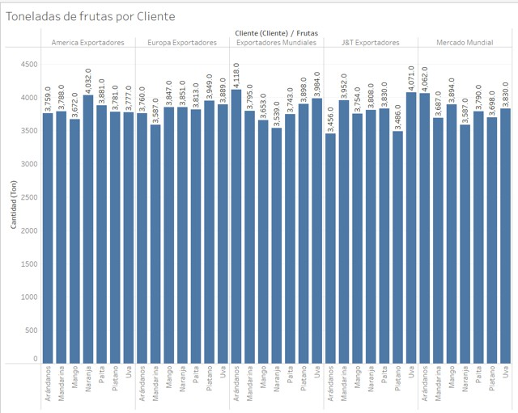

Una vez formateado el gráfico como se mostró anteriormente, es necesario asignar colores a las columnas según los clientes. Esto permitirá visualizar los datos de manera más clara. Para lograrlo, arrastra el campo `Clientes` a la herramienta de colores. Al aplicar este ajuste, cada cliente se representará con un color distinto, tal como se muestra en la imagen.

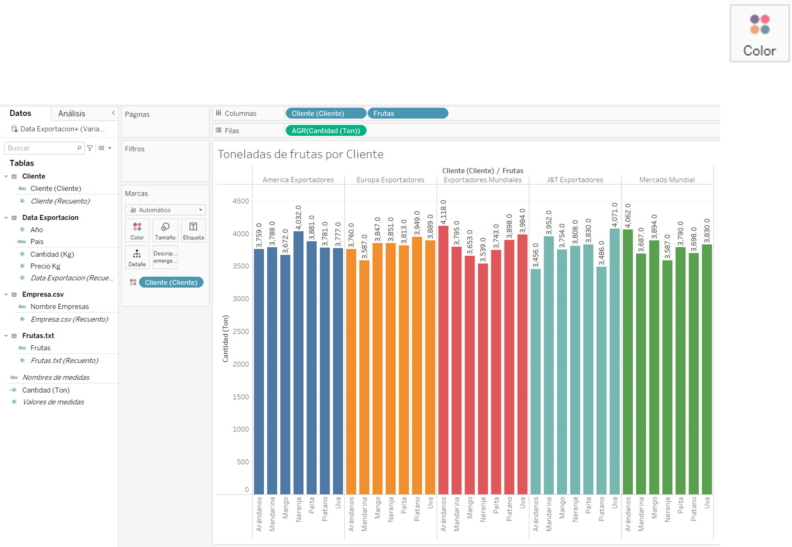

También puedes configurar el gráfico para que las barras se ordenen de manera descendente y ocultar la tarjeta de colores, con el objetivo de mejorar la presentación del reporte.

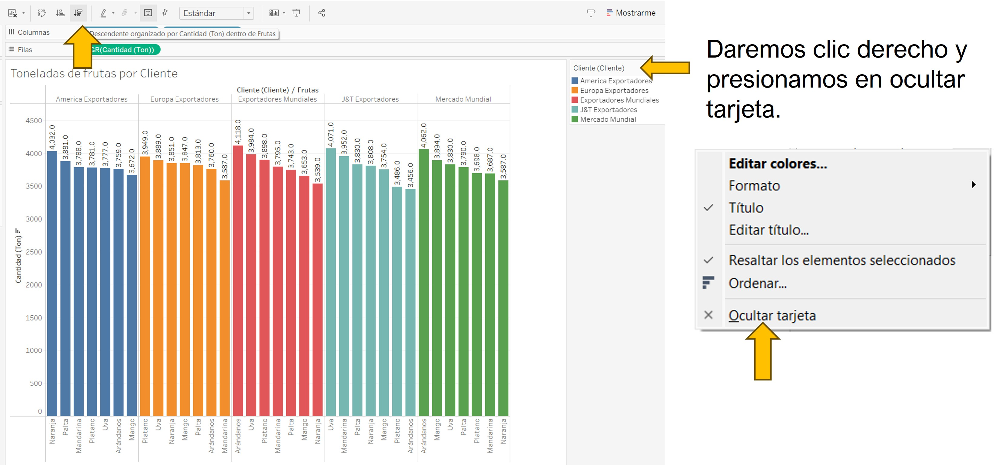

Luego oculta el encabezado de la gráfica dando clic derecho en `Ocultar`.

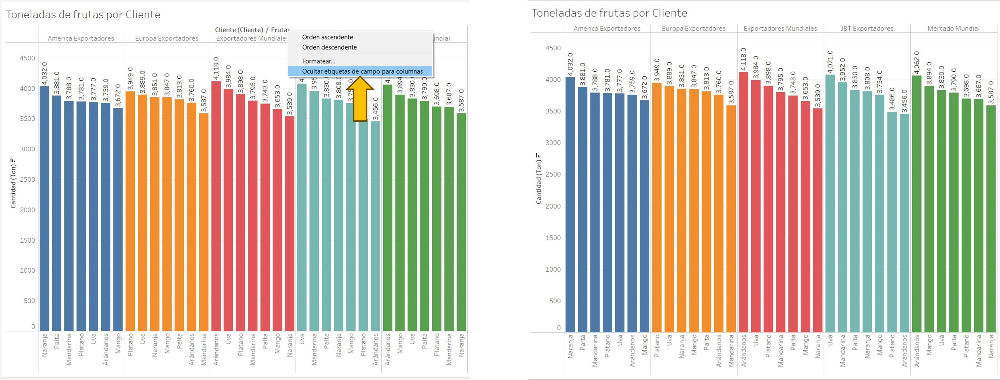

Por último, ajusta el formato para que no aparezcan decimales en el total de toneladas mostrado en la gráfica. Para hacerlo, ve a la medida correspondiente, haz clic izquierdo sobre ella y selecciona la opción `Formatear`. En la pestaña `Panel`, dirígete a la sección `Números` y elige el formato `Numeración estándar`.

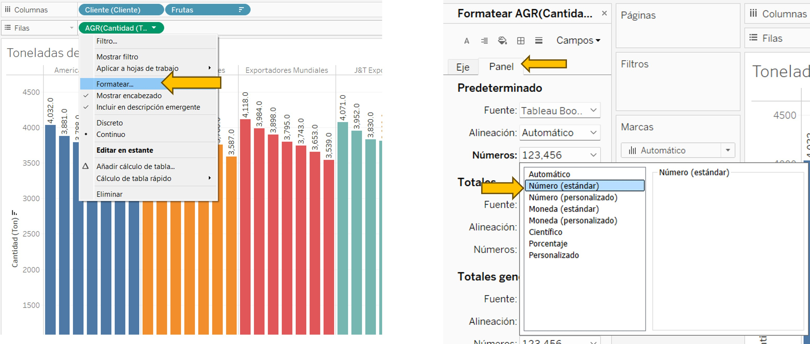

El resultado es el siguiente:

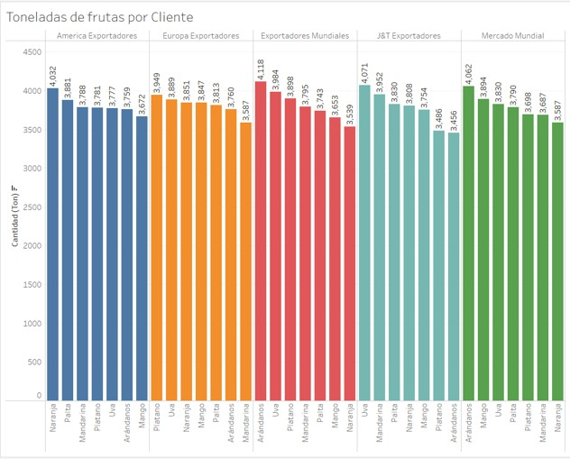

Luego crea otra hoja con el nombre de `Monto total y porcentaje por país`.

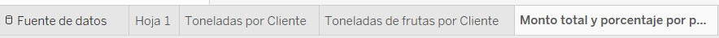

Luego, necesitarás colocar el campo `País` en las filas y obtener el monto total de la venta. Para ello, primero analiza el archivo Excel `Data Exportaciones`.

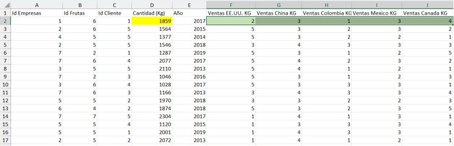

Para calcular el monto total, será necesario crear una medida que multiplique la cantidad en kilogramos por el precio de venta de los países. 

Ubica el campo `Precio`, haz clic derecho sobre él y selecciona la opción `Crear campo calculado`.

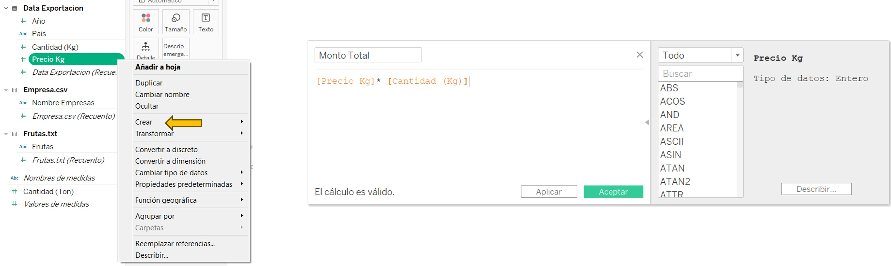

Una vez creado el campo, inicia la construcción de la gráfica: coloca el campo `País` en las filas y, como valores, utiliza el campo recién creado `Monto Total`.

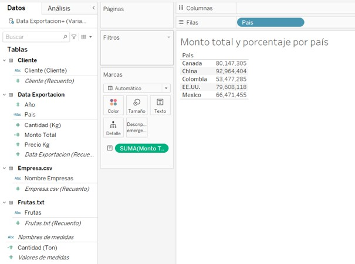

Una vez creada la tabla, utiliza el menú `Mostrarme` para cambiarla a una gráfica de barras y observa el resultado.

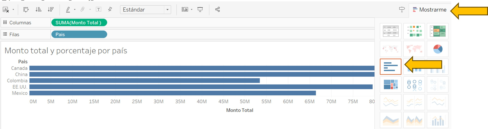

Luego, si vuelves a colocar en columnas el campo calculado `Monto Total`, verás que aparece el mismo dato en diferentes gráficas de barras.

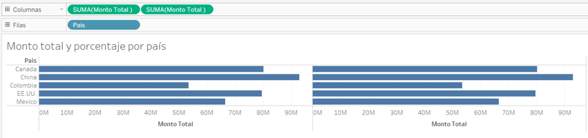

Esta segunda gráfica servirá para calcular el porcentaje.
Para ello, haz clic derecho sobre el segundo campo calculado `Monto Total`, selecciona `Cálculo de tablas rápido` y elige la opción `Porcentaje del total`. Observa cómo cambia la visualización.

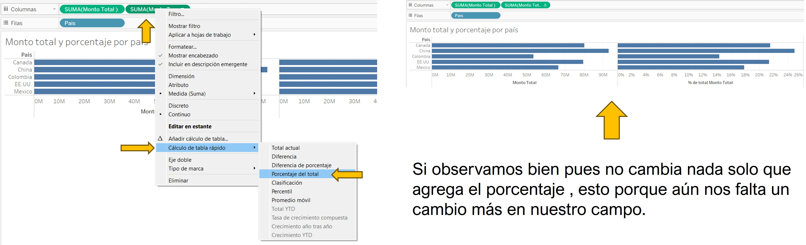

Ve al segundo campo agregado `Monto Total` y haz clic sobre él. En el menú, selecciona la opción `Discreto` y observa el resultado.

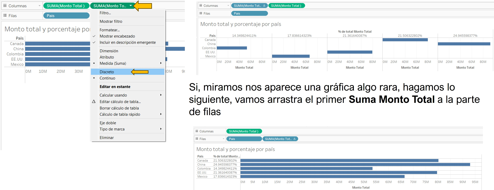

Luego, formatea la información del porcentaje para que muestre solo cifras. Para ello, haz clic en `Suma Monto Total` en las filas, selecciona `Formatear` y aplica el formato deseado.

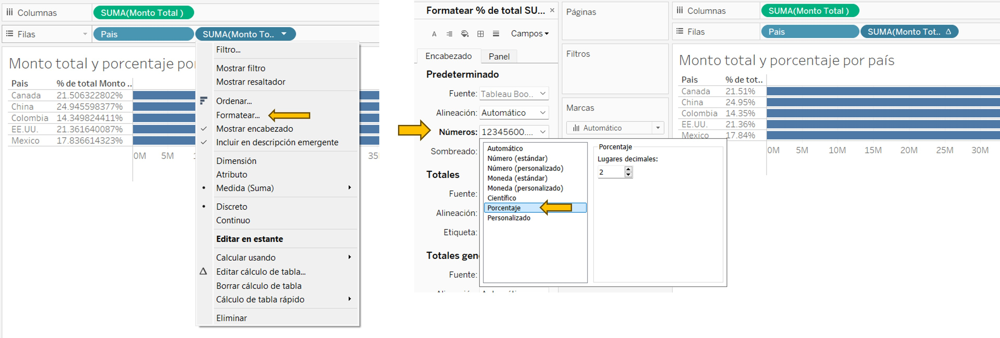

Después, ordena el gráfico en forma descendente para mejorar la visualización.

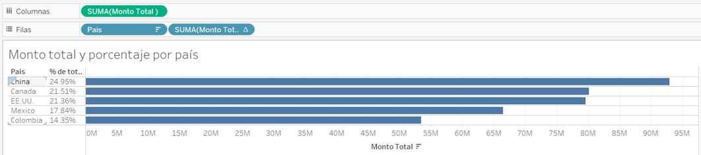

Personaliza los colores del gráfico: arrastra el campo `Monto Total` a la sección de colores y observa cómo se comporta.

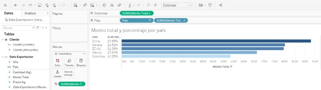

Finalmente, cambia el color azul por otro desde la paleta que aparece en el panel derecho y revisa el resultado.


Una vez creadas las gráficas de barras (total y porcentaje), crea una nueva hoja de trabajo y asígnale el título `Filtro de Donas`.


Primero, arrastra el campo `País` a la herramienta de colores.


Como resultado, los datos se mostrarán con una diferenciación por color.


Luego, en la sección `Marcas`, haz clic en la lista desplegable y selecciona la opción `Circular`.


Al realizar esta acción, el gráfico cambiará a formato circular.


A continuación, comienza a armar el gráfico: arrastra el campo `Cantidad (Toneladas)` a la opción `Etiquetas`.


Después, crea el Placeholder: en la parte de columnas, haz doble clic y escribe una coma (,), luego haz doble clic nuevamente y coloca una `y`. Esta acción formateará el gráfico de manera adecuada.


En el valor 1, haz clic izquierdo y, en el menú, convierte cada uno en una dimensión; realiza lo mismo para valor 2.


El resultado, tras aplicar la opción `Dimensión` en ambos valores, será una gráfica de pastel correctamente configurada.


Para mejorar la visualización, haz clic en la opción `Vista` y cambia de `Estándar` a `Vista completa`. 


Esto ampliará el área de trabajo y dará una mejor presentación.


Finalmente, observa que en la sección `Marcas` se han agregado configuraciones independientes para las gráficas de pastel, lo que permite personalizar cada una.


Comienza la personalización con el Gráfico Uno: amplía su tamaño al segundo espacio haciendo clic en la opción `Tamaño`, como se muestra en la imagen.


Luego, ajusta el Gráfico Dos: haz clic sobre él y elimina el campo `País`, de modo que quede un círculo gris con el total de toneladas.


Después, haz clic izquierdo sobre el segundo valor en columnas y selecciona `Eje doble`.


Continúa personalizando el segundo valor: en la sección `Marcas`, asigna el color blanco para obtener el resultado deseado.


Ahora, personaliza el Gráfico Uno agregando las etiquetas de país en sus valores.


Además, puedes formatear para que, en lugar de mostrar el número de toneladas, se represente el porcentaje del total por país. Para ello, haz clic izquierdo en `Cantidad (Toneladas)`, selecciona `Cálculo de tablas rápido` y elige `Porcentaje del total`.


Para enriquecer la visualización, arrastra nuevamente `Cantidad (Toneladas)` a etiquetas, mostrando tanto el porcentaje como el valor numérico.


Luego, elimina los encabezados superior e inferior (,): haz clic derecho sobre ellos y selecciona `Mostrar encabezado` para desactivarlos.


Quita también la línea divisora: haz clic en `Formatear`, selecciona `Línea` y configura `Ninguna` en Líneas de cuadrícula y Línea cero.


Con las gráficas y tablas listas, crea el primer Dashboard: haz clic en `Crear Dashboard`.


Una vez creado, configura la visualización en modo automático para que se ajuste al monitor de cada usuario.


Ahora que la visualización está configurada, arrastra la tabla `Toneladas por Cliente` y, en su menú de herramientas, ajusta la vista a `Vista completa`.


Luego, arrastra la gráfica de barras `Toneladas de frutas por cliente` y colócala en la parte inferior, como se muestra en la imagen.


Después, agrega la gráfica `Monto total y porcentaje por país` en la parte inferior también. Al soltarla, realiza los ajustes necesarios para que los datos se representen correctamente en el Dashboard.


Con los tres componentes ya ubicados, elimina los títulos de los últimos dos elementos: haz clic en la pestaña de opciones y desactiva la opción `Mostrar título`.


A continuación, agrega el filtro de donas y colócalo a la derecha del componente `Monto total y porcentaje`, tal como se muestra en la imagen. Recuerda también quitar su título.


Para mejorar la apariencia del Dashboard, valida que todos los componentes estén configurados en `Vista completa`.


Una vez validado, agrega los filtros importantes:


Filtro de Clientes: créalo desde la tabla `Toneladas por Cliente` utilizando las opciones desplegables.
Filtro de frutas: créalo desde la gráfica `Toneladas de frutas por Cliente`, igual que el anterior. Este se colocará automáticamente debajo del filtro de clientes.


Observa el resultado al aplicar los filtros. 


Si la disposición no es conveniente, edita el filtro de clientes desde su pestaña de ajustes para personalizarlo. 


